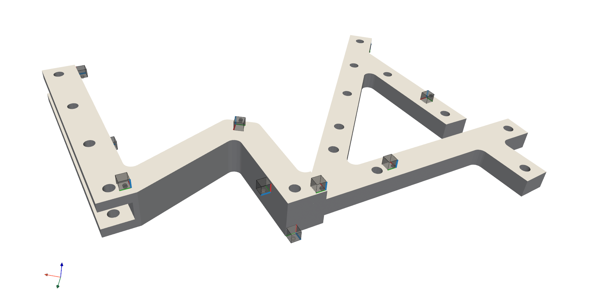
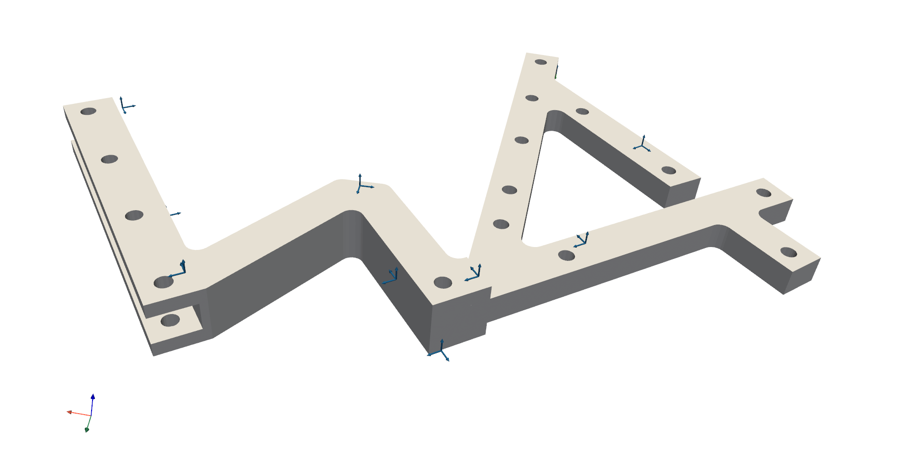
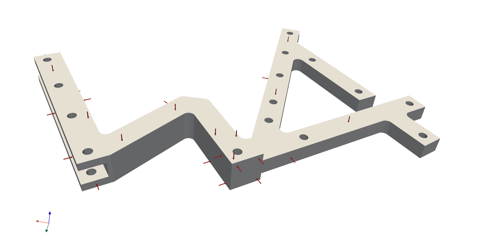
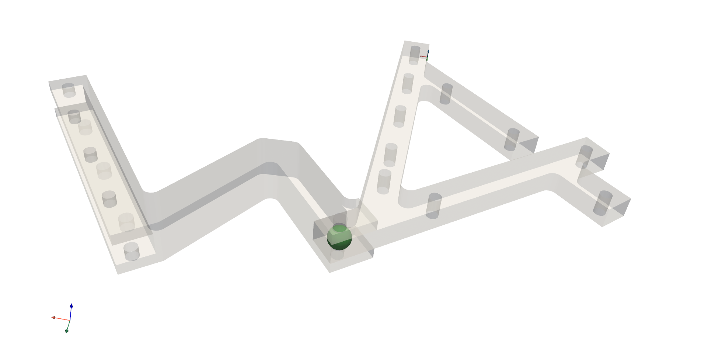

=================
Static 3D display
=================
A simple example of the 3D display. Sensors, impacts, channels, virtual points and the structure can be depicted in 3D view in a simple and intuitive way.

3D viewer
*********

First open a blank 3D display with a CSYS depicted in the origin. 

.. code-block:: python

	import pyFBS
	view3D = pyFBS.display.view3D()

Structure
*********
Structures can be added to 3Dview in a simple manner. Currently, only  STL file format is supported for the 3D display in the pyFBS.
	
.. code-block:: python
	
	path_stl = "../data/AM_substructuring_testbench/STL/AM_AB_final.stl"
	view3D = pyFBS.display.view3D(path_stl)
	view3D.add_stl(AB_stl)

.. figure:: ./data/3D_view.png
   :width: 500px
   
   AM substructuring testbench depicted in the pyFBS 3Dviewer. 

Accelerometers
**************
Accelerometers can be added to 3D view based on the information from the DataFrame.

.. code-block:: python
	
	path_xlsx = "../data/AM_substructuring_testbench/Measurements/decoupling/Excel/AM_Measurements.xlsx"
	df = pd.read_excel(path_xlsx, sheetname='Sensors_AB')
	view3D.show_acc(df)

   
   Accelerometers on the AM substructuring testbench depicted in the pyFBS 3Dviewer. 

Channels
********
Channels associated with each accelerometer can be added to 3D view based on the information supplied from the DataFrame.

.. code-block:: python
	
	df = pd.read_excel(path_xlsx, sheetname='Channels_AB')
	view3D.show_chn(df)

   
   Channels from accelerometers on the AM substructuring testbench depicted in the pyFBS 3Dviewer. 

Impacts
*******
Impact can be added to 3D view based on the information supplied  from the DataFrame.

.. code-block:: python
	
	df = pd.read_excel(path_xlsx, sheetname='Impacts_AB')
	view3D.show_imp(df)

   
   Impacts on the AM substructuring testbench depicted in the pyFBS 3Dviewer. 

Virtual points
**************
Virtual points can be added to 3D view based on the information supplied  from the DataFrame.

.. code-block:: python
	
	df = pd.read_excel(path_xlsx, sheetname='VP_Channels')
	view3D.show_vp(df)

   
   Channels from accelerometers on the AM substructuring testbench depicted in the pyFBS 3Dviewer. 

Labels
******
Accelerometer, channels, impacts or virtual points can be labeled or enumerated based on the information from the DataFrame.

.. figure:: ./data/labels.gif
   :width: 500px
   
   Accelerometer, channels, impacts and virtual points on the AM substructuring testbench depicted in the pyFBS 3Dviewer.