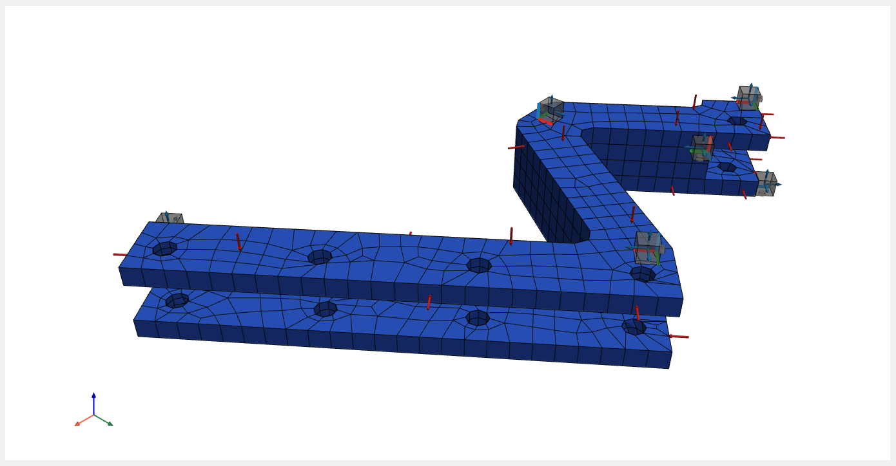
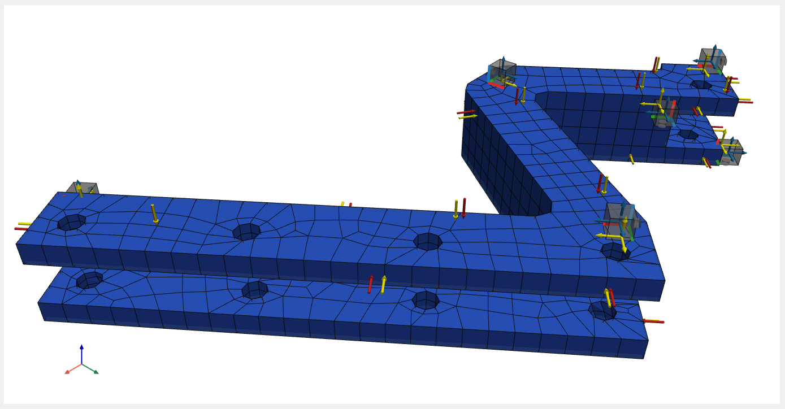
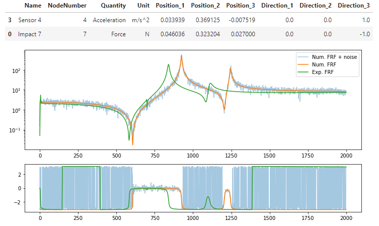

==================
FRF synthetization
==================

The mass and stiffness matrices contain information about the mass and stiffness distribution in the system. 
By solving the eigenvalue problem, the eigenfrequencies and eigenvectors of the system are determined.

.. note:: 
   Example showing the basic use of the FRF synthetization: :download:`03_FRF_synthetization.ipynb <../../examples/03_FRF_synthetization.ipynb>`.

In the ``pyFBS`` library, modal analysis and FRFs synthetization, can be performed relying on mass and stiffness matrices imported from Ansys.

MK model initialization
***********************

First, we initialize the so-called MK model (with class ``pyFBS.MK_model``) by importing ``.rst`` and ``.full`` files, 
which contains information on the locations of finite element nodes, their DoFs, the connection between nodes, 
the mass and stiffness matrix of the system...

.. code-block:: python

    import pyFBS
    from pyFBS.utility import *

    import numpy as np
    import matplotlib.pyplot as plt

    full_file = pyFBS.example_lab_testbench["FEM"]["B_full"]
    rst_file = pyFBS.example_lab_testbench["FEM"]["B_rst"]

    MK = pyFBS.MK_model(rst_file, full_file, no_modes = 100, allow_pickle = False, recalculate = False)

In this step, the eigenfrequencies and eigenvectors of the system are calculated. Their number is limited by the ``no_modes`` parameter.

Mode shape visualization
************************

After the MK model is defined, its modal shapes can also be visualized.
In the beginning is to display added the stl model, which won't be deformed during the animation.

.. code-block:: python

    stl = pyFBS.example_lab_testbench["STL"]["B"]
    view3D = pyFBS.view3D(show_origin= True)
    view3D.add_stl(stl,name = "engine_mount",color = "#8FB1CC",opacity = .1)   

Then the finite element mesh is added, on which the modal shapes will be animated.

.. code-block:: python

    view3D.plot.add_mesh(MK.mesh, scalars = np.ones(MK.mesh.points.shape[0]), cmap = "coolwarm", show_edges = True)

Mode shape is selected with method ``get_modeshape``. 
Parameters of animation are defined with the function ``dict_animation``, which is imported from ``pyFBS.utility``. 
Here are set frames per second (``fps``), deformation amplification (``r_scale``),  number of displayed frames (``no_points``).

.. code-block:: python

    select_mode = 6
    _modeshape = MK.get_modeshape(select_mode)

    mode_dict = dict_animation(_modeshape,"modeshape",pts = MK.pts, mesh = MK.mesh, fps=30, r_scale=10, no_points=60)
    view3D.add_modeshape(mode_dict,run_animation = True)

.. figure:: ./data/mode_shape_animation3.gif
   :width: 800px
   
   Animation of 7th mode shape.

To show undeformed geometry we simply click the button in the popup window or we call method ``clear_modeshape()``:

.. code-block:: python

    view3D.clear_modeshape()

Visualization of impacts and responses
======================================

Locations and directions of impacts and responses must be collected in pandas.DataFrame. 

.. code-block:: python

    # Path to .xslx file
    xlsx = pyFBS.example_lab_testbench["meas"]["xlsx"]

    # Import and show locations of accelereometers
    df_acc = pd.read_excel(xlsx, sheet_name='Sensors_B')
    view3D.show_acc(df_acc,overwrite = True)

    # Import and show directions of accelereometers channels
    df_chn = pd.read_excel(xlsx, sheet_name='Channels_B')
    view3D.show_chn(df_chn)

    # Import and show locations and directions of impacts
    df_imp = pd.read_excel(xlsx, sheet_name='Impacts_B')
    view3D.show_imp(df_imp,overwrite = True)

   
   Visualization of impacts and responses.

Defining DoFs of synthetized FRFs
*********************************

FRFs can only be generated at nodes that are included in the numerical model. 
Therefore, it is necessary to find the nodes closest to the desired locations in the numerical model and update them. 
The orientation of the generated FRFs is independent of the direction in the numerical model and will not change with location updates.

Locations of impacts and responses are update using method ``update_locations_df``:

.. code-block:: python

    df_chn_up = MK.update_locations_df(df_chn)
    df_imp_up = MK.update_locations_df(df_imp)

Updated locations can also be shown on the finite element model. 

.. code-block:: python

    view3D.show_chn(df_chn_up, color = "y", overwrite = False)
    view3D.show_imp(df_imp_up, color = "y", overwrite = False)

   
   Visualization of updated locations of impacts and responses with yellow color.

FRF synthetization
******************

FRFs are synthetized at given locations and directions in ``df_channel`` and ``df_impact`` parameters. 
Even if we forget to define updated response and excitation locations, the function will automatically find 
the nearest nodes in the numerical model from which the FRFs will be synthesized. 
Frequency properited are defined in parameters ``f_start``, ``f_end`` and ``f_resolution``. 
The number of modes that will be considered in the synthetization is defined in the ``no_modes`` parameter 
and coeficient of constant modal dampling is defined in parameter ``modal_damping``.
The result of the  FRF synthetization can be in the form of ``accelerance``, ``mobility`` or ``receptance``, 
which is defined in the ``frf_type`` parameter.

.. code-block:: python

    MK.FRF_synth(df_channel = df_chn, df_impact = df_imp, 
                 f_start = 0, f_end = 2000, f_resolution = 1, 
                 limit_modes = 50, modal_damping = 0.003, 
                 frf_type = "accelerance")

The DoFs in the FRF matrix row follows the order of responses in the ``df_channel`` parameter, 
and the DoFs column matches the order of excitations in ``df_impact``.

Adding noise
============

To analyze various problems, numerically obtained FRFs are often contaminated with random noise, 
which can be done by the ``add_noise`` method.

.. code-block:: python

    MK.add_noise(n1 = 2e-1, n2 = 2e-1, n3 = 5e-2 ,n4 = 5e-2)

FRF visualization
=================

An experimental measurement is also imported to compare different FRFs.

.. code-block:: python

    exp_file = pyFBS.example_lab_testbench["meas"]["Y_B"]

    freq, Y_B_exp = np.load(exp_file,allow_pickle = True)

When visualizing FRFs, responses and excitation locations can also be displayed in the form of an organized table.

.. code-block:: python

    plt.figure(figsize = (12,8))

    s1 = 3
    s2 = 0

    param = ["Name" ,"NodeNumber", "Quantity", "Unit",
             "Position_1", "Position_2", "Position_3", 
             "Direction_1", "Direction_2", "Direction_3"]
    df_disp = df_chn.iloc[[s1]][param].copy()
    display(df_disp.append(df_imp.iloc[[s2]][param]))

    plt.subplot(211)
    plt.semilogy(MK.freq,np.abs(MK.FRF_noise[:,s1,s2]), alpha=0.4, label = "Num. FRF + noise")
    plt.semilogy(MK.freq,np.abs(MK.FRF[:,s1,s2]), label = "Num. FRF")
    plt.semilogy(freq,np.abs(Y_B_exp[s1,s2]), label = "Exp. FRF")
    plt.legend()

    plt.subplot(413)
    plt.plot(MK.freq,np.angle(MK.FRF_noise[:,s1,s2]), alpha=0.4)
    plt.plot(MK.freq,np.angle(MK.FRF[:,s1,s2]))
    plt.plot(freq,np.angle(Y_B_exp[s1,s2]))

   
   Comparison of different FRFs.