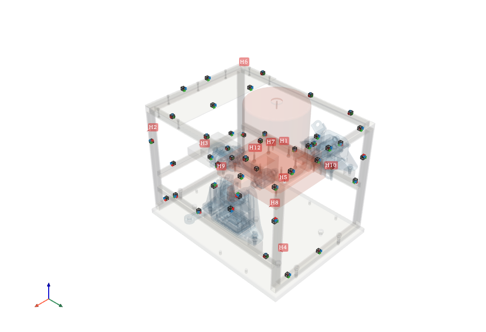
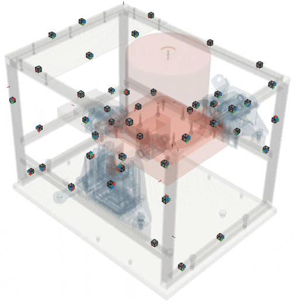

##########
Operational Deflection Shapes
##########

The 3D display of the pyFBS can be used to animate objects. Animation can be performed on meshes directly on predefined objects (such as accelerometers). In this example an operational deflection shape of the a structure is animated.

.. note:: 
   Example showing an application of the Operational Deflection Shapes: :download:`06_ODS.ipynb <../../examples/06_operational_deflection_shapes_ODS.ipynb>`.

Example Datasets and 3D view
----------------

As already shown in the `3D Display <../../html/examples/01_static_display.html>`_ one can load a predefined datasets from an example and add a structure from STL file to the 3D view. This allows both the acceleration sensors and excitation points to be visualized.

    

Experimental example
********************
Load experimental data for the operational deflection shape animation

.. code-block:: python

	_file = pyFBS.example_auto_testbench["meas"]["Y_ODS"]
	freq, Y_ODS = np.load(_file,allow_pickle = True)
	
Checkout a single FRF:

.. code-block:: python

	select_out = 5
	select_in = 1

	display(df_chn.iloc[[select_out]])
	display(df_imp.iloc[[select_in]])

	plt.figure(figsize = (8,6))
	plt.subplot(211)
	plt.semilogy(freq,np.abs(Y_ODS[:,select_out,select_in]))

	plt.subplot(413)
	plt.plot(freq,np.angle(Y_ODS[:,select_out,select_in]))
	
Accelerometer animation
-----------------------
The objects placed in the 3D view can be simply animated. In this example an operational deflection shape at a certain impact position can be animated: 

.. code-block:: python

	freq_sel = -1
	select_in = 6

	emp_2 = pyFBS.orient_in_global(Y_ODS[freq_sel,:,select_in],df_chn,df_acc)

	mode_dict = pyFBS.dict_animation(emp_2,"object",object_list = view3D.global_acc,r_scale=30)
	mode_dict["freq"] = freq[freq_sel]
	view3D.add_objects_animation(mode_dict,run_animation = True,add_note= True)
	
    
GIF export
----------
The pyFBS supports also an export to a GIF file. Before running the animation just set the output directory view3D.gif_dir and set the variable view3D.take_gif = True. When the GIF is exporting the animation lags the animation can lag in the 3D display.

   GIF export of the Operational Deflection Shapes (ODS). 