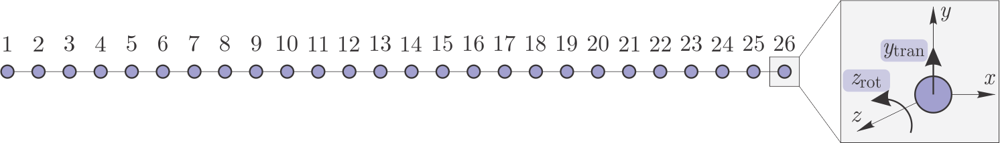
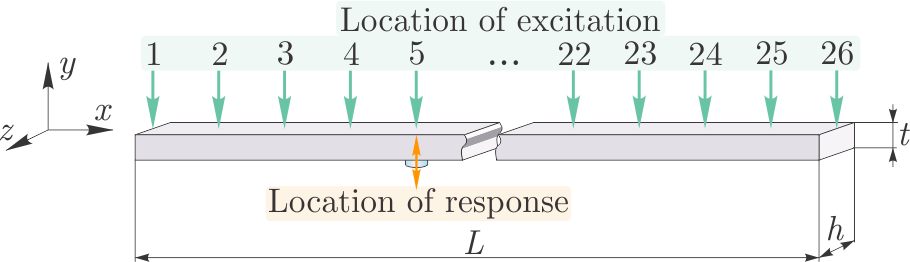

==============
Basic Examples
==============
A short description of basic features of the pyFBS. Additional examples are available in the examples folder (*./pyFBS/examples/*)  (prepared to be published on MyBinder).

Static 3D display
=================
A simple example of the 3D display. Sensors, impacts, channels, virtual points and the structure can be depicted in 3D view in a simple and intuitive way.

3D viewer
*********

First open a blank 3D display with a CSYS depicted in the origin. 

.. code-block:: python

	import pyFBS
	view3D = pyFBS.display.view3D()

Structure
*********
Structures can be added to 3Dview in a simple manner. Currently, only  STL file format is supported for the 3D display in the pyFBS.
	
.. code-block:: python
	
	path_stl = "../data/AM_substructuring_testbench/STL/AM_AB_final.stl"
	view3D = pyFBS.display.view3D(path_stl)
	view3D.add_stl(AB_stl)

.. figure:: ./data/3D_view.png
   :width: 500px
   
   AM substructuring testbench depicted in the pyFBS 3Dviewer. 

Accelerometers
**************
Accelerometers can be added to 3D view based on the information from the DataFrame.

.. code-block:: python
	
	path_xlsx = "../data/AM_substructuring_testbench/Measurements/decoupling/Excel/AM_Measurements.xlsx"
	df = pd.read_excel(path_xlsx, sheetname='Sensors_AB')
	view3D.show_acc(df)

.. figure:: ./data/acc.png
   :width: 500px
   
   Accelerometers on the AM substructuring testbench depicted in the pyFBS 3Dviewer. 

Channels
********
Channels associated with each accelerometer can be added to 3D view based on the information supplied from the DataFrame.

.. code-block:: python
	
	df = pd.read_excel(path_xlsx, sheetname='Channels_AB')
	view3D.show_chn(df)

.. figure:: ./data/chn.png
   :width: 500px
   
   Channels from accelerometers on the AM substructuring testbench depicted in the pyFBS 3Dviewer. 

Impacts
*******
Impact can be added to 3D view based on the information supplied  from the DataFrame.

.. code-block:: python
	
	df = pd.read_excel(path_xlsx, sheetname='Impacts_AB')
	view3D.show_imp(df)

.. figure:: ./data/imp.png
   :width: 500px
   
   Impacts on the AM substructuring testbench depicted in the pyFBS 3Dviewer. 

Virtual points
**************
Virtual points can be added to 3D view based on the information supplied  from the DataFrame.

.. code-block:: python
	
	df = pd.read_excel(path_xlsx, sheetname='VP_Channels')
	view3D.show_vp(df)

.. figure:: ./data/VP.png
   :width: 500px
   
   Channels from accelerometers on the AM substructuring testbench depicted in the pyFBS 3Dviewer. 

Labels
******
Accelerometer, channels, impacts or virtual points can be labeled or enumerated based on the information from the DataFrame.

.. figure:: ./data/labels.gif
   :width: 500px
   
   Accelerometer, channels, impacts and virtual points on the AM substructuring testbench depicted in the pyFBS 3Dviewer.
   
Interactive 3D display
======================
**Coming soon**

The idea behind interactive 3D display is simple. The position as well as the orientation of any componoment should be interactive directly in the 3D viewer.

.. figure:: ./data/dynamic_3Dview.gif
   :width: 500px
   
   An example of two interactive accelerometers.

SEMM - System equivalent model mixing
=====================================

With System Equivalent Model Mixing (SEMM) :cite:`KLAASSEN201890` method frequency-based models, either of numerical or experimental nature, can be mixed to form a hybrid model.

Example data import
*******************

First import numerical and experimental data (response models). Data used in this example are obtained on a simple beam.

.. code-block:: python

   import numpy as np
   import matplotlib.pyplot as plt
   import pyFBS
   
   path_num = "../data/LADISK_beam/BeamWith26Nodes/num_data.npz"
   path_exp = "../data/LADISK_beam/BeamWith26Nodes/exp_data.npz"

   num = np.load(path_num)
   exp = np.load(path_exp)

   freq_Num, Y_Num = num["freq"], num["Y"]
   freq_Exp, Y_Exp = exp["freq"], exp["Y"]

Numerical model form
--------------------
The numerical model must be properly formed. The first dimension presents frequency depth (if our case is 7000). 
The second dimension represents all outputs (responses) and the third dimension stands for all inputs (excitations). 
In the presented example are both valued 52. because the beam is discretized on 26 equidistant nodes and every node has 2 DoFs - translation in *y*-direction and rotation about *z*-axis.

The numerical model is not necessarily a square matrix, it can also be rectangular, it is only important that it contains at least those DoFs that are also represented in the experimental model.

.. code-block:: python

   >>> Y_Num.shape
   (7000, 52, 52)

   
   Numerical model of beam.

Experimental model form
-----------------------
The experimental model must also have the right form. All FRFs must be located in the 2D matrix in some meaningful order, as this makes it much easier to manipulate them later.
The first dimension presents frequency depth (if our case is 25600). 
The second dimension presents all measurement points. The measurements are not arranged in such a form as the numerical model that there are responses in the rows and the excitation in the columns. 
We simply stack the measurements one after the other but we need to know which location and direction each measurement refers to. This will be important in the next step.

It is also important that the values of the receptance of the numerical and experimental models refer to the same frequencies. 
Usually, the frequency range of the experimental model is larger, so it will automatically be truncated to the dimension of the numerical model while performing the SEMM method. 
However, the dimensions can also be adjusted manually with the corresponding truncation of both models.

.. code-block:: python

   >>> Y_Exp.shape
   (25600, 26)

   
   Experimental model of beam.

Defining locations of numerical and experimental model
******************************************************
We need to define where the measurements are located in the experimental model and which locations are represented in the numerical model. 
The basis is a numerical model, so all numbering must be adjusted to match the numerical model. 
The numerical model is usually obtained by the finite element method, where nodes id usually starts with the number 1, so for the purposes of using the SEMM function, it is necessary to start all numbering from 1.

The locations of the experimental and numerical model are defined with the parameters ``overlay``, ``DoF`` and ``loc_Y_num``.

Parameter ``DoF``
-----------------

It is easiest to define the DoF parameter, which represents the number of degrees of freedom of an individual node in a numerical model. 
In our example, we observed translation in *y*direction and  rotation about *z*-axis at each node, so the following applies:

.. code-block:: python

   DoF = 2

Parameter ``overlay``
---------------------

The overlay parameter defines in which places and directions of the numerical model the experiments were performed and which measurement belongs to this particular description. 
Parameter overlay is a list with a special form. Its form is easiest to explain in the case of the beam example.
The response of the beam was measured only at point 5 in the *y* direction, while the beam was excited at all 26 points also in the *y* direction.
The measurements in the matrix Y_Exp belong to the excitation locations in all 26 points in applied order.
Therefore, the ``overlay`` parameter has the following form:

.. code-block:: python

   overlay = [[[5,  1], [1, 1], [ 1]], 
              [[5,  2], [1, 1], [ 2]],  
              [[5,  3], [1, 1], [ 3]],
              [[5,  4], [1, 1], [ 4]],
              [[5,  5], [1, 1], [ 5]],
              [[5,  6], [1, 1], [ 6]],
              [[5,  7], [1, 1], [ 7]],
              [[5,  8], [1, 1], [ 8]],
              [[5,  9], [1, 1], [ 9]],
              [[5, 10], [1, 1], [10]],
              [[5, 11], [1, 1], [11]],
              [[5, 12], [1, 1], [12]],
              [[5, 13], [1, 1], [13]], 
              [[5, 14], [1, 1], [14]],  
              [[5, 15], [1, 1], [15]],  
              [[5, 16], [1, 1], [16]],  
              [[5, 17], [1, 1], [17]],  
              [[5, 18], [1, 1], [18]], 
              [[5, 19], [1, 1], [19]],  
              [[5, 20], [1, 1], [20]],
              [[5, 21], [1, 1], [21]], 
              [[5, 22], [1, 1], [22]],  
              [[5, 23], [1, 1], [23]],  
              [[5, 24], [1, 1], [24]],  
              [[5, 25], [1, 1], [25]],  
              [[5, 26], [1, 1], [26]]]

If we take a closer look at each line of the ``overlay`` parameter, we can explain its meaning. 
The first two numbers refer to the response point and the excitation point respectively. 
The next set of two numbers refers to the direction of response and excitation respectively, 
and the last set in each line refers to the order of measurement that meets these specifications.

Let's look at the first line as an example. 
We measured the response in point 5, while the structure was excited in point 1. 
The translation response was measured in the *y* direction, so the first value in the second set of numbers is 1.
The structure was force excited in the *y* direction, so the second number in this set is also 1. 
Since the first measurement in the vector ``Y_exp`` satisfies these conditions, we wrote the number 1 in the last set.

All numbering starts from the value 1.

Parameter ``loc_Y_num``
------------------------

In the ``loc_Y_num`` parameter we define which points are represented in the ``Y_num`` parameter. 
If the ``Y_num`` parameter is a full square matrix, then this parameter can have the value ``loc_Y_num = None``, which is also its default value. 
However, if the numerical model represents only a subset of the full numerical model, we need to define used response and excitation points.

For our case, we can take part in the receptance matrix where the response in node 5 is considered (it is necessary to take into account that each node has 2 DoFs).

.. code-block:: python

   Y_Num_node5 = np.asarray(Y_Num[:, (np.asarray([8, 9])), :])
   loc_Y_num = [[ 5],
                [ 1,  2,  3,  4,  5,  6,  7,  8,  9, 10, 11, 12, 13, 14, 15, 16, 17,18, 19, 20, 21, 22, 23, 24, 25, 26]]

The ``loc_Y_num`` parameter consists of two parts. The first part presents the response locations contained in the numerical model. 
The excitation locations are defined in the second part. 
In our case, it contains responses in point 5 and excitation in all 26 points.

Using the SEMM function
***********************

Once all the necessary parameters are defined, using the SEMM function is simple. 
The function enables the implementation of two SEMM method formulations: basic and fully-extended, which is defined in the ``SEMM_type`` parameter.
To use the basic formulation, the numerical model must be a full square matrix. 
In general, a fully-extended formulation gives better results. 
The ``red_comp`` and ``red_eq`` parameters can be used to influence the number of eigenvalues used to ensure equilibrium and compatibility conditions when the fully-extended-svd formulation is used.

The result is a hybrid model that contains the DoFs represented in the numerical model.

.. code-block:: python

   Y_SEMM_node5 = pyFBS.SEMM(Y_Num_node5, Y_Exp, overlay, DoF, loc_Y_num,  SEMM_type="fully-extend")
   Y_SEMM_full = pyFBS.SEMM(Y_Num, Y_Exp, overlay, DoF,  SEMM_type="fully-extend")
   Y_SEMM_full_red = pyFBS.SEMM(Y_Num, Y_Exp, overlay, DoF, SEMM_type="fully-extended-svd", red_comp=0, red_eq=20)

The results can also be displayed using the matplotlib library:

.. code-block:: python

   plt.semilogy(freq_Exp[0:4000], np.abs(Y_Exp[0:4000, 14]),"k", lw=4,  label="Exp.", alpha=0.6)
   plt.semilogy(freq_Num[0:4000], np.abs(Y_Num[0:4000, 8, 28]), label="Num.")
   plt.semilogy(freq_Num[0:4000], np.abs(Y_SEMM[0:4000, 0, 28]), label="SEMM - only resp. at node 5")
   plt.semilogy(freq_Num[0:4000], np.abs(Y_SEMM_full[0:4000, 8, 28]), label="SEMM - full")
   plt.semilogy(freq_Num[0:4000], np.abs(Y_SEMM_full_red[0:4000, 8, 28]), label="SEMM - full, reduced equlibirum")
   plt.legend()
   plt.ylabel("$Y(f)$ [m/N]")
   plt.xlabel("$f$ [Hz]")

.. figure:: ./data/SEMM_result.png
   :width: 400px
   
   Comparison of different formulations of SEMM method.

Such differences between the obtained FRFs are only in places where an inconsistent measurement was present (measurements at points 15 and 24). 
It can be seen that using the fully-extend-svd method with reduced equilibrium conditions, a measurement can be well corrected. 
A similar effect was achieved when only the frequency response functions in point 5 were included in the numerical model. 
Using SEMM in a fully-extended formulation, the results obtained at experimental points remain unchanged and coincide with corresponding measurements.