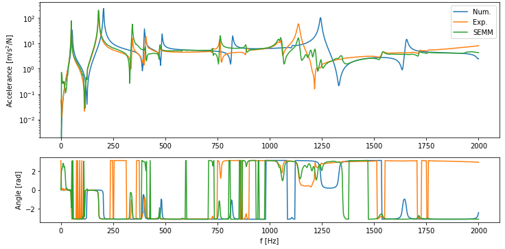

==============
Basic Examples
==============
A short description of basic features of the pyFBS. Additional examples are available in the examples folder (*./pyFBS/examples/*)  (prepared to be published on MyBinder).

Static 3D display
=================
A simple example of the 3D display. Sensors, impacts, channels, virtual points and the structure can be depicted in 3D view in a simple and intuitive way.

3D viewer
*********

First open a blank 3D display with a CSYS depicted in the origin. 

.. code-block:: python

	import pyFBS
	view3D = pyFBS.display.view3D()

Structure
*********
Structures can be added to 3Dview in a simple manner. Currently, only  STL file format is supported for the 3D display in the pyFBS.
	
.. code-block:: python
	
	path_stl = "../data/AM_substructuring_testbench/STL/AM_AB_final.stl"
	view3D = pyFBS.display.view3D(path_stl)
	view3D.add_stl(AB_stl)

.. figure:: ./data/3D_view.png
   :width: 500px
   
   AM substructuring testbench depicted in the pyFBS 3Dviewer. 

Accelerometers
**************
Accelerometers can be added to 3D view based on the information from the DataFrame.

.. code-block:: python
	
	path_xlsx = "../data/AM_substructuring_testbench/Measurements/decoupling/Excel/AM_Measurements.xlsx"
	df = pd.read_excel(path_xlsx, sheetname='Sensors_AB')
	view3D.show_acc(df)

.. figure:: ./data/acc.png
   :width: 500px
   
   Accelerometers on the AM substructuring testbench depicted in the pyFBS 3Dviewer. 

Channels
********
Channels associated with each accelerometer can be added to 3D view based on the information supplied from the DataFrame.

.. code-block:: python
	
	df = pd.read_excel(path_xlsx, sheetname='Channels_AB')
	view3D.show_chn(df)

.. figure:: ./data/chn.png
   :width: 500px
   
   Channels from accelerometers on the AM substructuring testbench depicted in the pyFBS 3Dviewer. 

Impacts
*******
Impact can be added to 3D view based on the information supplied  from the DataFrame.

.. code-block:: python
	
	df = pd.read_excel(path_xlsx, sheetname='Impacts_AB')
	view3D.show_imp(df)

.. figure:: ./data/imp.png
   :width: 500px
   
   Impacts on the AM substructuring testbench depicted in the pyFBS 3Dviewer. 

Virtual points
**************
Virtual points can be added to 3D view based on the information supplied  from the DataFrame.

.. code-block:: python
	
	df = pd.read_excel(path_xlsx, sheetname='VP_Channels')
	view3D.show_vp(df)

.. figure:: ./data/VP.png
   :width: 500px
   
   Channels from accelerometers on the AM substructuring testbench depicted in the pyFBS 3Dviewer. 

Labels
******
Accelerometer, channels, impacts or virtual points can be labeled or enumerated based on the information from the DataFrame.

.. figure:: ./data/labels.gif
   :width: 500px
   
   Accelerometer, channels, impacts and virtual points on the AM substructuring testbench depicted in the pyFBS 3Dviewer.
   
Interactive 3D display
======================
**Coming soon**

The idea behind interactive 3D display is simple. The position as well as the orientation of any componoment should be interactive directly in the 3D viewer.

.. figure:: ./data/dynamic_3Dview.gif
   :width: 500px
   
   An example of two interactive accelerometers.

SEMM - System equivalent model mixing
=====================================

With System Equivalent Model Mixing (SEMM) :cite:`KLAASSEN201890` method frequency-based models, either of numerical or experimental nature, can be mixed to form a hybrid model.

Example data import
*******************

First import numerical and experimental data (response models). Data used in this example are obtained on a laboratory test bench.

Experimental model
------------------
The experimental model must be properly prepared so that it contains FRFs in an ordered form. 
The first dimension represents the frequency depth, second the response points, and the third excitation points.

.. code-block:: python

   import numpy as np
   import matplotlib.pyplot as plt
   import pyFBS

   exp_file = r"../data/lab_testbench/Measurements/Y_AB.p"

   freq, Y_exp = np.load(exp_file, allow_pickle = True)
   Y_exp = np.transpose(Y_exp, (2, 0, 1))

Numerical model
---------------
FRFs in numerical model can be imported, or generated from the mass and stiffness matrix.
Locations and directions for which FRFs are generated are defined in an .xlsx file (for details see chapter ...)

.. code-block:: python

   stl = r"../data/lab_testbench/STL/AB.stl"
   xlsx = r"../data/lab_testbench/Measurements/AM_Measurements.xlsx"

   full_file = r'../data/lab_testbench/FEM/AB/file.full'
   ress_file = r'../data/lab_testbench/FEM/AB/file.rst'

   MK = pyFBS.MK_model(ress_file, full_file, no_modes = 100, recalculate = False)

   df_chn = pd.read_excel(xlsx, sheet_name='Channels_AB')
   df_imp = pd.read_excel(xlsx, sheet_name='Impacts_AB')

   MK.FRF_synth(df_chn,df_imp, 
                f_start=0,
                f_end=2002.5,
                f_resolution=2.5,
                modal_damping = 0.003,
                frf_type = "accelerance")

The numerical model must be properly formed. The first dimension presents frequency depth. 
The second dimension represents all outputs (responses) and the third dimension stands for all inputs (excitations).
It is also important that the values of the numerical and experimental models refer to the same frequencies.

The numerical model is not necessarily a square matrix, it can also be rectangular, it is only important that it contains at least those DoFs that are also represented in the experimental model.

Using the SEMM function
***********************

The function enables the implementation of three SEMM method formulations: ``basic``, ``fully-extend`` and ``fully-extend-svd``, which is defined in the ``SEMM_type`` parameter.
The ``red_comp`` and ``red_eq`` parameters can be used to influence the number of eigenvalues used to ensure equilibrium and compatibility conditions when the ``fully-extend-svd`` formulation is used.

The result is a hybrid model that contains the DoFs represented in the numerical model.

In the example below, only part of the experimental response matrix is intentionally selected to demonstrate the effect of the SEMM method.
It is essential that the order of measurements in the experimental model ``Y_exp`` coincides with the order of measurements in the parameters ``df_chn_exp`` and ``df_imp_exp``.

.. code-block:: python

   Y_AB_SEMM = pyFBS.SEMM(MK.FRF, Y_exp[:, 0:15, 5:20],
                          df_chn_num = df_chn, 
                          df_imp_num = df_imp, 
                          df_chn_exp = df_chn[0:15], 
                          df_imp_exp = df_imp[5:20], 
                          SEMM_type='fully-extend-svd', red_comp=10, red_eq=10)

The results can also be displayed using the matplotlib library:

.. code-block:: python

   s1 = 24
   s2 = 24

   display(df_chn.iloc[[s1]])
   display(df_imp.iloc[[s2]])

   plt.figure(figsize = (12,8))

   plt.subplot(211)
   plt.semilogy(MK.freq,np.abs(MK.FRF[:,s1,s2]), label = "Num.")
   plt.semilogy(freq,np.abs(Y_exp[:, s1,s2]), label = "Exp.")
   plt.semilogy(freq,np.abs(Y_AB_SEMM[:, s1,s2]), label = "SEMM")
   plt.ylabel("Accelerance [m/s$^2$/N]")
   plt.legend()

   plt.subplot(413)
   plt.plot(MK.freq,np.angle(MK.FRF[:,s1,s2]))
   plt.plot(freq,np.angle(Y_exp[:, s1,s2]))
   plt.plot(MK.freq,np.angle(Y_AB_SEMM[:,s1,s2]))
   plt.xlabel("f [Hz]")
   plt.ylabel("Angle [rad]")

   
   Comparison of FRFs.

