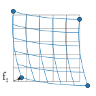
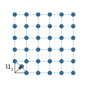
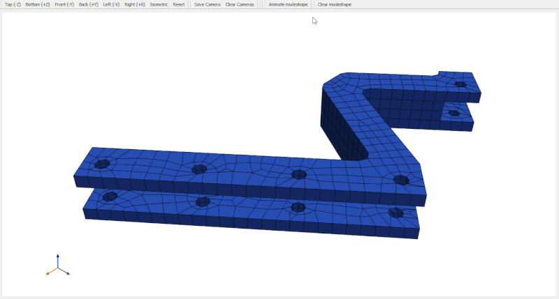

==================
FRF synthetization
==================
The :mod:`pyFBS` package enables user-friendly modal analysis and FRF synthetization based on the mass and stiffness matrices imported from the FEM software. 
Currently, only data import from Ansys is supported. 

.. note:: 
   Download example showing the basic use of the FRF synthetization: :download:`03_FRF_synthetization.ipynb <../../../examples/03_FRF_synthetization.ipynb>`

Numerical analysis of continuous systems requires their discretization by division into finite elements [1]_. 
The dynamic properties of the system are described by the equilibrium equation, 
where the external forces are equal to the internal forces resulting from inertia, damping and stiffness. 
The basic equation for a linear dynamical system with viscous damping has the following form:

.. math::

   \mathbf{M} \, \boldsymbol{\ddot{x}}(t) + \mathbf{C} \, \boldsymbol{\dot{x}}(t) + \mathbf{K} \, \boldsymbol{x}(t) = \boldsymbol{f}(t)

where :math:`\mathbf{M}` represents the mass matrix, :math:`\mathbf{C}` the damping matrix, :math:`\mathbf{K}` the stiffness matrix, 
:math:`\boldsymbol{x}` vector of responses at all :math:`n` degrees of freedom (DoFs), 
and :math:`\boldsymbol{f}` vector of externally applied forces. 

For consistent modeling of dynamic systems within the frequency domain the following assumptions have to be valid:

* Linearity - response amplitude is linearly proportional to the excitation amplitude.

* Time invariance - mass, stiffness, and damping characteristics are time-independent.

* Passivity - the energy flow in the system is always positive or equal to zero.

* Reciprocity - the response of the structure remains the same if the excitation and response location are switched.

* Stability - the response of the system is bounded if the excitation of the system is bounded.

If we apply the Fourier transform, a time function of response :math:`\boldsymbol{x}(t)` can be written in 
the frequency domain :math:`(\boldsymbol{x}(\omega))` and basic equation takes the following form: 

.. math::
    \mathbf{M} \, \boldsymbol{\ddot{x}}(\omega) + \mathbf{C} \, \boldsymbol{\dot{x}}(\omega) + \mathbf{K} \, \boldsymbol{x}(\omega) = \boldsymbol{f}(\omega).

By following the fact that :math:`\boldsymbol{\ddot{x}}(\omega) = - \omega^2 \boldsymbol{x}(\omega)` 
we can express :math:`\boldsymbol{x}(\omega)` on the right-hand side: 

.. math::
    (- \omega^2\,\mathbf{M} + \text{j}\, \omega\, \mathbf{C} + \mathbf{K}) \boldsymbol{x}(\omega) = \boldsymbol{f}(\omega).

The left-hand side can be collected into a single frequency-dependent matrix :math:`\mathbf{Z}(\omega)`:

.. math::
    \mathbf{Z}(\omega) \boldsymbol{x}(\omega) = \boldsymbol{f}(\omega).

The impedance matrix :math:`\mathbf{Z}(\omega)` is also called the dynamic stiffness matrix (often referred to as mechanical impedance or apparent mass). 
By inverting the mechanical impedance an admittance notation :math:`\mathbf{Y}(\omega)` can be obtained:

.. math::
    \boldsymbol{u}(\omega) = \mathbf{Y}(\omega) \boldsymbol{f}(\omega). \qquad \mathbf{Y}(\omega) = 
    \left(\mathbf{Z}(\omega)\right)^{-1} = \left(- \omega^2\,\mathbf{M} + \text{j}\, \omega\, \mathbf{C} + \mathbf{K} \right)^{-1}.

The last equation presents the direct harmonic method for FRF synthetization. The :math:`\mathbf{Y}(\omega)` denotes the frequency response function matrix and is often referred
to as admittance or dynamic flexibility. The admittance matrix is sometimes also denoted with the letter :math:`\mathbf{H}`. 

An admittance :math:`\mathbf{Y}_{ij}` is defined as the response at :math:`i`-th DoF when a unit excitation force is applied at :math:`j`-th DoF. 
A whole :math:`j`-th column from the admittance matrix :math:`\mathbf{Y}` can be determined from a single excitation point; 
therefore, the admittance matrix is fully coupled. A single admittance FRF is a global observation of the system dynamics.

The impedance :math:`\mathbf{Z}_{ji}` is defined as the force at :math:`j`-th DoF when a unitary displacement is imposed at :math:`i`-th DoF, 
while all remaining DoFs are fixed. 
Therefore, the impedance matrix :math:`\mathbf{Z}` is commonly sparse in the sense that a single impedance term is a local observation of the system dynamics.

Eigenvalue problem
******************

To determine the eigenfrequencies and eigenvectors, the considered system responds with free vibration while the damping is neglected. 
The equilibrium equation takes the form of a homogeneous second-order differential equation:

.. math::

    \mathbf{M}\,\boldsymbol{\ddot{x}}(t)+\mathbf{K}\,\boldsymbol{x}(t)=\boldsymbol{0}

Euler's identity represents the solution of the differential equation: :math:`\boldsymbol{x}(t)=\boldsymbol{X}\,e^{\text{i}\,\omega\,t}` and
:math:`\boldsymbol{\ddot{x}}(t)=-\omega^2\boldsymbol{X}\,e^{\text{i}\,\omega\,t}`.
By transformation to the modal domain the equation of motion takes the form 
:math:`\mathbf{M}(-\omega^2\boldsymbol{X}\,e^{\text{i}\,\omega\,t})+\mathbf{K}\,(\boldsymbol{X}\,e^{\text{i}\,\omega\,t})=\boldsymbol{0}`.
By knowing :math:`e^{\text{i}\,\omega\,t}\neq 0` for any time :math:`t` we obtain: 

.. math::

   (\mathbf{K} - \omega^2\,\mathbf{M}) \boldsymbol{X} = \boldsymbol{0}

To get non-trivial solution it is necessary to satisfy :math:`\text{det}(\mathbf{K}-\omega_r^2\,\mathbf{M})=\boldsymbol{0}`.
By solving the determinant, the eigenvalues :math:`\omega_1^2, \omega_2^2, \dots` are determined which represent undamped natural frequencies. 
Each eigenvalue result in corresponding eigenvector :math:`\boldsymbol{\psi}_1, \boldsymbol{\psi}_2, \dots` which prepresents mode shape.
Eigenvalues and eigenvectors can be organised into a matrix form:

.. math::

   [^{\nwarrow}{\pmb{\omega}_{r}^2}_{\searrow}]=\begin{bmatrix} 
   \omega_1^2 & 0 & \cdots & 0 \\
   0 & \omega_2^2 & \cdots & 0 \\
   \vdots & \vdots & \ddots & \vdots \\
   0 & 0 & \cdots & \omega_N^2
   \end{bmatrix}, 
   \qquad
   [\pmb{\Psi}] = \begin{bmatrix} \boldsymbol{\psi}_1 & \boldsymbol{\psi}_2 & \cdots & \boldsymbol{\psi}_N\end{bmatrix}

Modal mass and modal stifness are calculated using following equiations:

.. math::

   \pmb{\Psi}^{\text{T}}\,\mathbf{M}\,\pmb{\Psi} = [^{\nwarrow}{m_{r}}_{\searrow}], 
   \qquad
   \pmb{\Psi}^{\text{T}}\,\mathbf{K}\,\pmb{\Psi} = [^{\nwarrow}{k_{r}}_{\searrow}]

Mass normalised mode is calculated using equation: :math:`\boldsymbol{\phi}_r=\boldsymbol{\psi}_r\,\frac{1}{\sqrt{m_{r}}}`
and has following properies:

.. math::

   \pmb{\Phi}^{\text{T}}\,\mathbf{M}\,\pmb{\Phi} = [\mathbf{I}], 
   \qquad
   \pmb{\Phi}^{\text{T}}\,\mathbf{K}\,\pmb{\Phi} = [^{\nwarrow}{\pmb{\omega}_{r}^2}_{\searrow}]

For FRF generation mode superposition method can be used, where contributions of modes are superimposed at each frequency line using equation: 

.. math::

   \alpha_{i, j} = \sum_{r=1}^{m}\frac{\boldsymbol{\phi}_{i,r}\,\boldsymbol{\phi}_{j,r}}{\omega_r^2-\omega^2+2\,\mathrm{i}\,\xi_r\,\omega_r\,\omega}

where :math:`\xi_r` represents modal damping at :math:`r`-th natural frequency and can be neglected for lightly damped systems. 
Index :math:`i` represents the location of response and index :math:`j` stands for the location of excitation.
The number of modes used for reconstruction is equal to :math:`m` and is usually much lower than the number of DoFs (:math:`m \ll n`). 
Therefore, modal truncation occurs.

Using the :mod:`pyFBS` package, it is easy to calculate eigenfrequencies and modal shapes from an imported finite element model 
and visualize them using an animated 3D display.
Also, the FRF synthetization is user friendly and is supported with the mode superposition and direct harmonic method.

MK model initialization
***********************

First, the MK model is initialized (with class :class:`pyFBS.MK_model`) by importing ``.rst`` and ``.full`` files, 
which contain the information on the locations of finite element nodes, their DoFs, the connection between the nodes, 
the mass and stiffness matrix of the system.

.. code-block:: python

    import pyFBS
    from pyFBS.utility import *

    full_file = r"./lab_testbench/FEM/B.full"
    rst_file = r"./lab_testbench/FEM/B.rst"

    MK = pyFBS.MK_model(rst_file, full_file, no_modes = 100, allow_pickle = False, recalculate = False)

In this step also the eigenfrequencies and eigenvectors of the system are simultaneously calculated. Eigenvectors are mass normalised. The number of calculated eigenvalues is limited by the ``no_modes`` parameter.

.. tip::

   In the case of models with a huge number of DoFs, the process of solving the eigenproblem can take quite some time (depending on the complexity of the model and the computational power of the computer).
   By setting ``read_rst = True`` in :class:`pyFBS.MK_model` initialization modal parameters will be imported directly from the ``.rst`` file and not calculated again inside Python.

.. warning::
    The current version uses pickle module to store the modal parameters. The pickle module is not secure. Only unpickle data you trust.
	
.. tip::
    The imported model will only contain as many eigenvalues and eigenforms as there were calculated in Ansys. 
    If you want to use more, you need to re-solve the problem in Python (by setting: ``allow_pickle = True, read_rst == False``) or Ansys.

Mode shape visualization
************************

After the MK model is defined, the calculated mode shapes can be animated. For nicer representation, the STL file can be added to visualize the undeformed shape of the structure.
The 3D display is opened in a new window and allows the user to interact with the added model.

.. code-block:: python

    stl = r"./lab_testbench/STL/B.stl"
    view3D = pyFBS.view3D(show_origin= True)
    view3D.add_stl(stl,name = "engine_mount",color = "#8FB1CC",opacity = .1)   

To animate mode shape, a mesh of finite elements must be added to display. 
Colormap of the model can be changed using ``cmap`` parameter, which supports all `PyVista colormap choices <https://docs.pyvista.org/examples/02-plot/cmap.html>`_.

.. code-block:: python

    view3D.plot.add_mesh(MK.mesh, scalars = np.ones(MK.mesh.points.shape[0]), cmap = "coolwarm", show_edges = True)

Mode shape can be selected with the method ``get_modeshape``. 
Animation parameters are defined with the function ``dict_animation``, which is imported from :mod:`pyFBS.utility`. 
Here you can set the frame rate (``fps``), the relative scale of deformation (``r_scale``) and the number of points in the animation sequence (``no_points``).

.. code-block:: python

    select_mode = 6
    _modeshape = MK.get_modeshape(select_mode)

    mode_dict = dict_animation(_modeshape,"modeshape",pts = MK.pts, mesh = MK.mesh, fps=30, r_scale=10, no_points=60)
    view3D.add_modeshape(mode_dict,run_animation = True)

Animation is visible in the previously defined pop-up window. The following figure shows animated 7th mode shape. 

   
To show undeformed mesh you can simply click the button in the pop-up window or call a method :func:`clear_modeshape()`:

.. code-block:: python

    view3D.clear_modeshape()

Visualization of impacts and responses
======================================

Locations and directions of impacts and responses must be passed with a :mod:`pd.DataFrame`. 
They can be either read from an Excel file (as shown below) or generated directly with pyFBS (see `Interactive display example <https://pyfbs.readthedocs.io/en/master/examples/basic_examples/02_interactive_display.html>`_).
The parameter ``df_acc`` must include the following columns header: ``Position_1``, ``Position_2``,  ``Position_3``, ``Orientation_1``, ``Orientation_2``, ``Orientation_3``. 
The position parameters describe the location of accelerometers in the global coordinate system. 
Orientation of coordinate systems of accelerometer regarding the global coordinate system is defined with orientation parameters which are defined with Euler angles in degrees.
The parameter ``df_chn`` and ``df_imp`` must include the following columns header: ``Position_1``, ``Position_2``,  ``Position_3``, ``Direction_1``, ``Direction_2``, ``Direction_3``. 
The directions presents unit vector directions. 

.. code-block:: python

    # Path to .xslx file
    xlsx = r"./lab_testbench/Measurements/AM_measurements.xlsx"

    # Import and show locations of accelereometers
    df_acc = pd.read_excel(xlsx, sheet_name='Sensors_B')
    view3D.show_acc(df_acc,overwrite = True)

    # Import and show directions of accelereometers channels
    df_chn = pd.read_excel(xlsx, sheet_name='Channels_B')
    view3D.show_chn(df_chn)

    # Import and show locations and directions of impacts
    df_imp = pd.read_excel(xlsx, sheet_name='Impacts_B')
    view3D.show_imp(df_imp,overwrite = True)

.. raw:: html

    

            <iframe src="https://kitware.github.io/vtk-js/examples/SceneExplorer/index.html?fileURL=https://dl.dropbox.com/s/n5nhk4f9wsd8l9t/FRF_synthetization_imp_chn.vtkjs?dl=0" frameborder="0" allowfullscreen style="position: absolute; top: 0; left: 0; width: 100%; height: 100%;"></iframe>
    

Defining DoFs of synthetized FRFs
*********************************

FRFs can currently only be synthetized on the nodes of the numerical model. 
Therefore, it is necessary to find the nodes closest to the desired locations in the numerical model and update them. 
The orientation of the generated FRFs is independent of the direction in the numerical model and will not change with the updated location.

Locations of impacts and channels can be updated to the nodes of the numerical model with the :func:`pyFBS.MK_model.update_locations_df`:

.. code-block:: python

    df_chn_up = MK.update_locations_df(df_chn)
    df_imp_up = MK.update_locations_df(df_imp)

Updated locations can also be displayed in the 3D display. 
By setting ``overwrite`` to ``False`` added locations of impacts and responses won't override previously added features, thus everything is shown simultaneously.

.. code-block:: python

    view3D.show_chn(df_chn_up, color = "y", overwrite = False)
    view3D.show_imp(df_imp_up, color = "y", overwrite = False)

.. raw:: html

    

            <iframe src="https://kitware.github.io/vtk-js/examples/SceneExplorer/index.html?fileURL=https://dl.dropbox.com/s/n5nhk4f9wsd8l9t/FRF_synthetization_imp_chn.vtkjs?dl=0" frameborder="0" allowfullscreen style="position: absolute; top: 0; left: 0; width: 100%; height: 100%;"></iframe>
    

FRF synthetization
******************

FRFs for relativelly small systems can be efficiently computed using the full harmonic method:

.. code-block:: python

    MK.FRF_synth_full(f_start = 0, f_end = 2000, f_resolution = 1, frf_type = "accelerance")

.. warning::

    Using this formulation, a full admitance matrix is generated. 
    For large systems, this can be very consimung in terms of computational times and memory storage.

Another possibility to generate FRFs is by applying the mode superposition method.
FRFs are synthetized at given locations and directions in ``df_channel`` and ``df_impact`` parameters. 
Even if we forget to define updated response and excitation locations, the function will automatically find 
the nearest nodes in the numerical model from which the FRFs are generated. 
Frequency properties are defined in parameters ``f_start``, ``f_end`` and ``f_resolution``. 
The number of modes used for modal superposition FRF generation is defined in the ``no_modes`` parameter 
and coefficient of modal damping is defined in parameter ``modal_damping``.
The resulting FRFs can be in the form of ``accelerance``, ``mobility`` or ``receptance``, 
which is defined in the ``frf_type`` parameter.

.. code-block:: python

    MK.FRF_synth(df_channel = df_chn, df_impact = df_imp, 
                 f_start = 0, f_end = 2000, f_resolution = 1, 
                 limit_modes = 50, modal_damping = 0.003, 
                 frf_type = "accelerance")

.. tip::
    Compared to the direct harmonic, this method can be applied only to a reduced (arbitratily selected) set of DoFs and is 
    therefore preferable in terms of computational and memory cost. Note, that typically also modal truncation is applied in the process.
    Nevertheless, even if you are interested in a small frequency region only, you should always include eigenvalues from 
    outside this region to account for upper- and lower-residuals.

The DoFs in the FRF matrix row follows the order of responses in the ``df_channel`` parameter, 
and the DoFs column matches the order of excitations in ``df_impact``.

Adding noise
============

To analyze various real-life experiments, numerically obtained FRFs are often intentionally contaminated with random noise to follow experimental data. 
Noise can be added to FRFs by the ``add_noise`` method.

.. code-block:: python

    MK.add_noise(n1 = 2e-1, n2 = 2e-1, n3 = 5e-2 ,n4 = 5e-2)

FRF visualization
=================

An experimental measurement is imported to compare all FRFs.

.. code-block:: python

    exp_file = pyFBS.example_lab_testbench["meas"]["Y_B"]

    freq, Y_B_exp = np.load(exp_file,allow_pickle = True)

Comparison of different FRFs can be performed visually:

.. code-block:: python

    o = 3
    i = 0

    pyFBS.plot_frequency_response(freq, 
                np.hstack((MK.FRF_noise[:,o:o+1,i:i+1], MK.FRF[:,o:o+1,i:i+1], Y_B_exp[:,o:o+1,i:i+1])),
                labels=('Num. FRF + noise', 'Num. FRF', 'Exp. FRF'))
	
.. raw:: html

   <iframe src="../../_static/FRF_synth.html" height="460px" width="100%" frameborder="0"></iframe>

.. card:: That's a wrap!

    Want to know more, see a potential application? Contact us at info.pyfbs@gmail.com!

.. rubric:: References

.. [1] e Silva, Júlio M. Montalvão, and Nuno MM Maia, eds. Modal analysis and testing. Vol. 363. Springer Science & Business Media, 2012.