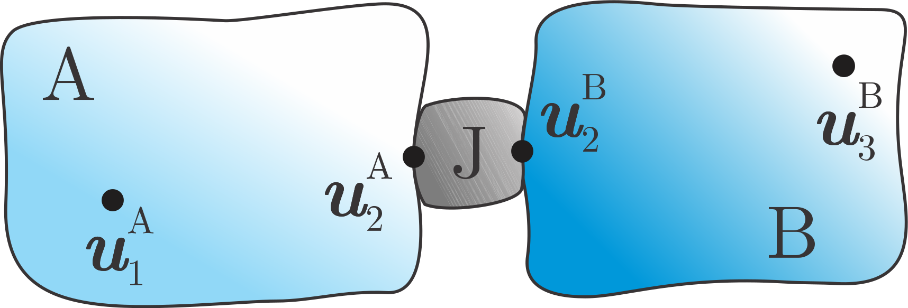
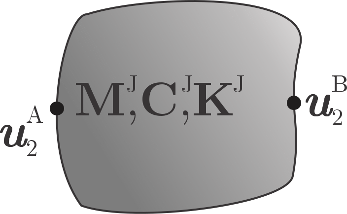
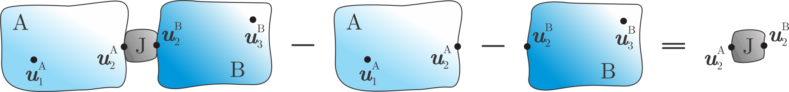
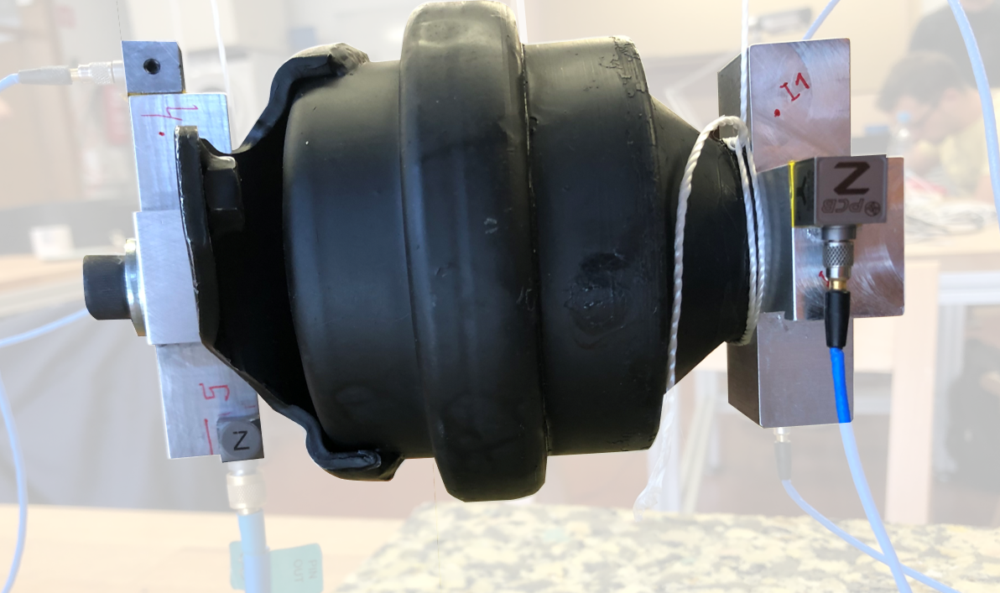
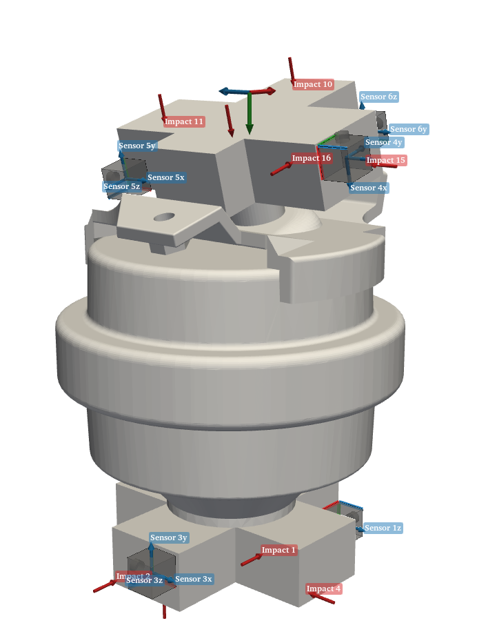

#############################
Rubber mount characterization
#############################

This example demonstrates Joint Identification with Frequency Based Substructuring techniques. 

.. note:: 
   Download example showing a Rubber Mount Characterization: :download:`19_rubber_mount_characterization.ipynb <../../../examples/19_rubber_mount_characterization.ipynb>`.

Joint identification
********************

Let's start with the features of a substructuring-based characterization:

* it is a black-box component-based characterization,
* it is relatively cheap and fast to perform,
* it can potentially cover a wide range of frequencies (> 1000 Hz),
* it can easily get to 6-DoF (6-to-6 DoFs system level dynamics).

The goal is to characterize the properties (or merely the dynamic effects) of a joint J connecting two components A and B. Consider the following illustration:

A dynamic approach considers the joint as a full dynamic component [1]_:

Dynamic decoupling consists in removing the dynamic contribution of components A and B from the measured assembled system AJB to retrieve the joint J:

Let us assume that all measurements are performed on interface DoFs :math:`(\star)_{22}`. 
The measured transfer function matrices of the assembled system :math:`\mathbf{Y}^\mathrm{AJB}_{22}` and the isolated substructures 
:math:`\mathbf{Y}^\mathrm{A|B}_{22}` (block-diagonal ensemble of :math:`\mathbf{Y}^\mathrm{A}_{22}` and :math:`\mathbf{Y}^\mathrm{B}_{22}`, i.e. 
:math:`\begin{bmatrix} \mathbf{Y}_{22}^\mathrm{A} & \mathbf{0}\\\mathbf{0} &  \mathbf{Y}_{22}^\mathrm{B}\end{bmatrix}`) 
can be inverted to retrieve the associated impedance counterparts:

.. math::
	\mathbf{Z}^\mathrm{AJB}_{22}=(\mathbf{Y}^\mathrm{AJB}_{22})^{-1}, \qquad \mathbf{Z}^\mathrm{A|B}_{22}=(\mathbf{Y}^\mathrm{A|B}_{22})^{-1}

.. warning::
	Inverting :math:`\mathbf{Y}^\mathrm{AJB}_{22}` (as well as :math:`\mathbf{Y}^\mathrm{A}_{22}` and :math:`\mathbf{Y}^\mathrm{B}_{22}`) is not equivalent to inverting the single elements of the measured datasets. Indeed, the latter will lead to so-called statically condensed versions of the quantities isolated after inversion of the full matrix.

By performing the *primal decoupling* we obtain [2]_:

.. math::
	\underbrace{\left[\begin{array}{cc}
	\mathbf{Z}_{2_\mathrm{A} 2_\mathrm{A}}^\mathrm{J} & \mathbf{Z}_{2_\mathrm{A} 2_\mathrm{B}}^\mathrm{J} \\
	\mathbf{Z}_{2_\mathrm{B} 2_\mathrm{A}}^\mathrm{J} & \mathbf{Z}_{2_\mathrm{B} 2_\mathrm{B}}^\mathrm{J} 
	\end{array}\right]}_{\mathbf{Z}_{2,2}^\mathrm{J}}=
	\underbrace{\left[\begin{array}{cc}
	\mathbf{Z}_{2_\mathrm{A} 2_\mathrm{A}}^\mathrm{A}+\mathbf{Z}_{2_\mathrm{A} 2_\mathrm{A}}^\mathrm{J} & \mathbf{Z}_{2_\mathrm{A} 2_\mathrm{B}}^\mathrm{J}\\
	\mathbf{Z}_{2_\mathrm{B} 2_\mathrm{A}}^\mathrm{J} & \mathbf{Z}_{2_\mathrm{B} 2_\mathrm{B}}^\mathrm{B} +\mathbf{Z}_{2_\mathrm{B} 2_\mathrm{B}}^\mathrm{J} 
	\end{array}\right]}_{\mathbf{Z}_{2 2}^\mathrm{AJB}}
	-\underbrace{\left[\begin{array}{cc}
	\mathbf{Z}_{2_\mathrm{A} 2_\mathrm{A}}^\mathrm{A} & \mathbf{0}\\
	\mathbf{0} &  \mathbf{Z}_{2_\mathrm{B} 2_\mathrm{B}}^\mathrm{B}
	\end{array}\right]}_{\mathbf{Z}_{2 2}^\mathrm{A|B}}

The same formulation can be implemented according to the *dual decoupling* by using directly measured FRFs:

.. math::
	\mathbf{Y}_{22}^\mathrm J=\left[\mathbf{I}-\mathbf{Y}\mathbf{B}^\mathrm{T}\left(\mathbf{B} \mathbf{Y} \mathbf{B}^\mathrm{T}\right)^{-1} \mathbf{B}\right] \mathbf{Y}, \qquad \mathbf{Y}=\left[\begin{array}{ccc}
	\mathbf{Y}_{22}^{\mathrm{AJB}} & \mathbf{0} & \mathbf{0} \\
	\mathbf{0} & -\mathbf{Y}_{22}^{\mathrm{A}} & \mathbf{0} \\
	\mathbf{0} & \mathbf{0} & -\mathbf{Y}_{22}^{\mathbf{B}}
	\end{array}\right]

where the signed Boolean matrix :math:`\mathbf{B}` imposes the matching interface DoFs between the A and B side of the interface connections between the assembled system and the two isolated substructures. 
A total of 2 interfaces are involved in the decoupling operation due to the dynamic nature of the joint.

Note the difference between primal and dual formulation:

* Primal: inversion + isolation with impedances,

* Dual: isolation with measured FRFs + inversion.

Cross-rubber-cross application
******************************

Impacting and measuring responses directly on the rubber mount is practically infeasible (if not for a limited amount of points and directions). 
Therefore, the need of some rigid fixtures (transmission simulators) that will act as subcomponents A and B in the assembly AJB.
The fixtures are designed here in the form of rigid crosses.

.. tip::
	The 'cross' shape is chosen to enable the excitation and measurement of all translations and all rotations at the connection to the rubber isolator
	The crosses should be light to not completely dominate the measured transfer functions and hinder the rubber effects
	The crosses should behave as rigid bodies in the frequency range of interest. This simplifies their modeling and guarantees the validity of the rigidity assumption underlying VPT

.. tip::
	What about the dynamic modeling of the crosses? 
	Several substructuring identification approaches rely on the dynamic models of the subcomponents. 
	All modeling approaches (analytical, finite element or experimental) are theoretically valid. 
	A direct experimental model of crosses is often a good choice because of its consistency with the assembled system model in terms of measurement setup and errors. 
	The shared inaccuracies will tend to be compensated for by removing A and B from AJB.

Example Datasests and 3D view
*****************************
In the following, an application of rubber characterization in pyFBS is presented. 
The mount to be identified is a common automotive isolator component:	

First, import the metafile with the geometrical information of sensors, channels, impacts and virtual points. 
The amount of impacts and sensors employed per each of the involved components (A, B and AJB) can be visualized by printing the corresponding variable.

.. note::
	Note that due to the coaxiality of the system, the 2 virtual points representing the 2 connecting interfaces are collocated in space.

Next, import the experimentally obtained FRF datasets. Note the FRF unit, :math:`\mathrm{m/N}` is prefered.
   
Virtual point transformation
****************************
The VPT can be performed on experimental data. See the :download:`04_VPT.ipynb <../../../examples/04_VPT.ipynb>` example for more options and details.
VP is first obtained for the full assembly AJB:

.. code-block:: python

	vpt = pyfbs.interface.VPT(df_chn,df_imp,df_vp,df_vpref,sort_grouping=True)
	vpt.apply_vpt(freq, Y_AJB)

	 Z_AJB = np.linalg.pinv(vpt.frf)

followed by the VP for individual crosses, A and B:

.. code-block:: python

	vpt.apply_vpt(freq, Y_A_B)

	Y_A = vpt.frf[:,:6,:6]
	Y_B = vpt.frf[:,6:,6:]

	Z_A = np.linalg.pinv(Y_A)
	Z_B = np.linalg.pinv(Y_B)
	
Primal decoupling
*****************
Primal decoupling removes the dynamics of the crosses from the assembled dynamics to isolate the rubber mount dynamics.

.. code-block:: python

	Z_A_B = np.zeros_like(Z_AJB)
	Z_A_B[:,:6,:6] = Z_A
	Z_A_B[:,6:,6:] = Z_B

	Z_J = Z_AJB - Z_A_B

.. code-block:: python

	pyfbs.display.plot_frf(freq, Z_J[:,:6,:6])

.. raw:: html

   <iframe src="../../_static/Z.html" height="500px" width="750px" frameborder="0"></iframe>

.. card:: That's a wrap!

    Want to know more, see a potential application? Contact us at info.pyfbs@gmail.com!

.. rubric:: References

.. [1] Meggitt, J. and Moorhouse, A. (2017). The in-situ decoupling of resiliently coupled sub-structures. In: ICSV - International Congress on Sound and Vibration.
.. [2] Haeussler, M., Klaassen, S., Rixen, D. J. (2020). Experimental twelve degree of freedom rubber isolator models for use in substructuring assemblies. In: Journal of Sound and Vibration 474.