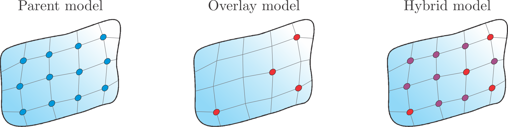
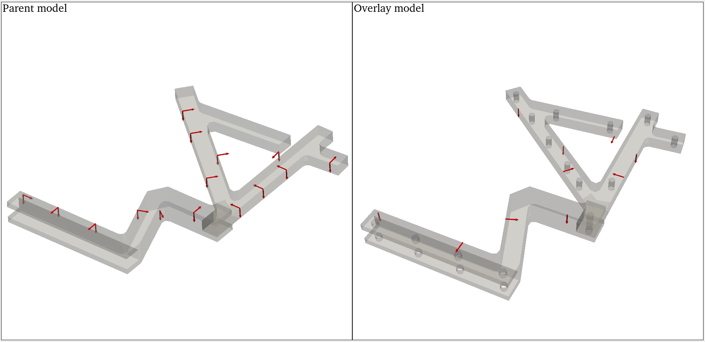

#############
System Equivalent Reduction Expansion Process
#############

.. note:: 
   Download example showing the use of model-mixing strategies: :download:`17_expansion_methods.ipynb <../../../examples/17_expansion_methods.ipynb>`

Before diving into the SEREP method let us introduce two equivalent models, denoted as the parent (par) and the overlay (ov). 
The naming convention is adopted from the original frequency-based SEMM implementation for consistency, even though the SEREP method was introduced decades earlier.
The expansion technique applies for equivalent models that are either purely numerical, experimental, or combined, provided that they meet the following characteristics: 

* Parent model: The inferior dynamic properties of this model are obtained in a dense set of DOFs.

* Overlay model: The superior dynamic properties of this model are obtained in a sparse set of DOFs.

The resulting hybrid model (hyb) is obtained by expanding the sparse overlay model's dynamics to the dense set of the parent model's DOFs.

For the following expanations, let us introduce the partitioning of the degrees of freedom. 
The dense set of the parent model's physical DOFs :math:`\pmb{u}^{(\mathrm{par})}` can be partitioned into the internal (:math:`i`) and the boundary subset (:math:`b`),  
of sizes :math:`n_i` and :math:`n_b`, respectively. 
The internal subset is unique to the dense set of DOFs, whereas the boundary subset is collocated with the sparse subset of the overlay model's 
DOFs :math:`\pmb{u}^{(\mathrm{ov})}`. Index :math:`g` is used to emphasize the combined set of internal and boundary DOFs.

The SEREP [1]_ technique is defined in the modal domain. The natural frequencies and damping ratios represent global modal parameters and are not
considered directly in the expansion process. In the hybrid model, these parameters are adopted by the overlay model. The expansion is peformed on the modeshapes,
where the boundary subset of the overlay model's modeshapes is expanded to the denser set of parent model's DOFs.

A set of mode shapes :math:`\mathbf{\Phi}^\mathrm{(par)} = \mathbf{\Phi}_g^\mathrm{(par)}` is considered as an expansion basis, used to expand the overlay model's
modeshapes :math:`\mathbf{\Phi}^\mathrm{(ov)}`. The parameters :math:`m^\mathrm{(par)}` and :math:`m^\mathrm{(ov)}` denote the corresponding number of modal vectors. 
The expanded hybrid model is then obtained as:

.. math::
  	\mathbf{\Phi}^\mathrm{(hyb)} = \mathbf{\Phi}_g^{(\mathrm{par})}\,\mathbf{\Phi}_b^{(\mathrm{par})\dagger}\,\mathbf{\Phi}_b^{(\mathrm{ov})}\,.

The original SEREP [1]_ methodology clearly distinguishes between a determined and an under-determined type, for which :math:`n_b \geq m^\mathrm{(par)}` 
and :math:`n_b < m^\mathrm{(par)}` hold, respectively. The methodology is effective for the determined type, where for :math:`n_b = m^\mathrm{(par)}` the hybrid modal 
vectors represent a solution of the determined problem, and for :math:`n_b > m^\mathrm{(par)}`, for which the solution of an over-determined problem is obtained 
in a least-squares sense. The under-determined type, on the other hand, although mathematically applicable, is considered to be of no practical use.

Example data import
*******************

To start with, a parent and an overlay modal model is defined consisting of natural frequencies, damping rations, and modeshapes. 
The datasets used in this example are from a laboratory testbench and are available directly within the :mod:`pyFBS`.

.. code-block:: python

   # number of modes
   # limited by m_par <= n_b, where n_b = 10
   m_par_SEREP = 9 
   # overlay - 2 kHz limit
   m_ov = 15

Overlay model
------------------
This example simulates the typical numerical-experimental modelling of a component. The overlay model is a (simulated experimental) beam-like structure with 16 
cylindrical holes. Two of them used for the fixed mounting.

.. code-block:: python

   eig_val_ov, xi_ov, eig_vec_ov = MK_O.transform_modal_parameters(df_chn_O, 
                                                                limit_modes = m_ov, 
                                                                modal_damping = dam_ov, 
                                                                return_channel_only = True)

Parent model
---------------
The parent model represents an approximate numerical counterpart of the overlay model, which is geometrically simplified by neglecting the holes, and the fixed boundary conditions are applied at the surfaces near the actual mounting holes.
A 5\% lower density and a 5\% higher Young's modulus is considered, compared to the overlay model.

.. code-block:: python

   eig_val_par_SEREP, xi_par_SEREP, eig_vec_par_SEREP = MK_P.transform_modal_parameters(df_chn_P,
                                                                   limit_modes = m_par_SEREP, 
                                                                   modal_damping = dam_par, 
                                                                   return_channel_only = True)

Application of SEREP
********************

The resulting hybrid modeshapes represent the expanded overlay model's modeshapes at the denser set of parent model's DOFs.

.. code-block:: python

   eig_vec_serep = pyFBS.SEREP(eig_vec_par_SEREP, eig_vec_ov, df_chn_P, df_chn_O)

.. tip::
   Note that a generalized inverse is performed in the calculation. For good results, ensure a low condition number of the :math:`\mathbf{\Phi}_b^{(\mathrm{par})}` matrix!

Finally, the results of the expanded hybrid model are compared to the reference using MAC.

.. raw:: html

   <iframe src="../../_static/serep_mac.html" height="270px" width="750px" frameborder="0"></iframe>

.. panels::
    :column: col-12 p-3

    **That's a wrap!**
    ^^^^^^^^^^^^

    Want to know more, see a potential application? Contact us at info.pyfbs@gmail.com!
   
.. rubric:: References

.. [1] O'CALLAHAN JC. System equivalent reduction expansion process. InProc. of the 7th Inter. Modal Analysis Conf., 1989.
