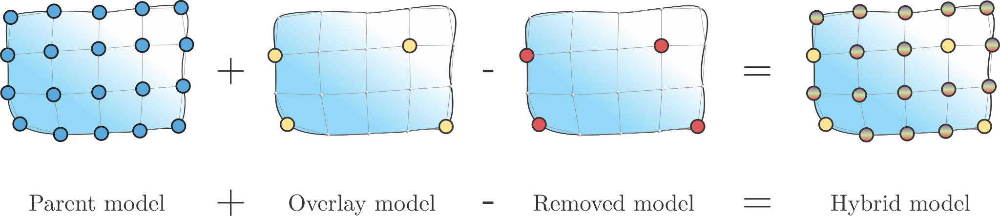
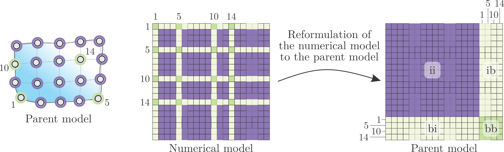
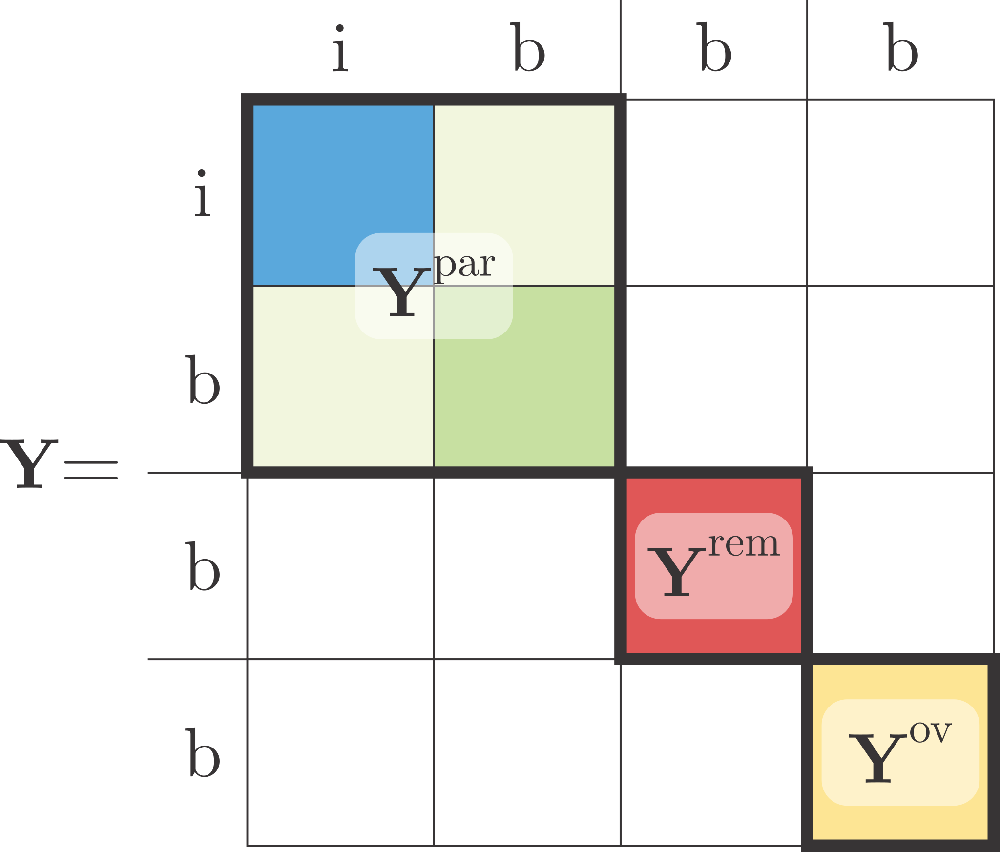
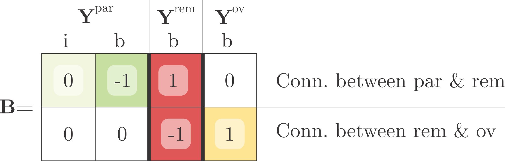
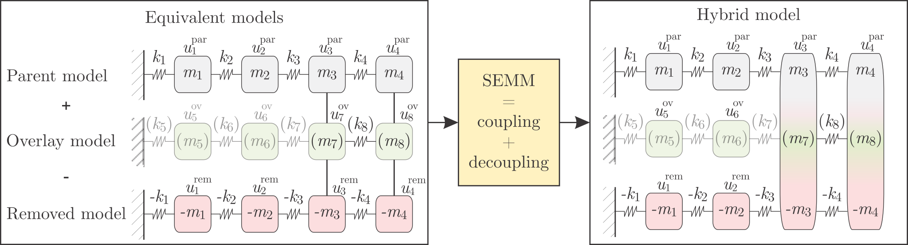

==============================
System Equivalent Model Mixing
==============================
With System Equivalent Model Mixing (SEMM), different dynamic models of the same system can be mixed into a single hybrid model using the Lagrange-multiplier frequency-based substructuring method. 
Hybrid model follows the dynamic behavior of a precise overlay model that is expanded to the all degrees of freedom of an equivalent parent model. 
Application of SEMM comprises the expansion of the experimental dynamics to the unmeasurable DoFs for use in coupling and decoupling processes, identification of inconsistent measurements in FBS, and improving the accuracy of the experimental response models.

.. only:: html

     .. figure:: ./../data/SEMM_result.png 
         :height: 150px
         :target: 05_SEMM.html

         SEMM example

.. toctree::
   :hidden:

   SEMM example

.. only:: html

     .. figure:: ./../data/id_algorithm.png 
         :height: 150px
         :target: 22_identification_algorithm.html

         Identification of inconsistent measurements

.. toctree::
   :hidden:

   22_identification_algorithm

|
|
|
|
|
|

System Equivalent Model Mixing (SEMM) was introduced by Klaassen et al [1]_ [2]_. 
The method forms a hybrid dynamic model by mixing equivalent (typically numerical and experimental) models of the same structure. 
The main goal of the method is to use the substructuring approach 
to expand the dynamics contained in a sparse overlay model :math:`\textbf{Y}^{\text{ov}}` 
onto a denser DoF space of a parent model :math:`\textbf{Y}^{\text{par}}`.

Conceptually the procedure is a two-step substructuring process, for which in the first step the experimental model 
is expanded to the denser DoF space by coupling the experimental and numerical model and then removing the excessive 
numerical contribution by introducing a decoupling of a removed model (which is a (sub)-model of the parent model).

Basic SEMM method
*****************

Typically, the interface in this process is considered as a set of all collocated DoFs on the parent and overlay model. 
Accordingly, the entire set of parent DoFs can be divided into internal (i) and boundary (b) subset of DoFs, 
for which the former is unique to the parent model and the latter is shared with the overlay (and removed) model.

In order to increase clarity, the same distribution will be taken into account when writing admittance matrices:

.. math::
    \mathbf{Y}^{\text{par}}\triangleq
		\begin{bmatrix}
			\mathbf{Y}_{\text{ii}}&\mathbf{Y}_{\text{ib}}\\
			\mathbf{Y}_{\text{bi}}&\mathbf{Y}_{\text{bb}}
		\end{bmatrix}^{\text{par}},\quad
		\mathbf{Y}^{\text{ov}}\triangleq
		\begin{bmatrix}
			\mathbf{Y}_{\text{bb}}
		\end{bmatrix}^{\text{ov}},\quad
		\mathbf{Y}^{\text{rem}}\triangleq
		\begin{bmatrix}
			\mathbf{Y}_{\text{bb}}
		\end{bmatrix}^{\text{par}}.

The LM-FBS equation is used to generate the hybrid model in the SEMM method. 
The block-diagonal equation of motion (incorporating the coupling and decoupling step) can be formulated as:

.. math::
    \begin{bmatrix}
			\boldsymbol{u}^{\text{par}}\\
			\boldsymbol{u}^{\text{rem}}\\
			\boldsymbol{u}^{\text{ov}}
		\end{bmatrix}
		=
		\begin{bmatrix}
			\mathbf{Y}^{\text{par}}& & \\
			&-\mathbf{Y}^{\text{rem}}& \\
			& &\mathbf{Y}^{\text{ov}}
		\end{bmatrix}
		\begin{bmatrix}
			\boldsymbol{f}^{\text{par}}\\
			\boldsymbol{0}\\
			\boldsymbol{0}
		\end{bmatrix}
		-
		\begin{bmatrix}
			\boldsymbol{g}^{\text{par}}\\
			\boldsymbol{g}^{\text{rem}}\\
			\boldsymbol{g}^{\text{ov}}
		\end{bmatrix}

Following the LM-FBS methodology, :math:`\boldsymbol{u}` represents the displacement vector and :math:`\boldsymbol{f}` represents 
the external force vector (with the latter only acting on the parent model). 
Vector :math:`\boldsymbol{g}` represents the interface forces between the equivalent models. 
The compatibility and equilibrium conditions are defined by the following equations:

.. math::
    \mathbf{B}\boldsymbol{u}=\mathbf{0},
		\\
		\boldsymbol{g}=-\mathbf{B}^{\text{T}}\,\boldsymbol{\lambda}

where the signed Boolean matrix is defined as:

.. math::
		\mathbf{B}=
		\begin{bmatrix}
			\mathbf{B}^{\text{par}}&\mathbf{B}^{\text{rem}}&\mathbf{B}^{\text{ov}}
		\end{bmatrix}
		=
		\left[
		\begin{array}{rr|r|r}
			\mathbf{0} & -\mathbf{I} & \mathbf{I} & \mathbf{0}\\
			\mathbf{0} & \mathbf{0} & -\mathbf{I} & \mathbf{I}	
		\end{array}
		\right].

The substructuring procedure can be performed using the well known LM-FBS formulation:

.. math::
    \overline{\mathbf{Y}}
		=
		\mathbf{Y}
		-
		\mathbf{Y}\,\mathbf{B}^{\text{T}}\,
		\left(\mathbf{B}\, \mathbf{Y}\,\mathbf{B}^{\text{T}}\right)^{-1} \,
		\mathbf{B}\, \mathbf{Y},

where

.. math::
	\mathbf{Y}
		\triangleq
		\begin{bmatrix}
			\mathbf{Y}^{\text{par}}& & \\
			&-\mathbf{Y}^{\text{rem}}& \\
			& &\mathbf{Y}^{\text{ov}}
		\end{bmatrix}.

In order to retain the primal DoFs, the dual formulation can be reformulated using the localization matrix, 
which results in a single-line form of the basic SEMM method:

.. math::
    \mathbf{Y}^{\text{SEMM}}=
		\begin{bmatrix}
			\mathbf{Y}
		\end{bmatrix}^{\text{par}}
		-
		\begin{bmatrix}
			\mathbf{Y}_{\text{ib}}\\
			\mathbf{Y}_{\text{bb}}
		\end{bmatrix}^{\text{par}}
		%\,
		\left( \mathbf{Y}^{\text{rem}}\right) ^{-1}
		%\,
		\left( \mathbf{Y}^{\text{rem}}-\mathbf{Y}^{\text{ov}}\right)
		%\,
		\left( \mathbf{Y}^{\text{rem}}\right)^{-1}
		%\,
		\begin{bmatrix}
			\mathbf{Y}_{\text{bi}}&\mathbf{Y}_{\text{bb}}
		\end{bmatrix}^{\text{par}}.

.. tip::
	Note how the overlay admittance matrix :math:`\textbf{Y}^{\text{ov}}` is not inverted in the single-line formulation of basic SEMM? 
	In cases when overlay model is obtained through experimental testing this proves to be especially convinient, as, unlike in 
	classic FBS coupling, ill-conditioning due to experimental errors does not amplify in the inversion.

.. warning::
	When mixing equivalent models using basic SEMM, a common occurrence is the presence of spurious peaks at the internal DoFs of the hybrid model. 
	These peaks correspond neither the eigenfrequencies of the overlay nor the parent model. 

Why spurious peaks appear in the hybrid model?
==============================================

In order to be able to answer to this question, let's have a 
look at the physical model of a simple 4-DoF system. Three equivalent models are formed, but the 
dynamics of the overlay and the removed model are only obtained at the boundary DoF (thus its internal DoFs are presented transparent).

.. note::
	It turns out out that the hybrid model generated with SEMM is actually an 8-DoF system, even though it is collected at the 4 parent-related DoFs. 
	Thus, it is reasonable to expect the hybrid model has 8 natural frequencies and corresponding modes. 
	Compared to the overlay dynamics, this is a source of the spurious modes.

Extension of SEMM method - extended interface
*********************************************

As already established in decoupling applications, extending the interface can prove beneficial 
for the substructuring prediction. 
Therefore, Klaassen [1]_ has proposed an extension to the method, where the compatibility and equilibrium conditions 
in the decoupling step (parent - removed) are extended to the full (internal + boundary) set of DoFs.

Such a formulation has been proven to be able to eliminate the problem with spurious peaks. 
This ability is essential to improve the method's applicability. 
If the removed interface is extended to all the internal DoFs, then the removed model has the following form:

.. math::
    \mathbf{Y}^{\text{rem}}=
		\begin{bmatrix}
			\mathbf{Y}_{\text{ii}}&\mathbf{Y}_{\text{ib}}\\
			\mathbf{Y}_{\text{bi}}&\mathbf{Y}_{\text{bb}}
		\end{bmatrix}^{\text{par}}.

The equation of motion remains the same as in the basic formulation, 
only the removed model is extended to the internal DoFs:

.. math::
    \overline{\mathbf{Y}}
		=
		\mathbf{Y}
		-
		\mathbf{Y}\,\mathbf{B}^{\text{T}}\,
		\left(\mathbf{B}\, \mathbf{Y}\,\mathbf{B}^{\text{T}}\right)^{-1} \,
		\mathbf{B}\, \mathbf{Y},
		\text{ where: }
		\mathbf{Y}
		\triangleq
		\begin{bmatrix}
			\mathbf{Y}^{\text{par}}& & \\
			&-\mathbf{Y}^{\text{rem}}& \\
			& &\mathbf{Y}^{\text{ov}}
		\end{bmatrix}.

The final version of the fully extended SEMM method can also be written in a single-line notation 
where relations defined in matrix :math:`\textbf{B}` are directly applied:

.. math::
    \mathbf{Y}^{\text{SEMM}}=
		\mathbf{Y}^{\text{par}}
		-
		\mathbf{Y}^{\text{par}}
		%\,
		\left( \begin{bmatrix} \mathbf{Y}_{\text{bi}}&\mathbf{Y}_{\text{bb}}\end{bmatrix}^{\text{rem}}\right ) ^{+}
		%\,
		\left( \mathbf{Y}^{\text{rem}}_{\text{bb}}-\mathbf{Y}^{\text{ov}}\right)
		%\,
		\left( \begin{bmatrix} \mathbf{Y}_{\text{ib}}\\ \mathbf{Y}_{\text{bb}}\end{bmatrix}^{\text{rem}}\right ) ^{+}
		%\,
		\mathbf{Y}^{\text{par}}.

.. note::
    In the case of a fully extended formulation of the SEMM method, special attention must be paid to the manipulation 
    of the interface matrix that is inverted during decoupling. 
    It turns out that this matrix is always singular, so the inverse does not exist. 
    The problem is solved by using a pseudoinverse instead which enables the inversion of the matrix and hence the calculation 
    of the response of the hybrid model.

.. warning::
    Due to the use of pseudoinverse, the connections between equivalent models are no longer perfect. Therefore, in the hybrid model, 
    duplicated DoFs do not have the same response. It turns out that the only real response that reflects the 
    experimental model most accurately is the response at the DoFs of the parent model.	This is already considered in the single line notation of the fully extended SEMM.

.. tip::
	SEMM has been successfully employed in a variety of applications, such as dynamic coupling
	within frequency-based substructuring [3]_ and substructuring-based joint identification [4]_. 
	Another possible application of the expansion method is the detection of inconsistent measurements,
	which was implemented in [5]_ [6]_.
	Although the framework is typically considered for experimental-numerical hybrid modeling, the same procedure can be
	applied for purely experimental applications, such as improving full-field high-speed [7]_ or acoustic [8]_ camera
	measurements. 

.. rubric:: References

.. [1] Klaassen SW, van der Seijs MV, de Klerk D. System equivalent model mixing. Mechanical Systems and Signal Processing. 2018 May 15;105:90-112.
.. [2] Klaassen SW, van der Seijs MV. Introducing semm: A novel method for hybrid modelling. InDynamics of Coupled Structures, Volume 4 2018 (pp. 117-125). Springer, Cham.
.. [3] Pasma E, Klaassen S, Nieuwenhuijse L, Van Der Seijs M, Lennström D. Application of system equivalent model mixing (SEMM) to model the structural dynamic properties of a complex vehicle component using numerical and experimental data. Proceedings of ISMA2018. 2018.
.. [4] Klaassen SW, Rixen DJ. Using SEMM to Identify the Joint Dynamics in Multiple Degrees of Freedom Without Measuring Interfaces. InDynamic Substructures, Volume 4 2020 (pp. 87-99). Springer, Cham.
.. [5] Kodrič M, Čepon G, Boltežar M. Experimental framework for identifying inconsistent measurements in frequency-based substructuring. Mechanical Systems and Signal Processing. 2021 Jun 1;154:107562.
.. [6] Saeed Z, Firrone CM, Berruti TM. Joint identification through hybrid models improved by correlations. Journal of Sound and Vibration. 2021 Mar 3;494:115889.
.. [7] Bregar T, Zaletelj K, Čepon G, Slavič J, Boltežar M. Full-field FRF estimation from noisy high-speed-camera data using a dynamic substructuring approach. Mechanical Systems and Signal Processing. 2021 Mar 1;150:107263.
.. [8] Ocepek D, Kodrič M, Čepon G, Boltežar M. On the estimation of structural admittances from acoustic measurement using a dynamic substructuring approach. Applied Acoustics. 2021 Sep 1;180:108115.