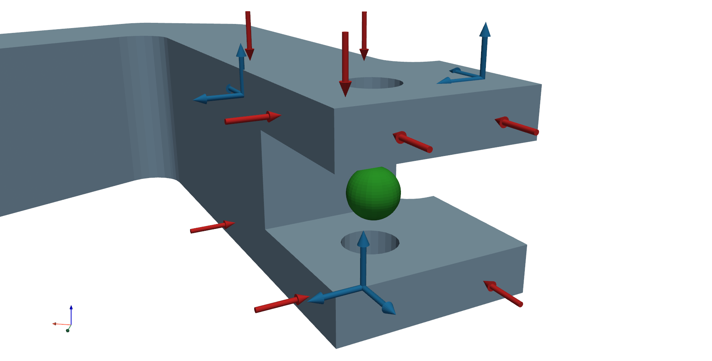
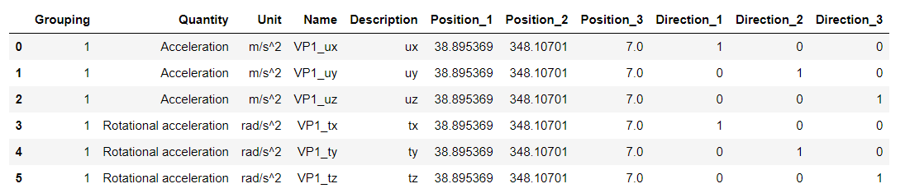

============================
VPT example
============================
Virtual point transformation (VPT) projects measured dynamics (input and output signals) into a subspace composed by the predefined interface deformation modes (IDMs) [1]_. 
By default, only 6 rigid IDMs are used in the transformation, thus retaining only the dynamics loading the surrounded interface in a purely rigid manner. 
Rigid IDMs can also be extended by the user with flexible interface modes.
Current implementation of the :class:`pyFBS.VPT` additionaly supports the expansion where directly measured rotational response is included in the transformation [2]_. 

.. note:: 
   Download example showing the basic use of the VPT: :download:`04_VPT.ipynb <../../../examples/04_VPT.ipynb>`
   
Consider an example for the VPT where 9 impacts and 9 channels (3 tri-axial accelerometers) are positioned around the interface:

.. tip::
	For the VP with 6 DoFs it is common practice to use 9 impacts and 9 channels around the interface. 
	Larger number of impacts/channels is encouraged but the required experimental effort is increased.
	By increasing the number of measurements over the VP DoFs the benefits are two-hand: 
	observability and controlability of the interface is better, and the measurement errors 
	(bias errors due to sensor misalignement and uncorrelated measurement noise) are filtered our from the VP to some extend. 

   
***************************
Interface deformation modes
***************************

.. tip::
	It is advised impacts and channels are evenly distributed across the interface for better controlability and observability of the VP DoFs.
	Even distribution should be ensured in terms of positions and directions as well.
	Also ensure that impacts and channels do not point straight to the VP in order to generate rotational response and moment around the VP.

For the VPT, positional data is required for channels (``df_chn_up``), impacts (``df_imp_up``) and for virtual points (``df_vp`` and ``df_vpref``). 
Positioning can be performed using interactive positioning or imported from Excel datasheets.

.. tip::
	Placing sensors closer to VP reduces the effects of flexible IDMs. 
	However, with a decreased distance the uncertainties associated with the position and orientation are increased.
	Therefore, sensor should be mounted on the strcture with great care.
	Using accelerometer faces as impact locations is discouraged as sensor overload is quickly reached in this manner.

While performing VPT, special care should be put into determining ``Grouping`` number and DoFs ``Description``. 
The ``Description`` tells which DoFs you would like to reconstruct using VPT. 
``Grouping`` number organizes which impacts and sensors belong to which virtual point. 
Arbitrary number of VPs can be reconstructed at once if grouping numbers are properly defined.

After the positions are defined a class instance of :class:`pyFBS.VPT` can be created.

.. code-block:: python

	vpt = pyFBS.VPT(df_chn_up,df_imp_up,df_vp,df_vpref)

Interface displacement reduction :func:`pyFBS.VPT.define_IDM_U` and interface force reduction :func:`pyFBS.VPT.define_IDM_F` are directly defined. 
Both reduction matrices are avialable as class variables ``vpt.Tu`` and ``vpt.Tf``.

**********************
Application of the VPT
**********************
After the reduction matrices are defined the VPT can be applied directly on an FRF matrix.

.. code-block:: python

		vpt.apply_VPT(freq,FRF)

Transformed FRF matrix is then available as a class variable ``vpt.vptData``.

.. raw:: html

   <iframe src="../../_static/FRF_VP.html" height="500px" width="750px" frameborder="0"></iframe>

.. tip::
	Check driving-point FRFs if passivity criterion is met by simply clicking on corresponding circles.

Reciprocity check is also already implemented in pyFBS:

.. code-block:: python

	reciprocity = pyFBS.coh_on_FRF(vpt.vptData[:,:6,:6])

.. raw:: html

   <iframe src="../../_static/VP_rec.html" height="270px" width="350px" frameborder="0"></iframe>

******************************
Measurement quality indicators
******************************

One of the primary advantages of the VPT is also the ability to evaluate consistency of the performed measurements. 
Measurement consistency is evaluated by expanding the reduced virtual DoFs back to the original DoFs and comparing them with the measured ones.

.. code-block:: python

		vpt.consistency([1],[1])
		
If the interface would be perfectly rigid, the filtered response would be equal to the measured one. 
However, if the interface is not completely rigid or if predetermined positions and orientations are not perfect, the filtered response will vary from the measured response.

Both channel/sensor (``vpt.specific_sensor`` and ``vpt.overall_sensor``) and impact (``vpt.specific_impact`` and ``vpt.overall_impact``) consistency can be evaluated after the transformation. 

.. raw:: html

   <iframe src="../../_static/VP_spec_cons.html" height="290px" width="600px" frameborder="0"></iframe>

.. warning::
	A low value of quality indicators indicates inconsistent measurements. 
	Always check if sensor/impacts are correctly positioned, orientated, sensors' sensitivity is correct, responses do not exceed sensors range, etc. 
	Low values could also indicate flexible interface behaviour; in that case, check CMIF value [3]_ if rigid IDMs are in fact dominant.

.. tip::
	Take A LOT of pictures of your experiment in case you need to correct some sensor positions or orientations later.

.. panels::
    :column: col-12 p-3

    **That's a wrap!**
    ^^^^^^^^^^^^

    Want to know more, see a potential application? Contact us at info.pyfbs@gmail.com!

.. rubric:: References

.. [1] de Klerk D, Rixen DJ, Voormeeren SN, Pasteuning P. Solving the RDoF problem in experimental dynamic sybstructuring. InInternational modal analysis conference IMAC-XXVI 2008 (pp. 1-9).
.. [2] Tomaž Bregar, Nikola Holeček, Gregor Čepon, Daniel J. Rixen, and Miha Boltežar. Including directly measured rotations in the virtual point transformation. Mechanical Systems and Signal Processing, 141:106440, July 2020.
.. [3] Allemang RJ, Brown DL. A complete review of the complex mode indicator function (CMIF) with applications. InProceedings of ISMA International Conference on Noise and Vibration Engineering, Katholieke Universiteit Leuven, Belgium 2006 Sep (pp. 3209-3246).