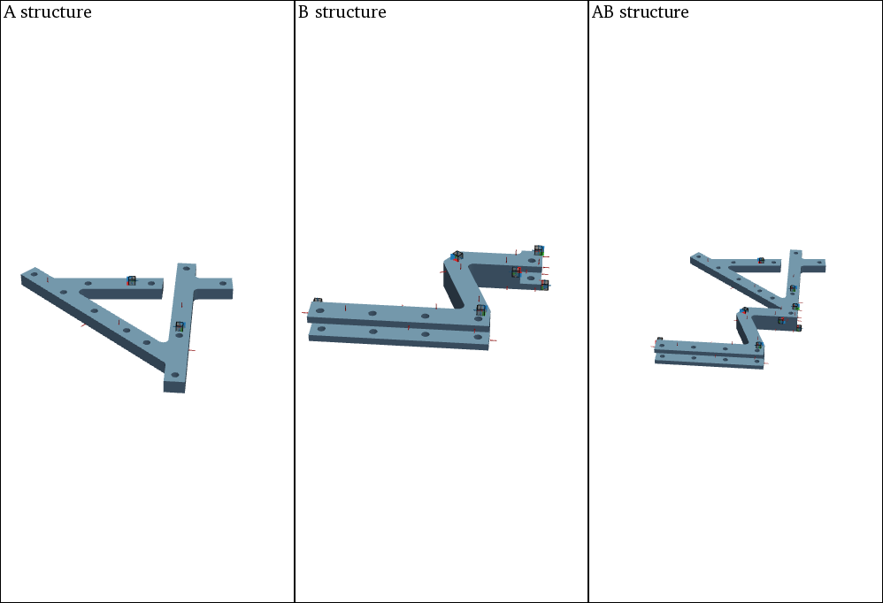
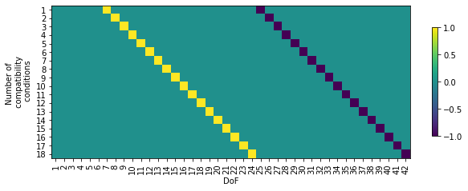
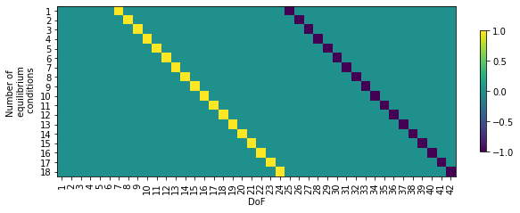

##############
VPT Decoupling
##############

The decoupling of susbtructures is performed in a similar fashion as the coupling, with the only difference that a minus sign 
must be applied on the subsystem to be decoupled. The operation is also based on the Lagrange-Multiplier Frequency-Based Substructuring (LM-FBS) [1]_
formulation. In the following, a basic decoupling of two numerically-generated substructures is presented. 
The virtual point transformation [2]_ is applied to impose collocated matching DoFs at the interface. 
This can also be performed analogously with experimentally acquired data.

.. note:: 
   Download example showing a substructure decoupling application: :download:`08_decoupling_VPT.ipynb <../../../examples/08_FBS_decoupling_VPT.ipynb>`
    
.. tip::
    Why use virtual point when decoupling substructures?

    * Complex interfaces are very often inaccessible for the measurement equipment. Therefore measurements are often performed away from the actual interface. Also, the collocation of DoFs at the neighboring interfaces is almost impossible to ensure. Virtual point, on the other hand, can be defined in an arbitrary location at the interface that coincides for all substructures.
    * Virtual point accounts for rotational degrees of freedom, which are mandatory for the successful decoupling of the substructures. 
    * By the reduction of measurements to the virtual point the interface problem is weakened. That means that compatibility and equilibrium conditions on the measured DoFs are a bit more relaxed. In this manner, unwanted stiffening effects can be avoided. 
    * Due to the reduction, measurement errors such as bias from sensor positioning or uncorrelated measurement noise are filtered out to some extend.
 

Example Datasets and 3D view
****************************

Load the required predefined datasets and open the 3D viewer in the background as already shown in `Static display example <https://pyfbs.readthedocs.io/en/master/examples/basic_examples/01_static_display.html>`_. Also for decoupling, a subplot representation, as already presented in `Coupling <https://pyfbs.readthedocs.io/en/master/examples/fbs/07_coupling.html>`_, can be used.
    

   
.. tip::
    With ``pyFBS`` you can simply prepare the experiments before hand! 
    Position your virtual accelerometers and sensors on 3D model, generate numerical FRFs and make sure that everything is in order. 
    Then, perform your experiment, following the sensor setup you prepared in your virtual example. 
    Simply replace numerical FRFs with experimental ones, and results are only few clicks away!
..    
    Numerical model
    ***************
    Load the corresponding .full and .ress file from the example datasets. For more information on .full and .ress files refer to the :download:`03_FRF_synthetization.ipynb <../../../examples/03_FRF_synthetization.ipynb>` example

    .. code-block:: python

        full_file_AB = r"./lab_testbench/FEM/AB.full"
        ress_file_AB = r"./lab_testbench/FEM/AB.rst"

        full_file_B = r"./lab_testbench/FEM/B.full"
        ress_file_B = r"./lab_testbench/FEM/B.rst"

        full_file_A = r"./lab_testbench/FEM/A.full"
        ress_file_A = r"./lab_testbench/FEM/A.rst"
        
    Create an MK model for each component:

    .. code-block:: python

        MK_A = pyFBS.MK_model(ress_file_A,full_file_A,no_modes = 100,allow_pickle= True,recalculate = False)
        MK_B = pyFBS.MK_model(ress_file_B,full_file_B,no_modes = 100,allow_pickle= True,recalculate = False)
        MK_AB = pyFBS.MK_model(ress_file_AB,full_file_AB,no_modes = 100,allow_pickle= True,recalculate = False)
        
    Update locations of channels and impacts to snap to the nearest FE node.

    .. code-block:: python

        df_chn_A_up = MK_A.update_locations_df(df_chn_A)
        df_imp_A_up = MK_A.update_locations_df(df_imp_A)

        df_chn_B_up = MK_B.update_locations_df(df_chn_B)
        df_imp_B_up = MK_B.update_locations_df(df_imp_B)

        df_chn_AB_up = MK_AB.update_locations_df(df_chn_AB)
        df_imp_AB_up = MK_AB.update_locations_df(df_imp_AB)
        
    Perform the FRF sythetization for each component based on the updated locations.

    .. code-block:: python

        MK_A.FRF_synth(df_chn_A_up,df_imp_A_up,f_start = 0,modal_damping = 0.003)
        MK_B.FRF_synth(df_chn_B_up,df_imp_B_up,f_start = 0,modal_damping = 0.003)
        MK_AB.FRF_synth(df_chn_AB_up,df_imp_AB_up,f_start = 0,modal_damping = 0.003)
    
Virtual point transformation
****************************
.. tip::
    It would be impractical to measure interface admittance for both substructures in multiple DoFs at the interface and furthermore ensure, 
    that these DoFs are perfectly collocated. Therefore we adopt VPT in order to obtain a collocated full-DoF interface admittance matrix for each substructure.

The VPT can be performed directly on the generated data. See the :download:`04_VPT.ipynb <../../../examples/04_VPT.ipynb>` example for more options and details.

.. code-block:: python

    df_vp = pd.read_excel(pos_xlsx, sheet_name='VP_Channels')
    df_vpref = pd.read_excel(pos_xlsx, sheet_name='VP_RefChannels')

    vpt_AB = pyFBS.VPT(df_chn_AB_up,df_imp_AB_up,df_vp,df_vpref)
    vpt_B = pyFBS.VPT(df_chn_B_up,df_imp_B_up,df_vp,df_vpref)
    
Apply the defined VP transformation on the FRFs:

.. code-block:: python

    vpt_AB.apply_VPT(MK_AB.freq,MK_AB.FRF)
    vpt_B.apply_VPT(MK_B.freq,MK_B.FRF)
    
Extract the requried FRFs and the frequency vector:

.. code-block:: python

    freq = MK_AB.freq
    Y_AB = vpt_AB.vptData
    Y_B = vpt_B.vptData
    
LM-FBS Decoupling
*****************
First, construct an admittance matrix for the uncoupled system, containing substructure admittances. 
Note that the operation is equivalent to the one performed for the coupling case with the difference that a minus sign here is applied on the subsystem to be decoupled.

.. math::
    \mathbf{Y}^\text{AB|B} = \begin{bmatrix} 
    \mathbf{Y}^\text{AB} & \mathbf{0} \\
    \mathbf{0} & -\mathbf{Y}^\text{B}
    \end{bmatrix}

.. code-block:: python

    Y_ABnB = np.zeros((Y_AB.shape[0],Y_AB.shape[1]+Y_B.shape[1],Y_AB.shape[2]+Y_B.shape[2]), dtype=complex)

    Y_ABnB[:,:Y_AB.shape[1],:Y_AB.shape[2]] = Y_AB
    Y_ABnB[:,Y_AB.shape[1]:,Y_AB.shape[2]:] = -1*Y_B

Next the compatibility and the equilibrium conditions has to be defined through the signed Boolean matrices ``Bu`` and ``Bf``. 

.. math::
    \mathbf{B}_\text{u}\,\boldsymbol{u} = \mathbf{0}

.. math::
    \boldsymbol{g} = - \mathbf{B}_\text{f}^\text{T} \boldsymbol{\lambda}

Make sure that the correct DoFs are selected for the decoupling. For this case, the interface is extended to the internal DoFs common to both AB and B, 
making in total 6 + 12 compatibility and equilibrium conditions. 
Adding compatibility and equilibrium at the internal DoFs contributes to increase the observability and controllability 
of the interface dynamics [3]_.

.. code-block:: python

    k = 6 + 12 

    Bu = np.zeros((k,Y_AB.shape[1]+Y_B.shape[1]))
    Bu[:k,6:6+k] = 1*np.eye(k)
    Bu[:k,24:24+k] = -1*np.eye(k)

    Bf = np.zeros((k,Y_AB.shape[1]+Y_B.shape[1]))
    Bf[:k,6:6+k] = 1*np.eye(k)
    Bf[:k,24:24+k] = -1*np.eye(k)
    

    
For the LM FBS method, having defined :math:`\mathbf{Y^{\text{AB|B}}}`, :math:`\mathbf{B}_\text{u}` and :math:`\mathbf{B}_\text{f}` is already sufficient to perform coupling:

.. math::
    \mathbf Y^{\text{A}} = \mathbf Y^{\text{AB|B}} - \mathbf Y^{\text{AB|B}}\,\mathbf B^\mathrm{T} \left( \mathbf B \mathbf Y^{\mathrm{AB|B}} \mathbf{B}^\mathrm{T} \right)^{-1} \mathbf B \mathbf Y^\text{AB|B}

.. code-block:: python

    Y_An = np.zeros_like(Y_ABnB,dtype = complex)

    Y_int = Bu @ Y_ABnB @ Bf.T
    Y_An =Y_ABnB - Y_ABnB @ Bf.T @ np.linalg.pinv(Y_int) @ Bu @ Y_ABnB
    
Results
*************
First extract the FRFs at the reference DoFs:

.. code-block:: python

    arr_coup = [0,1,2,3,4,5]
    Y_A_coupled = Y_An[:,arr_coup,:][:,:,arr_coup]
    Y_A_ref = MK_A.FRF
    
The decoupled and the reference results can then be compared and evaluated:
   
.. raw:: html

   <iframe src="../../_static/VP_decoupling.html" height="500px" width="750px" frameborder="0"></iframe>
   
.. card:: That's a wrap!

    Want to know more, see a potential application? Contact us at info.pyfbs@gmail.com!

.. rubric:: References

.. [1] de Klerk D, Rixen DJ, Voormeeren SN. General framework for dynamic substructuring: history, review and classification of techniques. AIAA journal. 2008 May;46(5):1169-81.
.. [2] van der Seijs MV, van den Bosch DD, Rixen DJ, de Klerk D. An improved methodology for the virtual point transformation of measured frequency response functions in dynamic substructuring. In4th ECCOMAS thematic conference on computational methods in structural dynamics and earthquake engineering 2013 Jun (No. 4).
.. [3] Voormeeren SN, Rixen DJ. A family of substructure decoupling techniques based on a dual assembly approach. Mechanical Systems and Signal Processing. 2012 Feb 1;27:379-96.