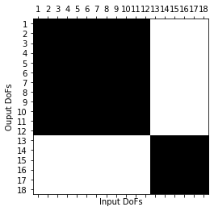
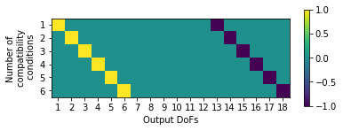
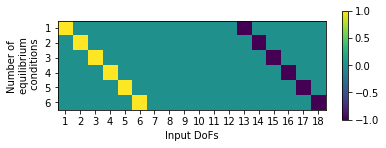

##############
SVT Decoupling
##############

pyFBS has implemented the novel SVD-based approach for interface reduction in LM-FBS. The SVT is the first engineering tool to tackle the issue of flexible interfaces in lightly damped system for experimental frequency-based substructuring. The methodology can be applied without any knowledge of system geometry and treat efficiently measurement error by combining reduction, filtering and regularization in a single transformation step.

.. note:: 
   Download example showing a substructure decoupling application with SVT: :download:`09_FBS_decoupling_SVT.ipynb <../../../examples/09_FBS_decoupling_SVT.ipynb>`
    
Example Datasets and 3D view
****************************

Load the required predefined datasets and open the 3D viewer in the background as already shown in `Static display example <https://pyfbs.readthedocs.io/en/master/examples/basic_examples/01_static_display.html>`_. Also for decoupling, a subplot representation, as already presented in `Coupling <https://pyfbs.readthedocs.io/en/master/examples/fbs/07_coupling.html>`_, can be used.
    
.. figure:: ./../data/eight_three.png
   :width: 500px
   
    
Experimental model
******************
Load the experimental measurements file from the example datasets.

.. code-block:: python

	exp_A = r"./lab_testbench/Measurements/Y_A.p"
	exp_B = r"./lab_testbench/Measurements/Y_B.p"
	exp_AB = r"./lab_testbench/Measurements/Y_AB.p"

	freq, _Y_A_exp = np.load(exp_A, allow_pickle = True)
	_, _Y_B_exp = np.load(exp_B, allow_pickle = True)
	_, _Y_AB_exp = np.load(exp_AB, allow_pickle = True)

	Y_A_exp = np.transpose(_Y_A_exp, (2, 0, 1))
	Y_B_exp = np.transpose(_Y_B_exp, (2, 0, 1))
	Y_AB_exp = np.transpose(_Y_AB_exp, (2, 0, 1))
	

Singular vector transformation
******************************
The SVT can be performed directly on the measured data. Make sure that input and output DoFs involved in the transformation are the same in the subsystem to be decoupled (B) and the assembled system (AB). Furthermore, the same reduction spaces must be used for both the systems (B and AB) in order to guarantee a proper compatibility and equilibrium. The reduced singular subspaces are extracted from the subsystem B and a number of 6 DoFs is used.

.. code-block:: python

	k = 6
	svt = pyFBS.SVT(df_chn_B,df_imp_B,freq,Y_B_exp,[1,10],k)
	
    
Apply the defined SVT to systems B and AB:

.. code-block:: python

	_,_,FRF_B_sv= svt.apply_SVT(df_chn_B,df_imp_B,freq,Y_B_exp)
	_,_,FRF_AB_sv= svt.apply_SVT(df_chn_AB,df_imp_AB,freq,Y_AB_exp)

LM-FBS Decoupling
*****************
The uncoupled global admittance is constructed using the transformed FRF datasets and imposing the decoupling operation 
through the minus sign. 

.. code-block:: python

  	Y_AB_un = np.zeros((len(freq),2*k+6,2*k+6),dtype = complex)

	Y_AB_un[:,0:2*k,0:2*k] = FRF_AB_sv
	Y_AB_un[:,2*k:,2*k:] = -1*FRF_B_sv

	plt.spy(np.abs(Y_AB_un[100])) # display at arbitrary frequency to check for shape

The compatibility and the equilibrium conditions are defined via the signed Boolean matrices.

.. code-block:: python

	Bu = np.zeros((k,2*k+6))
	Bu[:k,0:k] = 1*np.eye(k)
	Bu[:k,2*k:2*k+6] = -1*np.eye(k)

	Bf = Bu
    

   
Apply the LM-FBS based on the defined compatibility and equilibrium conditions.

.. code-block:: python

	Y_int = Bu @ Y_AB_un @ Bf.T
	Y_A_dec  = Y_AB_un - Y_AB_un @ Bf.T @ np.linalg.pinv(Y_int) @ Bu @ Y_AB_un

Results
*******

First extract the FRFs at the reference DoFs:

.. code-block:: python

	arr_ = [6,7,8,9,10,11]
	Y_A_LMFBS = Y_A_dec[:,arr_,:][:,:,arr_]
	Y_A_ref = Y_A_exp
    
The decoupled and the reference results for A can be compared:
   
.. raw:: html

   <iframe src="../../_static/decoupling_SVT.html" height="500px" width="750px" frameborder="0"></iframe>

.. panels::
    :column: col-12 p-3

    **That's a wrap!**
    ^^^^^^^^^^^^

    Want to know more, see a potential application? Contact us at info.pyfbs@gmail.com!