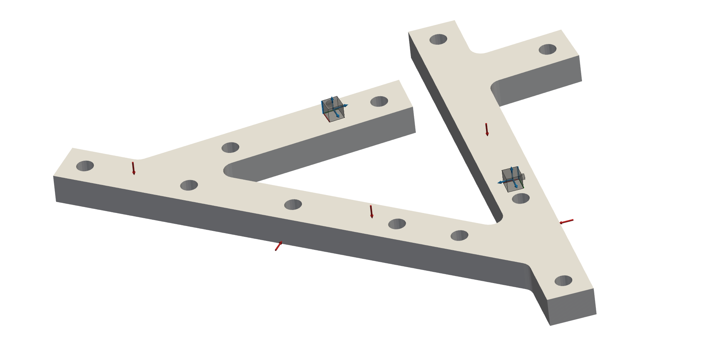
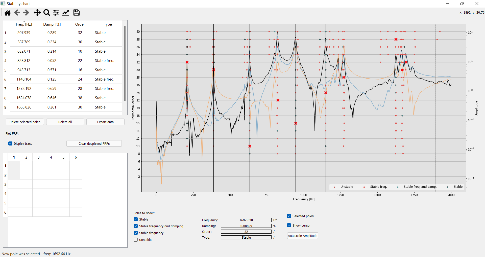

#################################
Experimental modal analysis (EMA)
#################################
A latest edition to pyFBS is also a functionality to perform multi-reference experimental modal analyis. 
``modal_id`` object enables frequency domain identification for modal parameter estimation as a combination 
of poly-reference Least-Squares Complex Frequency (pLSCF) and Least-Squares Frequency Domain (LSFD) methods [1]_.
The applicability of the function is depicted in this example using real experimental data, also available directly within the pyFBS.

.. note:: 
   Download example showing an Experimental Modal Analysis (EMA) application: :download:`20_modal_id.ipynb <../../../examples/20_modal_id.ipynb>`

Example Datasests and 3D display
********************************

Load the required predefined datasets. Open a 3Dviewer in the background. Add the STL file of the assembly to the 3D display:

pLSCF
********************************
   
First, initialize ``modal_id`` class and perform the pLSCF calculation of system's poles and modal participation factors. 
Modal_id takes two arguments, frequency vector and frequency response function matrix. 
You can define maximum polynomial order, order step and stabilization criterions of your convinience.

.. code-block:: python

   _id = pyFBS.modal_id(freq, Y_AB_exp)
   _id.pLSCF(max_order=60)

Stable poles are selected using stability chart. 
Poles at each order are then presented to the user in a form of stabilization chart. 
Poles are divided into four groups: unstable (also called new) poles, poles stable in frequency, poles stable in frequency and damping ratio and poles stable in frequency, 
damping ratio and modal participation factors. 

.. code-block:: python

   _id.stabilization()

.. tip::
   Pole selection is not the only feature that stability chart offers. You can also export selected poles with their associated modal parameters in a form of an Excel 
   datasheet by clicking on ``Export data``. To make pole selection as easy as possible, you can adapt the plot at your likings by showing/hiding specific 
   FRFs and pole groups. Plus, you can always return back to the stability chart to redefine your pole selection and then run the code onwards to see the 
   results of your modal identification.

pLSFD
********************************

Based on user selection, selected poles and modal participations factors are then feed to the LSFD estimator. 
From the LSFD, modal residues, upper- and lower-residuals are estimated.

.. code-block:: python

   _id.pLSFD(lower_residuals=False)

.. tip::
   Within ``pLSFD`` function, you can also reconstruct FRFs directly from identified modal parameters. 
   This is done by default. 
   It can be useful to compare reconstructed FRF with measured ones, to visually evaluate the quality of modal parameter identification.

.. raw:: html

   <iframe src="../../_static/modal_id_FRF.html" height="460px" width="750px" frameborder="0"></iframe>

.. card:: That's a wrap!

    Want to know more, see a potential application? Contact us at info.pyfbs@gmail.com!

.. rubric:: References

.. [1] Guillaume, Patrick, et al. "A poly-reference implementation of the least-squares complex frequency-domain estimator." Proceedings of IMAC. Vol. 21. Kissimmee, FL: A Conference & Exposition on Structural Dynamics, Society for Experimental Mechanics, 2003.
