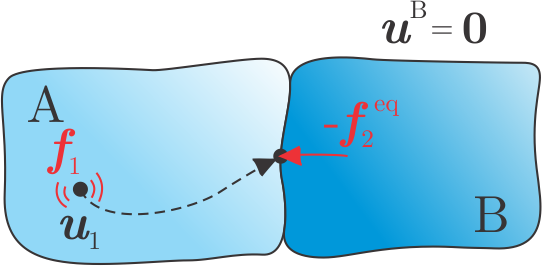
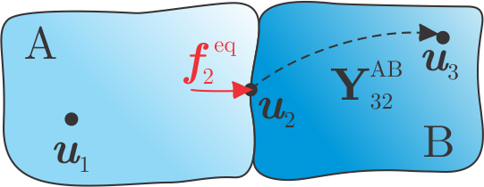

##############################
in-situ Transfer Path Analysis
##############################

The in-situ Transfer Path Analysis is a method that utilizes equivalent forces to describe operational excitations [1]_.
With the possibility to perform operational measurements on the target assembly, dismounting of any part can be avoided.

.. note:: 
   Download example showing a numerical example of the in-situ TPA: :download:`11_insitu_TPA.ipynb <../../../examples/11_TPA_in-situ.ipynb>`

What is in-situ TPA?
********************

Consider a system of substructures A and B, coupled at the interface, as depicted below.
Substructure A is treated as an active component with operational excitation acting in :math:`\boldsymbol{u}_1`. 
Meanwhile, no excitation force is acting on passive substructure B. 
Responses in :math:`\boldsymbol{u}_3`, :math:`\boldsymbol{u}_4`, and also in interface DoFs :math:`\boldsymbol{u}_2` are hence a consequence of active force :math:`\boldsymbol{f}_1` only. 

.. figure:: ./../data/in_situ.png
   :width: 250px
   :align: center

Source internal structure-borne excitations :math:`\boldsymbol{f}_1` are often unmeasurable in practice.
In-situ TPA introduces the set of equivalent forces, acting on interface DoFs, that cause the same displacements on B as :math:`\boldsymbol{f}_1`.
Therefore, application of forces :math:`\boldsymbol{f}_1` and reaction forces :math:`-\boldsymbol{f}_2^{\mathrm{eq}}` should annul any response on the passive side, e.q. for :math:`\boldsymbol{u}_4`:

.. math::

   \textbf{0} = \underbrace{\textbf{Y}_{41}^{\text{AB}} \boldsymbol{f}_1}_{\boldsymbol{u}_4} + \textbf{Y}_{42}^{\text{AB}} \big( - \boldsymbol{f}_2^{\text{eq}} \big).

Expressing :math:`\boldsymbol{f}_2^{\mathrm{eq}}` yields:

.. math::

   \boldsymbol{f}_2^{\text{eq}} = \Big( \textbf{Y}_{42}^{\text{AB}} \Big)^+ \boldsymbol{u}_4

or a set of equivalent forces, that are valid source descriptions for any receiver B.
TPA methods offer a useful tool to assess the completeness of the interface description in a form of on-board validation [2]_.
Response in :math:`\boldsymbol{u}_3` can be predicted based on :math:`\boldsymbol{f}_2^{\mathrm{eq}}`:

.. math::

   \boldsymbol{u}_3^{\text{TPA}} = \textbf{Y}_{32}^{\text{AB}} \boldsymbol{f}_2^{\text{eq}}.

By comparing predicted :math:`\boldsymbol{u}_3^{\mathrm{TPA}}` and measured :math:`\boldsymbol{u}_3` it is possible to evaluate if transfer paths through the interface are sufficiently described by :math:`\boldsymbol{f}_2^{\mathrm{eq}}`.

How to calculate equivalent forces?
***********************************

In order to determine equivalent forces, the following steps should be performed:

1. Measurement of admittance matrices :math:`\textbf{Y}_{42}^{\text{AB}}` and :math:`\textbf{Y}_{32}^{\text{AB}}`.
2. Measurement of operational responses :math:`\boldsymbol{u}_4`.

Virtual Point Transformation
============================

To simplify the measurement of the :math:`\textbf{Y}_{42}^{\text{AB}}` and :math:`\textbf{Y}_{32}^{\text{AB}}` the VPT can be applied on the interface excitation to transform forces at the interface into virtual DoFs (from :math:`\textbf{Y}_{\mathrm{uf}}` to :math:`\textbf{Y}_{\mathrm{um}}`): 

.. math::

   \textbf{Y}_{\text{um}} = \textbf{Y}_{\text{uf}} \, \textbf{T}_{\text{f}}.

For the VPT, positional data is required for channels (``df_chn_up``), impacts (``df_imp_up``) and for virtual points  (``df_vp`` and ``df_vpref``):

.. code-block:: python

   df_chn_AB = pd.read_excel(pos_xlsx, sheet_name='Channels_AB')
   df_imp_AB = pd.read_excel(pos_xlsx, sheet_name='Impacts_AB')
   df_vp = pd.read_excel(pos_xlsx, sheet_name='VP_Channels')
   df_vpref = pd.read_excel(pos_xlsx, sheet_name='VP_RefChannels')

   vpt_AB = pyFBS.VPT(df_chn_AB_up,df_imp_AB_up,df_vp,df_vpref)

Defined force transformation is then applied on the FRFs:

.. code-block:: python

   Y_um = Y_uf @ vpt_AB.Tf

and requried admittance matrices :math:`\textbf{Y}_{42}^{\text{AB}}` and :math:`\textbf{Y}_{32}^{\text{AB}}` are extracted as follows:

.. code-block:: python

   Y_42 = Y_um[:,:9,:6]
   Y_32 = Y_um[:,9:,:6]

Therefore, the interface is loaded with three forces (:math:`f_x,\,f_y,\,f_z`) and three moments (:math:`m_x,\,m_y,\,m_z`). 
Consistency of the VPT can be additionally evaluated using specific and overall impact consistency:

.. code-block:: python

   vpt_AB.consistency([1],[1])
   barchart(np.arange(1,10,1), vpt_AB.specific_impact, title='Specific Impact Consistency')
   plot_coh(freq, vpt_AB.overall_impact, title='Overall Impact Consistency')

.. raw:: html

   <iframe src="../../_static/specific_impact_consistency.html" height="300px" width="295px" frameborder="0"></iframe>
   <iframe src="../../_static/overall_impact_consistency.html" height="300px" width="595px" frameborder="0"></iframe>

For more options and details about :mod:`pyFBS.VPT` see the :download:`04_VPT.ipynb <../../../examples/04_VPT.ipynb>` example.

Calculation of equivalent forces
================================

Equivalent forces at the interface are calculated in the following manner:

.. code-block:: python

   f_eq = np.linalg.pinv(Y_42) @ u4_op

On-board validation
===================

Finally, equivalent forces are evaluated through on-board validation:

.. code-block:: python

   u3_tpa = Y_32 @ f_eq

   o = 0

   u3 = plot_frequency_response(freq, np.hstack((u3_tpa[:,o:o+1], u3_op[:,o:o+1])))

.. raw:: html

   <iframe src="../../_static/u3_comparison.html" height="460px" width="100%" frameborder="0"></iframe>

Additionally, a coherence criterion can be used to objectively evaluate interface completeness:

.. code-block:: python 

   coh_data = coh(u3_tpa, u3_op)
   plot_coh_group(freq, coh_data)

.. raw:: html

   <iframe src="../../_static/on_board_coherence.html" height="330px" width="1500px" frameborder="0"></iframe>

See also cross-validation for further evaluation of the equivalent forces completeness [3]_.

Partial response contribution
=============================

With the equivalent forces known a partial response contribution can be evaluated for each separate component of excitation:

.. math::

   u_i(\omega) = \sum_{j} Y_{ij}^{\text{AB}}(\omega) f_j^{\text{eq}}(\omega) \quad
      \begin{cases}
         & u_i \in \boldsymbol{u}_3 \\
         & f_j^{\text{eq}} \in \boldsymbol{f}_2^{\text{eq}}
      \end{cases}.

.. code-block:: python

   sel_i = 1
   u_partial = []

   for j in range(6):
      gg = _Y_temp[:,sel_i:sel_i+1,j:j+1] @ f_eq[:,j:j+1,0:1]
      u_partial.append(gg[:,0,0])
      
   u_partial = np.asarray(u_partial).T

The partial responses can then be displayed as a heatmap:

.. raw:: html

   <iframe src="../../_static/TP_contribution.html" height="250px" width="100%" frameborder="0"></iframe>

Using the graphical presentation above, the most dominant transfer path can be pinpointed.

.. [1] Moorhouse, A. T., A. S. Elliott, and T. A. Evans. "In situ measurement of the blocked force of structure-borne sound sources." Journal of Sound and Vibration 325.4-5 (2009): 679-685.

.. [2] Van der Seijs, M. V. "Experimental dynamic substructuring: Analysis and design strategies for vehicle development." (2016).

.. [3] El Mahmoudi, A., et al. "In-situ TPA for NVH analysis of powertrains: an evaluation on an experimental test setup." AAC 2019: Aachen acoustics colloquium/aachener akustik kolloquium. 2019.