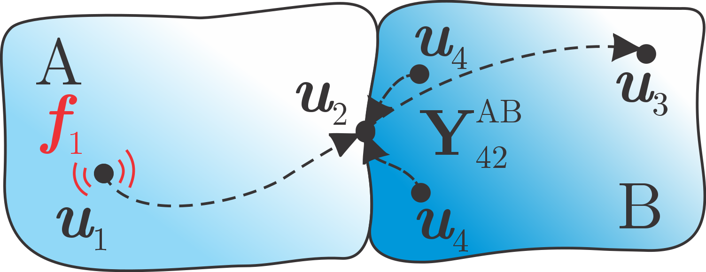

##############################
in-situ Transfer Path Analysis
##############################

The in-situ Transfer Path Analysis is a method that utilizes equivalent forces to describe operational excitations [1]_.
With the possibility to perform operational measurements on the target assembly, dismounting of any part can be avoided.

.. note:: 
   Download example showing a numerical example of the in-situ TPA: :download:`11_insitu_TPA.ipynb <../../../examples/11_TPA_in-situ.ipynb>`

What is in-situ TPA?
********************

Consider a system of substructures A and B, coupled at the interface, as depicted below.
Substructure A is treated as an active component with operational excitation acting in :math:`\boldsymbol{u}_1`. 
Meanwhile, no excitation force is acting on passive substructure B. 
Responses in :math:`\boldsymbol{u}_3`, :math:`\boldsymbol{u}_4`, and also in interface DoFs :math:`\boldsymbol{u}_2` are hence a consequence of active force :math:`\boldsymbol{f}_1` only. 

Source internal structure-borne excitations :math:`\boldsymbol{f}_1` are often unmeasurable in practice.
In-situ TPA introduces the set of equivalent forces, acting on interface DoFs, that cause the same displacements on B as :math:`\boldsymbol{f}_1`.
Therefore, application of forces :math:`\boldsymbol{f}_1` and reaction forces :math:`-\boldsymbol{f}_2^{\mathrm{eq}}` should annul any response on the passive side, e.q. for :math:`\boldsymbol{u}_4`:

.. figure:: ./../data/in-situ_blocked.svg
   :width: 250px
   :align: center

.. math::

   \textbf{0} = \underbrace{\textbf{Y}_{41}^{\text{AB}} \boldsymbol{f}_1}_{\boldsymbol{u}_4} + \textbf{Y}_{42}^{\text{AB}} \big( - \boldsymbol{f}_2^{\text{eq}} \big).

Expressing :math:`\boldsymbol{f}_2^{\mathrm{eq}}` yields:

.. math::

   \boldsymbol{f}_2^{\text{eq}} = \Big( \textbf{Y}_{42}^{\text{AB}} \Big)^+ \boldsymbol{u}_4

or a set of equivalent forces, that are valid source descriptions for any receiver B [2]_.

.. tip::
   Equivalent forces from in-situ TPA are property of the active component and are transferable to any assembly with modified passive side.

TPA methods offer a useful tool to assess the completeness of the interface description in a form of on-board validation [2]_.
The responses :math:`\boldsymbol{u}_3` remain independent of :math:`\boldsymbol{f}_2^{\mathrm{eq}}`, as they are not considered in the calculation of the latter.
Therefore, response in :math:`\boldsymbol{u}_3` can be predicted based on :math:`\boldsymbol{f}_2^{\mathrm{eq}}`:

.. figure:: ./../data/in-situ_eq_source.svg
   :width: 250px
   :align: center

.. math::

   \boldsymbol{u}_3^{\text{TPA}} = \textbf{Y}_{32}^{\text{AB}} \boldsymbol{f}_2^{\text{eq}}.

By comparing predicted :math:`\boldsymbol{u}_3^{\mathrm{TPA}}` and measured :math:`\boldsymbol{u}_3` 
it is possible to evaluate if transfer paths through the interface are sufficiently described by :math:`\boldsymbol{f}_2^{\mathrm{eq}}`.

.. tip ::
   This approach can be useful for an on-board validation, when the prediction is performed on the assembly AB, 
   or a cross validation, when applied to the assembly with an modified passive side.

How to calculate equivalent forces?
***********************************

In order to determine equivalent forces, the following steps should be performed:

1. Measurement of admittance matrices :math:`\textbf{Y}_{42}^{\text{AB}}` and :math:`\textbf{Y}_{32}^{\text{AB}}`.
   Often, measurement campaign is carried out on non-operating system 
   using impact hammer due to rapid FRF aquisition for each impact location.
2. Measurement of operational responses :math:`\boldsymbol{u}_4` while the assembly 
   is subjected to the operational excitation.

.. warning::
   To ensure that the equivalent forces are independent of the receiver structure, the operating excitation must originate solely from the source structure.

.. tip::
   Number of indicator responses :math:`\boldsymbol{u}_4` should preferably exceed the number of equivalent forces :math:`\boldsymbol{f}_2^{\mathrm{eq}}`.
   An over-determination of at least a factor of 1.5 improves the results of the inverse force identification. If the amount of channels is not a limitation, a factor of 2 is suggested.
   Positions of the :math:`\boldsymbol{u}_4` should be located in the proximity of the interface and must be carefully considered to maximize the observability of the equivalent forces. 
   If all recommendations are met, sufficient rank and low condition number of :math:`\textbf{Y}_{42}^{\text{AB}}` matrix prevents amplification of measurement errors in the inversion.

.. warning::
   One should keep in mind that we assume considered systems are linear. Especially with respect to systems with nonlinear interface properties, 
   the limitations of the method should be kept in mind. Because the FRF determination through impact hammer or shaker is done during non-operation, operation FRFs might differ as 
   non-linear components are changing their dynamic behaviour depending on the operational speed. 
   Consequently, errors arise in equivalent forces and their transferabillity is limited.

Virtual Point Transformation
============================

.. tip::
   The virtual point [3]_, typically used in frequency based substructuring (FBS) applications, has the advantage of taking into account moments in the transfer paths that are otherwise not measurable with
   conventional force transducers. Hence the description of the interface is more complete [4]_.

To simplify the measurement of the :math:`\textbf{Y}_{42}^{\text{AB}}` and :math:`\textbf{Y}_{32}^{\text{AB}}` the VPT can be applied on the interface excitation to transform forces at the interface into virtual DoFs (from :math:`\textbf{Y}_{\mathrm{uf}}` to :math:`\textbf{Y}_{\mathrm{um}}`): 

.. math::

   \textbf{Y}_{\text{um}} = \textbf{Y}_{\text{uf}} \, \textbf{T}_{\text{f}}^\text{T}.

For the VPT, positional data is required for channels (``df_chn_up``), impacts (``df_imp_up``) and for virtual points  (``df_vp`` and ``df_vpref``). 
Note that only transformation of forces is required for succesful identification of equivalent forces using in-situ TPA, 
but in order to define the VPT object in pyFBS, VP for displacements must also be defined (but neglected latter in the trasnformation):

.. code-block:: python

   df_chn_AB = pd.read_excel(pos_xlsx, sheet_name='Channels_AB')
   df_imp_AB = pd.read_excel(pos_xlsx, sheet_name='Impacts_AB')
   df_vp = pd.read_excel(pos_xlsx, sheet_name='VP_Channels')
   df_vpref = pd.read_excel(pos_xlsx, sheet_name='VP_RefChannels')

   vpt_AB = pyFBS.VPT(df_chn_AB_up,df_imp_AB_up,df_vp,df_vpref)

Defined force transformation is then applied on the FRFs:

.. code-block:: python

   Y_um = Y_uf @ vpt_AB.Tf

and requried admittance matrices :math:`\textbf{Y}_{42}^{\text{AB}}` and :math:`\textbf{Y}_{32}^{\text{AB}}` are extracted as follows:

.. code-block:: python

   Y_42 = Y_um[:,:9,:6]
   Y_32 = Y_um[:,9:,:6]

Therefore, the interface is loaded with three forces (:math:`f_x,\,f_y,\,f_z`) and three moments (:math:`m_x,\,m_y,\,m_z`). 
Consistency of the VPT can be additionally evaluated using specific and overall impact consistency:

.. code-block:: python

   vpt_AB.consistency([1],[1])
   barchart(np.arange(1,10,1), vpt_AB.specific_impact, title='Specific Impact Consistency')
   plot_coh(freq, vpt_AB.overall_impact, title='Overall Impact Consistency')

.. raw:: html

   <iframe src="../../_static/specific_impact_consistency.html" height="300px" width="295px" frameborder="0"></iframe>
   <iframe src="../../_static/overall_impact_consistency.html" height="300px" width="595px" frameborder="0"></iframe>

For more options and details about :mod:`pyFBS.VPT` see the :download:`04_VPT.ipynb <../../../examples/04_VPT.ipynb>` example.

Calculation of equivalent forces
================================

Equivalent forces at the interface are calculated in the following manner:

.. code-block:: python

   f_eq = np.linalg.pinv(Y_42) @ u4_op

.. tip::

   In cases when the excitation source exhibits tonal excitation behavior, responses outside the excitation orders may fall below the noise floor of the measurement equipment [5]_. 
   The use of regularisation techniques is advisable in such cases to prevent the measurement noise from building up the equivalent forces 
   (Singular Value Truncation or Tikhonov regularisation, for more info see [6]_ [7]_ [8]_).

On-board validation
===================

Finally, equivalent forces are evaluated through on-board validation:

.. code-block:: python

   u3_tpa = Y_32 @ f_eq

   o = 0

   u3 = plot_frequency_response(freq, np.hstack((u3_tpa[:,o:o+1], u3_op[:,o:o+1])))

.. raw:: html

   <iframe src="../../_static/u3_comparison.html" height="460px" width="750px" frameborder="0"></iframe>

Additionally, a coherence criterion can be used to objectively evaluate interface completeness:

.. code-block:: python 

   coh_data = coh(u3_tpa, u3_op)
   plot_coh_group(freq, coh_data)

.. raw:: html

   <iframe src="../../_static/on_board_coherence.html" height="330px" width="750px" frameborder="0"></iframe>

See also cross-validation for further evaluation of the equivalent forces completeness [9]_.

Partial response contribution
=============================

If we now focus on only one response at the passive side at :math:`\boldsymbol{u}_3`, 
we can build this responses solely by the equivalent forces. 
Partial response is calculated for each equivalent force using equation:

.. math::

   u_{i,j} = Y_{ij}^\mathrm{AB} f_j^\text{eq}

Then if we sum all partial :math:`u_{i,j}` we obtain total response of the passive side [2]_. 
But it is also interesting to examine all partial responses individually. 
Based on them, we can determine, which equivalent force contributes the most to the passive side responses, 
or in other words, which transfer path is most critical on our product.

.. code-block:: python

   sel_i = 1
   u_partial = []

   for j in range(6):
      gg = _Y_temp[:,sel_i:sel_i+1,j:j+1] @ f_eq[:,j:j+1,0:1]
      u_partial.append(gg[:,0,0])
      
   u_partial = np.asarray(u_partial).T

The partial responses can then be displayed as a heatmap:

.. raw:: html

   <iframe src="../../_static/TP_contribution.html" height="250px" width="100%" frameborder="0"></iframe>

.. tip::
   Using the graphical presentation above, the most dominant transfer path can be pinpointed.

.. rubric:: References

.. [1] Moorhouse AT. On the characteristic power of structure-borne sound sources. Journal of sound and vibration. 2001 Nov 29;248(3):441-59.
.. [2] van der Seijs MV. Experimental dynamic substructuring: Analysis and design strategies for vehicle development (Doctoral dissertation, Delft University of Technology).
.. [3] van der Seijs MV, van den Bosch DD, Rixen DJ, de Klerk D. An improved methodology for the virtual point transformation of measured frequency response functions in dynamic substructuring. In4th ECCOMAS thematic conference on computational methods in structural dynamics and earthquake engineering 2013 Jun (No. 4).
.. [4] Haeussler, M., Mueller, T., Pasma, E. A., Freund, J., Westphal, O., Voehringer, T., & AG, Z. F. (2020). Component TPA: benefit of including rotational degrees of freedom and over-determination. In ISMA 2020-International Conference on Noise and Vibration Engineering (pp. 1135-1148).
.. [5] Haeussler, M., Kobus, D. C., & Rixen, D. J. (2021). Parametric design optimization of e-compressor NVH using blocked forces and substructuring. Mechanical Systems and Signal Processing, 150, 107217.
.. [6] Wernsen, M. W. F., van der Seijs, M. V., & de Klerk, D. (2017). An indicator sensor criterion for in-situ characterisation of source vibrations. In Sensors and Instrumentation, Volume 5 (pp. 55-69). Springer, Cham.
.. [7] Haeussler, M. (2021). Modular sound & vibration engineering by substructuring. Technische Universität München.
.. [8] Wernsen MW. Observability and transferability of in-situ blocked force characterisation.
.. [9] El Mahmoudi, A., Trainotti, F., Park, K., & Rixen, D. J. (2019). In-situ TPA for NVH analysis of powertrains: an evaluation on an experimental test setup. In AAC 2019: Aachen acoustics colloquium/aachener akustik kolloquium.