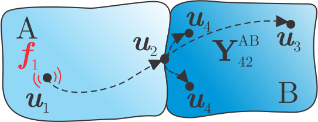

##############################
Matrix Inverse
##############################

The Matrix Inverse method determines operational interface forces between active and passive side based on structural admittance and responses at the passive side.

.. note:: 
   Download example showing a numerical example of the matrix inverse method: :download:`14_TPA_matrix_inverse.ipynb <../../../examples/13_TPA_matrix_inverse.ipynb>`

What is Matrix Inverse method?
******************************

Consider a system of substructures A and B, coupled at the interface, as depicted below.
Substructure A is treated as an active component with operational excitation acting in :math:`\boldsymbol{u}_1`. 
Meanwhile, no excitation force is acting on passive substructure B. 
Responses in :math:`\boldsymbol{u}_3`, :math:`\boldsymbol{u}_4`, and also in interface DoFs :math:`\boldsymbol{u}_2` are hence a consequence of active force :math:`\boldsymbol{f}_1` only. 

Using LM-FBS notation, responses at the indicator sensors :math:`\boldsymbol{u}_4` can be expressed in terms of subsystem admittances [1]_:

.. math::

   \boldsymbol{u}_4 = \textbf{Y}_{41}^{\text{AB}} \boldsymbol{f}_1 = \textbf{Y}_{42}^{\text{B}} \underbrace{ \Big(\textbf{Y}_{22}^{\text{A}} + \textbf{Y}_{22}^{\text{B}}\Big)^{-1} \textbf{Y}_{21}^{\text{A}} \boldsymbol{f}_1 }_{\boldsymbol{g}_2^{\text{B}}}.

It can be seen that responses at B arise due to application of interface forces :math:`\boldsymbol{g}_2^{\mathrm{B}}` at the interface on the passive side. Expressing :math:`\boldsymbol{g}_2^{\mathrm{B}}` yields:

.. math::

   \boldsymbol{g}_2^{\text{B}} = \Big( \textbf{Y}_{42}^{\text{B}} \Big)^+ \boldsymbol{u}_4.

Responses at the passive side can than be predicted based on :math:`\boldsymbol{g}_2^{\mathrm{B}}`:

.. math::

   \tilde{\boldsymbol{u}}_3 = \Big( \textbf{Y}_{32}^{\text{B}} \Big)^+ \boldsymbol{g}_2^{\text{B}}.

.. tip::

   By comparing predicted :math:`\tilde{\boldsymbol{u}}_3` and measured :math:`\boldsymbol{u}_3` it is possible to evaluate if transfer paths through the 
   interface are sufficiently described by :math:`\boldsymbol{g}_2^{\mathrm{B}}`.

How to calculate interface forces?
***********************************

In order to determine interface forces :math:`\boldsymbol{g}_2^{\mathrm{B}}`, the following steps should be performed:

1. Measurement of admittance matrices :math:`\textbf{Y}_{42}^{\text{B}}` and :math:`\textbf{Y}_{32}^{\text{B}}` (note that for this assembly must be taken apart and only passive side is considered).
2. Measurement of responses :math:`\boldsymbol{u}_4` on an assembly subjected to the operational excitation.

.. tip::
   Number of indicator responses :math:`\boldsymbol{u}_4` should preferably exceed the number of interface forces :math:`\boldsymbol{g}_2^{\mathrm{B}}` (or be at least equal but this is not recommended).
   An over-determination of at least a factor of 1.5 improves the results of the inverse force identification. If the amount of channels is not a limitation, a factor of 2 is suggested.
   Positions of the :math:`\boldsymbol{u}_4` should be located in the proximity of the interface and must be carefully considered to maximize the observability of the interface forces. 
   If all recommendations are met, sufficient rank and low condition number of :math:`\textbf{Y}_{42}^{\text{B}}` matrix prevents amplification of measurement errors in the inversion.

Virtual Point Transformation
============================

.. tip::
   The virtual point [2]_, typically used in frequency based substructuring (FBS) applications, has the advantage of taking into account moments in the transfer paths that are otherwise not measurable with
   conventional force transducers. Hence the description of the interface is more complete.

To simplify the measurement of the :math:`\textbf{Y}_{42}^{\text{B}}` and :math:`\textbf{Y}_{32}^{\text{B}}` the VPT can be applied on the interface excitation to transform forces at the interface into virtual DoFs (from :math:`\textbf{Y}_{\mathrm{uf}}` to :math:`\textbf{Y}_{\mathrm{um}}`): 

.. math::

   \textbf{Y}_{\text{um}} = \textbf{Y}_{\text{uf}} \, \textbf{T}_{\text{f}}.

For the VPT, positional data is required for channels (``df_chn_up``), impacts (``df_imp_up``) and for virtual points  (``df_vp`` and ``df_vpref``):

.. code-block:: python

   df_imp_B = pd.read_excel(xlsx_pos, sheet_name='Impacts_B')
   df_chn_B = pd.read_excel(xlsx_pos, sheet_name='Channels_B')
   df_vp = pd.read_excel(xlsx_pos, sheet_name='VP_Channels')
   df_vpref = pd.read_excel(xlsx_pos, sheet_name='VP_RefChannels')

   vpt_B = pyFBS.VPT(df_chn_B, df_imp_B, df_vp, df_vpref)

Defined force transformation is then applied on the FRFs and requried admittance matrices :math:`\textbf{Y}_{42}^{\text{B}}` and :math:`\textbf{Y}_{32}^{\text{B}}` are extracted as follows:

.. code-block:: python

   Y42_B = MK_B.FRF[:,:9,:9] @ vpt_B.Tf
   Y32_B = MK_B.FRF[:,9:12,:9] @ vpt_B.Tf

For more options and details about :mod:`pyFBS.VPT` see the :download:`04_VPT.ipynb <../../../examples/04_VPT.ipynb>` example.

Calculation of interface forces
================================

Interface forces are calculated in the following manner:

.. code-block:: python

   g2_B = np.linalg.pinv(Y42_B) @ u4

On-board validation
===================

Finally, interface forces are applied to build up predicted response at the passive side. 
Completeness of the interface forces is then evaluated via comparison of predicted and actual response using on-board validation:

.. code-block:: python

   u3_tpa = Y32_B @ g2_B

   o = 0

   u3 = plot_frequency_response(freq, np.hstack((u3_tpa[:,o:o+1], u3_op[:,o:o+1])))

.. raw:: html

   <iframe src="../../_static/on_board_matrix_inverse.html" height="460px" width="100%" frameborder="0"></iframe>

.. warning::

   Poor agreement between :math:`\boldsymbol{u}_3` and :math:`\tilde{\boldsymbol{u}}_3`  indicates that there might be other sources that significantly contribute to the target output, 
   the predefined forces are not correct or the on-board validation sensor is too far from the interface.

.. tip::

   In cases when the excitation source exhibits tonal excitation behavior, responses outside the excitation orders may fall below the noise floor of the measurement equipment. 
   The use of regularisation techniques is advisable in such cases to prevent the measurement noise from building up the interface forces 
   (Singular Value Truncation or Tikhonov regularisation, for more info see [3]_ [4]_).

.. rubric:: References

.. [1] van der Seijs MV. Experimental dynamic substructuring: Analysis and design strategies for vehicle development (Doctoral dissertation, Delft University of Technology).
.. [2] van der Seijs MV, van den Bosch DD, Rixen DJ, de Klerk D. An improved methodology for the virtual point transformation of measured frequency response functions in dynamic substructuring. In4th ECCOMAS thematic conference on computational methods in structural dynamics and earthquake engineering 2013 Jun (No. 4).
.. [3] Thite AN, Thompson DJ. The quantification of structure-borne transmission paths by inverse methods. Part 1: Improved singular value rejection methods. Journal of Sound and Vibration. 2003 Jul 3;264(2):411-31.
.. [4] Thite AN, Thompson DJ. The quantification of structure-borne transmission paths by inverse methods. Part 2: Use of regularization techniques. Journal of Sound and Vibration. 2003 Jul 3;264(2):433-51.