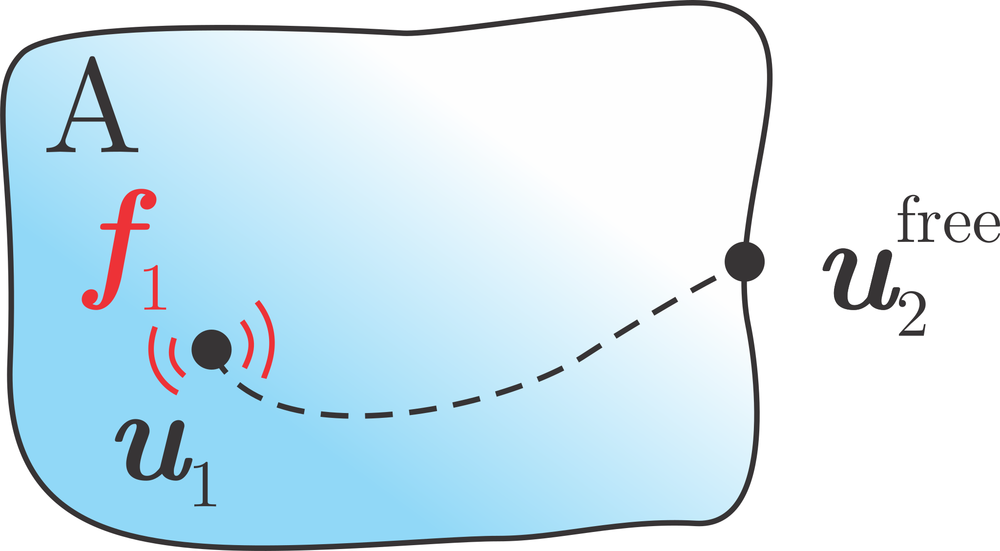

#############
Free velocity
#############

Using free velocity concept equivalent forces can be expressed from the interface motion of the source component 
while operating in free-free conditions.

.. note:: 
   Download example showing a numerical example of the free velocity: :download:`13_free_velocity.ipynb <../../../examples/13_TPA_free_velocity.ipynb>`

Free velocity concept
*********************

When the interface of the source structure is left free, vibrations at the interface DoFs can be treated as a 
free displacements :math:`\boldsymbol{u}_2^{\mathrm{free}}`.

By definition [1]_, equivalent forces, applied in the opposite direction must cancel out responses at the interface 
caused by the source in operation:

.. math::
   \mathbf{0} = \underbrace{\mathbf{Y}_{21}^\text{A} \boldsymbol{f}_1}_{\boldsymbol{u}_2^\text{free}} + \mathbf{Y}_{22}^\text{A} (- \boldsymbol{f}_2^\text{eq})

To derive the equivalent forces :math:`\boldsymbol{f}_2^{\mathrm{eq}}` from the free velocities the 
free admittance matrix of the uncoupled source component :math:`\mathbf{Y}_{22}^{\text{A}}` is needed:

.. math::

   \boldsymbol{f}_2^{\mathrm{eq}} = \left( \mathbf{Y}_{22}^\text{A} \right)^{-1} \boldsymbol{u}_2^\text{free}

.. tip::
   Equivalent forces are property of the active component and are transferable to any assembly with modified passive side [1]_.

How to calculate equivalent forces?
***********************************

In order to determine equivalent forces, the following steps should be performed:

1. Measurement of admittance matrix :math:`\textbf{Y}_{22}^{\text{A}}`.
   Often, measurement campaign is carried out on non-operating system
   using impact hammer due to rapid FRF aquisition for each impact location.
2. Measurement of free velocities :math:`\boldsymbol{u}_2^\text{free}` while the source structure 
   is subjected to the operational excitation.

.. tip::
   At first glance measurement campaign looks fairly simple. Both required measurements have to be performed on a sorce structure only,
   so the experimental effort is quite low. However...

.. warning::
   ...running source objects at free-free conditions is often challenging as some of them require some sort of support to be able to run in 
   operation. The active components often needs to be connected to a certain load or mount for operating.

.. tip::
   In practice, source description using free velocities is limited for lower frequency range due to 
   unreal running conditions if the interface is left free. 
   Hence free velocity concept is more suited for frequency range well above rigid body modes of the source. 
   The method is expected to perform best when differences between operational and free accelerations are small. 
   See [2]_ for some practical considerations.

Virtual Point Transformation
============================

.. tip::
   The virtual point [3]_, typically used in frequency based substructuring (FBS) applications, has the advantage of taking into account moments in the transfer paths that are otherwise not measurable with
   conventional force transducers. Hence the description of the interface is more complete.

To simplify the measurement of the :math:`\textbf{Y}_{22}^{\text{A}}` the VPT can be applied on the interface excitation to 
transform displacements and forces at the interface into virtual DoF: 

.. math::

   \textbf{Y}_{\text{qm}} = \textbf{T}_{\text{u}} \, \textbf{Y}_{\text{uf}} \, \textbf{T}_{\text{f}}^\text{T}.

For the VPT, positional data is required for channels (``df_chn_up``), impacts (``df_imp_up``) and for virtual points  (``df_vp`` and ``df_vpref``):

.. code-block:: python

   df_acc_A = pd.read_excel(xlsx_pos, sheet_name='Sensors_A')
   df_chn_A = pd.read_excel(xlsx_pos, sheet_name='Channels_A')
   df_imp_A = pd.read_excel(xlsx_pos, sheet_name='Impacts_A')

   df_vp = pd.read_excel(xlsx_pos, sheet_name='VP_Channels')
   df_vpref = pd.read_excel(xlsx_pos, sheet_name='VP_RefChannels')

After the reduction matrices are defined the VPT can be applied directly on an FRF matrix:

.. code-block:: python

   vpt = pyfbs.interface.VPT(df_chn_A_up, df_imp_A_up, df_vp, df_vpref)
   vpt.apply_vpt(MK_A.freq, MK_A.frf)

For more options and details about :mod:`pyfbs.interface.VPT` see the :download:`04_VPT.ipynb <../../../examples/04_VPT.ipynb>` example.

Calculation of equivalent forces
================================

Equivalent forces at the interface are calculated in the following manner:

.. code-block:: python

   f_eq = np.linalg.pinv(Y_42) @ u2_free

.. tip::

   In cases when the excitation source exhibits tonal excitation behavior, responses outside the excitation orders may fall below the noise floor of the measurement equipment. 
   The use of regularisation techniques is advisable in such cases to prevent the measurement noise from building up the equivalent forces 
   (Singular Value Truncation or Tikhonov regularisation, for more info see [1]_ [4]_).

Cross validation
================

.. tip::

   TPA methods offer a useful tool to assess the completeness of the source description in a form of cross validation. 
   
As stated previously, equivalent forces are a property of the source only and are thus transferable to any assembly with modified passive side. 
Response of the new assembly when subjected to the operational excitation of the source (:math:`\boldsymbol{u}_3`) 
can be predicted based on :math:`\boldsymbol{f}_2^{\mathrm{eq}}` identified from source in free conditions
and admittance of the new assembly (:math:`\mathbf{Y}_{32}^{\mathrm{AB}}`):   

.. math::
   \boldsymbol{u}_3 = \mathbf{Y}_{32}^{\mathrm{AB}}\, \boldsymbol{f}_2^{\mathrm{eq}}

.. code-block:: python

   u3 = Y32_AB @ f2_eq

.. raw:: html

   <iframe src="../../_static/free_velocity_cross.html" height="460px" width="750px" frameborder="0"></iframe>

.. tip::
   We can see that equivalent forces are indeed independent of the passive substructure.

.. card:: That's a wrap!

    Want to know more, see a potential application? Contact us at info.pyfbs@gmail.com!

.. rubric:: References

.. [1] Van der Seijs, M. V. "Experimental dynamic substructuring: Analysis and design strategies for vehicle development." (2016).
.. [2] Wagner P, Bianciardi F, Corbeels P, Hülsmann A. High frequency source characterization of an e-motor using component-based TPA.
.. [3] van der Seijs MV, van den Bosch DD, Rixen DJ, de Klerk D. An improved methodology for the virtual point transformation of measured frequency response functions in dynamic substructuring. In4th ECCOMAS thematic conference on computational methods in structural dynamics and earthquake engineering 2013 Jun (No. 4).
.. [4] Haeussler, M. (2021). Modular sound & vibration engineering by substructuring. Technische Universität München.
