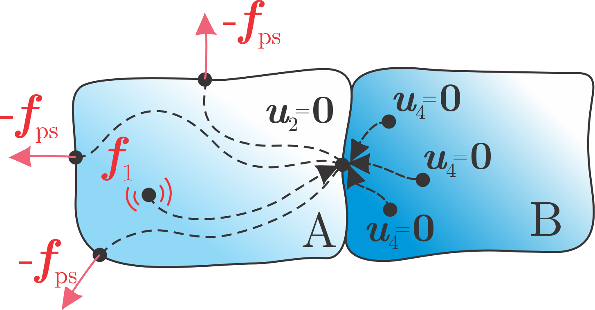
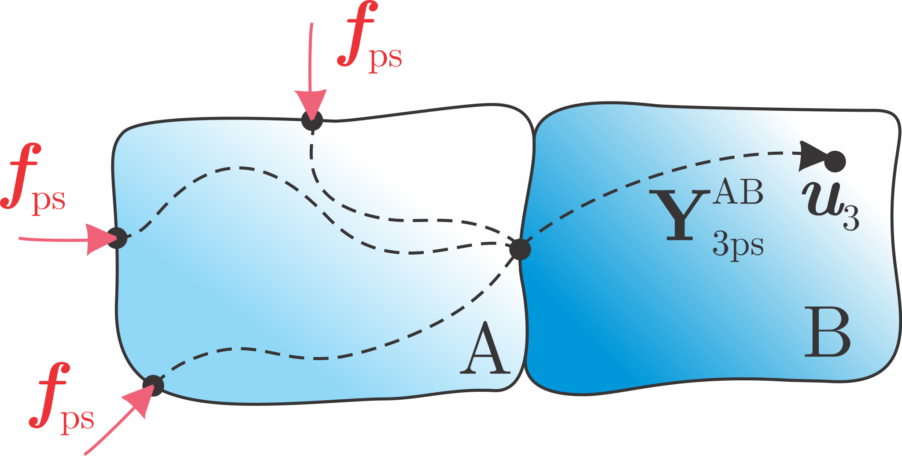

#############
Pseudo-forces
#############

Pseudo-forces respresent the source excitations for responses at the passive side of the assembly. 
The same methodology as for the equivalent forces also applies for the pseudo-forces. 
They surpress the responses at the passive substructure, caused by the source running at operating conditions. 

.. note:: 
   Download example showing a numerical example of pseudo-forces: :download:`17_pseudo-forces.ipynb <../../../examples/16_TPA_pseudo_forces.ipynb>`

A set of negative signed pseudo-forces is acting at arbitrary locations on the active side of the assembly. 
They counteract the operational vibrations transmitted through the interface to the passive side [1]_.
That means that, if a set of pseudo-forces and operational excitations are applied at the system simmultaniously, 
the response at the interface DoFs :math:`\boldsymbol{u}_2` and consequently at the passive side in general equals zero.

Using a set of indicator response DoFs :math:`\boldsymbol{u}_4` at the passive side this can be formulated as:

.. math::

   \textbf{0} = \underbrace{\textbf{Y}_{41}^{\text{AB}} \boldsymbol{f}_1}_{\boldsymbol{u}_4} 
   + \textbf{Y}_{4\text{ps}}^{\text{AB}} \big( - \boldsymbol{f}_{\text{ps}} \big).

Expressing :math:`\boldsymbol{f}_{\mathrm{ps}}` yields:

.. math::

   \boldsymbol{f}_{\text{ps}} = \Big( \textbf{Y}_{4\text{ps}}^{\text{AB}} \Big)^+ \boldsymbol{u}_4

or a set of pseudo-forces, that are valid source descriptions for any receiver B [2]_.

.. tip::
   Pseudo-forces are property of the active component and are transferable to any assembly with modified passive side.

Applying the pseudo-forces while the source excitation is turned off 
yields the same responses as if the assembly was subjected to the :math:`\boldsymbol{f}_1`:

.. math::

   \boldsymbol{u}_3^{\text{TPA}} = \textbf{Y}_{3\text{ps}}^{\text{AB}} \boldsymbol{f}_{\text{ps}}.

The responses :math:`\boldsymbol{u}_3` remain independent of :math:`\boldsymbol{f}_{\mathrm{ps}}`, 
as they are not considered in the calculation of the latter.
By comparing predicted :math:`\boldsymbol{u}_3^{\mathrm{TPA}}` and measured :math:`\boldsymbol{u}_3` 
it is possible to evaluate if transfer paths through the interface are sufficiently described by :math:`\boldsymbol{f}_{\mathrm{ps}}`.

.. tip ::
   This approach can be useful for an on-board validation, when the prediction is performed on the assembly AB, 
   or a cross validation, when applied to the assembly with an modified passive side.

.. note::
   In-situ TPA is considered as a special case of pseudo-force method, where pseudo-forces are located directly at the interface DoFs.

How to calculate pseudo-forces?
*******************************

In order to determine pseudo-forces, the following steps should be performed:

1. Selection of a set of pseudo-forces :math:`\boldsymbol{f}_{\mathrm{ps}}` on the source. The locations of the pseudo-forces can be 
   chosen arbitrary, so it is reasonable to select locations that can be easily reached with impact hammer of shaker. 
   Care should be taken that the sufficient number of :math:`\boldsymbol{f}_{\mathrm{ps}}` is selected to fully replicate the source excitation.

.. tip::
   A minimum number of 6 pseudo-forces is required to fully describe rigid interface behaviour. If flexible interface behavior is not to be 
   neglected, this number should be increased reasonabely. Mind that by increasing the number of pseudo-forces, number of indicator DoFs is 
   also growing, resulting in larger experimental effort.

2. Measurement of admittance matrix :math:`\textbf{Y}_{4\text{ps}}^{\text{AB}}`.
   Often, measurement campaign is carried out on non-operating system 
   using impact hammer due to rapid FRF aquisition for each impact location.
3. Measurement of operational responses :math:`\boldsymbol{u}_4` while the assembly 
   is subjected to the operational excitation.

.. tip::
   Number of indicator responses :math:`\boldsymbol{u}_4` should preferably exceed the number of pseudo-forces :math:`\boldsymbol{f}_2^{\mathrm{eq}}`.
   An over-determination of at least a factor of 1.5 improves the results of the inverse force identification. If the amount of channels is not a limitation, a factor of 2 is suggested.
   Positions of the :math:`\boldsymbol{u}_4` should be located in the proximity of the interface and must be carefully considered to maximize the observability of the pseudo-forces. 
   If all recommendations are met, sufficient rank and low condition number of :math:`\textbf{Y}_{4\text{ps}}^{\text{AB}}` matrix prevents amplification of measurement errors in the inversion.

.. note::
   Note that no dismounting of the assembly is required in the described measurement campaign.

Once the measurement campaing is complete, pseudo-forces are simply calculated in the following manner:

.. code-block:: python

   f_ps = np.linalg.pinv(Y_4ps) @ u4_op

.. tip::

   In cases when the excitation source exhibits tonal excitation behavior, responses outside the excitation orders may fall below the noise floor of the measurement equipment. 
   The use of regularisation techniques is advisable in such cases to prevent the measurement noise from building up the pseudo-forces 
   (Singular Value Truncation or Tikhonov regularisation, for more info see [2]_ [3]_).

Finally, pseudo-forces are evaluated through on-board validation:

.. code-block:: python

   u3_tpa = Y_3ps @ f_ps

   o = 0

   u3 = plot_frequency_response(freq, np.hstack((u3_tpa[:,o:o+1], u3_op[:,o:o+1])))

.. raw:: html

   <iframe src="../../_static/u3_comparison_ps.html" height="460px" width="750px" frameborder="0"></iframe>

.. tip::
	That's a wrap! Want to know more, see a potential application? Contact us at info.pyfbs@gmail.com!

.. rubric:: References

.. [1] Janssens MH, Verheij JW. A pseudo-forces methodology to be used in characterization of structure-borne sound sources. Applied Acoustics. 2000 Nov 1;61(3):285-308.
.. [2] Van der Seijs, M. V. "Experimental dynamic substructuring: Analysis and design strategies for vehicle development." (2016).
.. [3] Haeussler, M. (2021). Modular sound & vibration engineering by substructuring. Technische Universität München.
