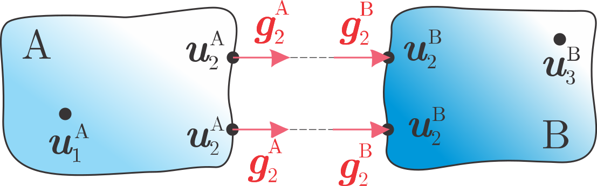
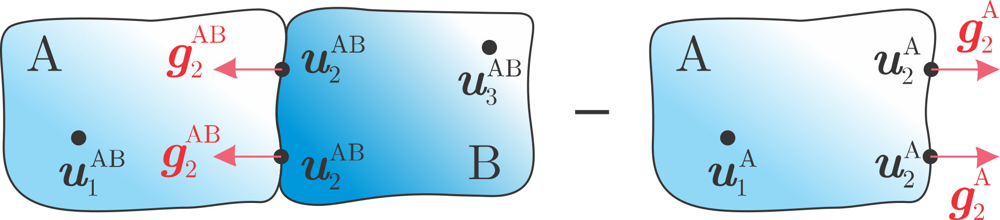

==============================
Frequency Based Substructuring
==============================
The methodology to divide large and complex systems into several subsystems is a common practice in the field of structural dynamics. 
Structural dynamic analyses can be carried out more efficiently if complex systems are divided into smaller subsystems, analysed separately, and later coupled using dynamic substructuring (DS) methods.
In terms of the modeling domain, a frequency-based substructuring (FBS) is often preferred by experimentalists due to its ease of use and implementation with directly measured Frequency Response Functions (FRFs). 
In this context, datasets of measured transfer functions constitute the dynamic models of the substructures involved in the assembly/disassembly process.

..
    .. raw:: html

        

    .. only:: html

        .. figure:: ./../data/vpt_scheme.svg   
        :target: ./virtual_point_transformation.html

        Virtual Point Transformation

    .. raw:: html

        

    .. toctree::
    :hidden:

    ./virtual_point_transformation

    

    .. raw:: html

        

    .. only:: html

        .. figure:: ./../data/SVT.png   
        :target: ./singular_vector_transformation.html

        Singular Vector Transformation

    .. raw:: html

        

    .. toctree::
    :hidden:

    ./singular_vector_transformation

    |
    |
    |
    |
    |
    |
    |
    |
    |

One can distinguish between coupling and decoupling of dynamic systems as follows:

* **Coupling** is the process of assembly sub-systems by imposing physical boundary conditions to the common interface.
* **Decoupling** aims at identifying a standalone sub-system from the assembly by removing the influence of the other subsystem exerted through the interface connection.

In any case, the dynamic interaction between sub-systems (or substructures) is confined to a set of interface DoFs.
Let's consider the linearized equations of motion of a system composed by :math:`n` substructures in the frequency domain [1]_:

.. math::
    \mathbf{Z}(\omega)\,\boldsymbol{u}(\omega)=\boldsymbol{f}(\omega)+\boldsymbol{g}(\omega)

where :math:`\mathbf{Z}(\omega)` represent the block-diagonal frequency-dependent dynamic stiffness matrix of individual subsystems impedances,
the vector :math:`\boldsymbol{u}(\omega)` represents the displacements to the external force vector :math:`\boldsymbol{f}(\omega)`,
applied to the assembly, and :math:`\boldsymbol{g}(\omega)` is the vector of reaction forces
between the substructures:

.. math::
    \mathbf{Z}(\omega)=\begin{bmatrix}\mathbf{Z}^1(\omega) & & \mathbf{0}\\ & \ddots &  \\ \mathbf{0} & &\mathbf{Z}^n(\omega) \end{bmatrix}, \quad
    \boldsymbol{u}(\omega)=\begin{bmatrix}\boldsymbol{u}^1(\omega) \\ \vdots \\ \boldsymbol{u}^n(\omega) \end{bmatrix}, \quad
    \boldsymbol{f}(\omega)=\begin{bmatrix}\boldsymbol{f}^1(\omega) \\ \vdots \\ \boldsymbol{f}^n(\omega) \end{bmatrix}, \quad
    \boldsymbol{g}(\omega)=\begin{bmatrix}\boldsymbol{g}^1(\omega) \\ \vdots \\ \boldsymbol{g}^n(\omega) \end{bmatrix}

Let's now assume two interacting subsystems to be assembled:

Considering a partition between internal :math:`(\star)_1,(\star)_3` and interface :math:`(\star)_2` DoFs, the vector of displacements, forces and reaction forces can be written as:

.. math::
    \boldsymbol{u}=\begin{bmatrix}
    \boldsymbol{u}_1^{\mathrm A} \\ \boldsymbol{u}_2^{\mathrm A}  \\ \boldsymbol{u}_2^{\mathrm B} \\ \boldsymbol{u}_3^{\mathrm B} 
    \end{bmatrix}, \quad 
    \boldsymbol{f}=\begin{bmatrix}
    \boldsymbol{f}_1^{\mathrm A} \\ \boldsymbol{f}_2^{\mathrm A}  \\ \boldsymbol{f}_2^{\mathrm B} \\ \boldsymbol{f}_3^{\mathrm B} 
    \end{bmatrix}, \quad
    \boldsymbol{g}=\begin{bmatrix}
    \boldsymbol{0} \\ \boldsymbol{g}_2^{\mathrm A}  \\ \boldsymbol{g}_2^{\mathrm B} \\ \mathbf{0}
    \end{bmatrix}.   

In order to assembly/disassembly the subsystems' dynamics, two physical conditions must be enforced:

* compatibility of displacements,
* equilibrium of forces.

Compatibility of displacements
******************************

The first interface condition to be fulfilled is the compatibility of displacements at the matching interface DoFs of the two subsystems:

.. math::
    \boldsymbol{u}^{\mathrm A}_{2}=\boldsymbol{u}^{\mathrm B}_{2}

This can be re-formulated by operating on the full set of physical DoFs :math:`\boldsymbol{u}` as:

.. math::
    \mathbf{B}\,\boldsymbol{u}=\mathbf{0}; \quad \mathbf{B}=
    \begin{bmatrix}
    \mathbf{0} & -\mathbf{I} &  \mathbf{I} & \mathbf{0} 
    \end{bmatrix}.

The signed Boolean matrix :math:`\mathbf{B}` maps the corresponding matching interface DoFs. Each row of the matrix identifies a single pair of interface DoFs to be connected.
Alternatively, by substituting the physical coordinates :math:`\boldsymbol{u}` with a set of unique generalized coordinates :math:`\boldsymbol{q}`:

.. math::
    \boldsymbol{u}=\mathbf{L}\boldsymbol{q} \implies \begin{cases}\boldsymbol{u}^{\mathrm A}_{1}=\boldsymbol{q}_{1} \\ \boldsymbol{u}^{\mathrm A}_{2}=\boldsymbol{q}_{2} \\ \boldsymbol{u}^{\mathrm B}_{2}=\boldsymbol{q}_{2} \\ \boldsymbol{u}^{\mathrm B}_{3}=\boldsymbol{q}_{3}  \end{cases}; \quad \mathbf{L}=
    \begin{bmatrix}
    \mathbf{I} & \mathbf{0} &  \mathbf{0} \\ 
    \mathbf{0} & \mathbf{I} & \mathbf{0} \\
    \mathbf{0} & \mathbf{I} &  \mathbf{0} \\
    \mathbf{0} & \mathbf{0} &  \mathbf{I} 
    \end{bmatrix}.

The localization Boolean matrix :math:`\mathbf{L}` maps the physical DoFs of all subsystems to the generalized global set :math:`\boldsymbol{q}`.

.. tip::
    The use of this coordinate transformation should remind you of a common finite element assembly procedure.

By using a unique set of coordinates :math:`\boldsymbol{q}`, it is made implicit that the compatibility of displacements for :math:`\boldsymbol{u}` is automatically satisfied:

.. math::
    \mathbf{B}\,\boldsymbol{u}=\mathbf{B}\,\mathbf{L}\,\boldsymbol{q}=\mathbf{0} \quad \forall \boldsymbol{q}

This means that :math:`\mathbf{B}` and :math:`\mathbf{L}` are each other's nullspaces:

.. math::
    \begin{array}{lcc}
    \mathbf{L}=\text{null}(\mathbf{B}), \\ \mathbf{B}^{\mathrm T}=\text{null}(\mathbf{L}^{\mathrm T}).\end{array}

Equilibrium of forces
*********************

The second conditions requires the force equilbrium at matching interface DoFs to be satisfied according to the *actio et reactio* principle:

.. math::
    \boldsymbol{g}^{\mathrm A}_{2}=-\boldsymbol{g}^{\mathrm B}_{2}

By back-projecting the vector of reaction forces :math:`\boldsymbol{g}` to the Boolean localization space :math:`\mathbf{L}`, the interface forces are directly paired:

.. math::
    \begin{array}{lcc}
    \mathbf{L}^{\mathrm T}\boldsymbol{g}=\mathbf{0} \implies \begin{cases} \boldsymbol{g}^{\mathrm A}_{1}=\mathbf{0} \\ \boldsymbol{g}^{\mathrm A}_{2}+\boldsymbol{g}^{\mathrm B}_{2}=\mathbf{0} \\ \boldsymbol{g}^{\mathrm B}_{3}=\mathbf{0} \end{cases}\end{array}.

Alternatively, by using the signed Boolean matrix :math:`\mathbf{B}` the reaction forces :math:`\boldsymbol{g}` are replaced by a set of Lagrange multipliers :math:`\boldsymbol{\lambda}`, 
which represent the intensity of the interface forces:

.. math::
    \begin{array}{lcc}
    \boldsymbol{g}=-\mathbf{B}^{\mathrm T}\boldsymbol{\lambda} \implies \begin{cases} \boldsymbol{g}^{\mathrm A}_{1}=\mathbf{0} \\ \boldsymbol{g}^{\mathrm A}_{2}= \boldsymbol{\lambda} \\\boldsymbol{g}^{\mathrm B}_{2}=-\boldsymbol{\lambda} \\ \boldsymbol{g}^{\mathrm B}_{3}=\mathbf{0} \end{cases}
    \end{array}

Using the definition of Lagrange multipliers for the interface forces automatically satisfies the equilibrium condition. 
This can be verified by exploiting the mathematical relationship between :math:`\mathbf{L}` and :math:`\mathbf{B}`:

.. math::
    \mathbf{L}^{\mathrm T}\boldsymbol{g}=-\mathbf{L}^{\mathrm T}\mathbf{B}^{\mathrm T}\boldsymbol{\lambda}=\mathbf{0} \quad \forall \,\boldsymbol{g}

Combining the equation of motion with the introduced interface conditions, the frequency-based formulation of the substructuring problem becomes:

.. math::
    \begin{cases}
    \mathbf{Z}(\omega)\,\boldsymbol{u}(\omega)=\boldsymbol{f}(\omega)+\boldsymbol{g}(\omega) \\ \mathbf{B}\,\boldsymbol{u}(\omega)=\mathbf{0} \\ \mathbf{L}^{\mathrm T}\boldsymbol{g}(\omega)=\mathbf{0}
    \end{cases}

From here on the frequency-dependence will be omitted for simplicity.
Solving the above equations of motion could be expensive due to the interface unknown to be resolved, i.e. :math:`\boldsymbol{u}` and :math:`\boldsymbol{g}`. 
Hence, the primal and dual formulations:

* **Primal**: satisfying a priori compatibility and solving for a unique set of interface displacements.
* **Dual**: satisfying a priori the equilibrium condition and solving for a new set of interface forces.

.. note::
    The concept of primal vs dual has roots in the optimization field. According to the duality principle, 2 mirrored formulation of the same optimization problem exist: 
    each variable in the primal form becomes a constraint in the dual and viceversa; 
    therefore, the objective direction is inversed (maximization and minimization for primal and dual respectively).

A primal formulation
********************

Primal assembly
===============

The primal assembly starts by defining a unique set of generalized coordinates :math:`\boldsymbol{q}`. 
The physical DoFs of all subsystems are mapped to :math:`\boldsymbol{q}` by applying the appropriate localization Boolean matrix :math:`\mathbf{L}`  
as :math:`\boldsymbol{u} = \mathbf{L}\,\boldsymbol{q}`. The compatibility is thus satisfied a priori. The equations of motion of the substructuring problem become:

.. math::
    \begin{cases}
    \mathbf{Z}^{\mathrm{A|B}}\mathbf{L}\boldsymbol{q}=\boldsymbol{f}+\boldsymbol{g} \\ \mathbf{L}^{\mathrm T}\boldsymbol{g}=\mathbf{0}
    \end{cases}, \qquad \mathbf{Z}^{\mathrm{A|B}}=\begin{bmatrix}
    \mathbf{Z}^\mathrm A & \mathbf{0} \\ 
    \mathbf{0} & \mathbf{Z}^\mathrm B
    \end{bmatrix}

The system is solved by premultiplying the first row by :math:`\mathbf{L}^\text{T}`, thus eliminating the interface forces and solving for the generalized interface displacement :math:`\boldsymbol{q}`:

.. math::
    \mathbf{\tilde{Z}}^{\mathrm{AB}}\boldsymbol{q}=\boldsymbol{p}, \qquad \mathbf{\tilde{Z}}^{\mathrm{AB}}=\mathbf{L}^T\mathbf{Z}^{\mathrm{A|B}}\mathbf{L} \quad \text{and}  \quad 
    \boldsymbol{p}=\mathbf{L}^\mathrm T\boldsymbol{f}

where :math:`\mathbf{\tilde{Z}}^\mathrm{AB}` is the primally assembled impedance for the generalized DoFs. 
Note that the size of the matrix is reduced according to the number of generalized DoFs being considered.
This assembly procedure is analogous to a finite element assembly. 
Here, the subsystems act like the super-elements and their dynamic properties are 'added' through the matching interface DoFs.

Consider the simple system depicted bellow. The primally assembled impedance can be written as follows:

.. math::
    \mathbf{\tilde{Z}}^\mathrm{AB}=\mathbf{L}^\mathrm T\mathbf{Z}^\mathrm{A|B}\mathbf{L} \implies 
    \begin{bmatrix}\mathbf{Z}^\mathrm A_{11} & \mathbf{Z}^\mathrm A_{12} & \mathbf{0} \\ 
    \mathbf{Z}^\mathrm A_{21} & \mathbf{Z}^\mathrm A_{22}+\mathbf{Z}^\mathrm B_{22}& \mathbf{Z}^\mathrm B_{23} \\
    \mathbf{0} & \mathbf{Z}^\mathrm B_{32} &\mathbf{Z}^\mathrm B_{33}\end{bmatrix}= \mathbf{L}^\mathrm T\begin{bmatrix}\mathbf{Z}^\mathrm A_{11} & \mathbf{Z}^\mathrm A_{12} & \mathbf{0}& \mathbf{0} \\ 
    \mathbf{Z}^\mathrm A_{21} & \mathbf{Z}^\mathrm A_{22}  & \mathbf{0}& \mathbf{0} \\ 
    \mathbf{0} & \mathbf{0} & \mathbf{Z}^\mathrm B_{22} &\mathbf{Z}^\mathrm B_{23} \\
    \mathbf{0} & \mathbf{0} & \mathbf{Z}^\mathrm B_{32} &\mathbf{Z}^\mathrm B_{33} 
    \end{bmatrix} \mathbf{L}

with the localization matrix :math:`\mathbf{L}` defined as follows:

.. math::
    \qquad \mathbf{L}= \begin{bmatrix}
    \mathbf{I} & \mathbf{0} &  \mathbf{0} \\ 
    \mathbf{0} & \mathbf{I} & \mathbf{0} \\
    \mathbf{0} & \mathbf{I} &  \mathbf{0} \\
    \mathbf{0} & \mathbf{0} &  \mathbf{I} 
    \end{bmatrix}.

Primal disassembly
==================

A substructure decoupling procedure consists in the removal of the dynamic influence of a subsystem from the assembly in order to retrieve the remaining subsystem. 
In that sense, it can be considered as the 'reverse' operation of substructure coupling.
The reference representation of a disassembly procedure with corresponding DoFs is depicted:

Considering a partition between internal :math:`(\star)_1,(\star)_3` and interface :math:`(\star)_2` DoFs, the vector of displacements, forces and reaction forces can be written as:

.. math::
    \boldsymbol{u}=\begin{bmatrix}
    \boldsymbol{u}^\mathrm {AB}_{1} \\ \boldsymbol{u}^\mathrm {AB}_{2} \\ \boldsymbol{u}^\mathrm {AB}_{3} \\ \boldsymbol{u}^\mathrm {A}_{1} \\ \boldsymbol{u}^\mathrm {A}_{2}
    \end{bmatrix}, \quad 
    \boldsymbol{f}=\begin{bmatrix}
    \boldsymbol{0} \\ \boldsymbol{f}^\mathrm {AB}_{2} \\ \boldsymbol{f}^\mathrm {AB}_{3} \\ \boldsymbol{0} \\ \mathbf{0}
    \end{bmatrix}, \quad
    \boldsymbol{g}=\begin{bmatrix}
    \boldsymbol{0} \\ \boldsymbol{g}_2^\mathrm {AB} \\ \boldsymbol{0} \\ \mathbf{0} \\ -\boldsymbol{g}_2^\mathrm {A} 
    \end{bmatrix}.

The decoupling operation in the primal domain can be formulated as a coupling between the assembled system dynamic 
stiffness :math:`\mathbf{Z}^\text{AB}` and the negative dynamic stiffness of :math:`\mathbf{Z}^\text{A}`. The minus sign represents the subtraction operation:

.. math::

    \mathbf{\tilde{Z}}^\mathrm{B}=\mathbf{L}^\mathrm T\mathbf{Z}^\mathrm{AB|A}\mathbf{L} \implies 
    \begin{bmatrix}
    \cdot & \cdot & \cdot & \cdot\\ 
    \cdot & \mathbf{Z}^\mathrm B_{22} & \mathbf{Z}^\mathrm B_{23} & \cdot\\
    \cdot & \mathbf{Z}^\mathrm B_{32} &\mathbf{Z}^\mathrm B_{33} & \cdot \\
    \cdot & \cdot & \cdot & \cdot
    \end{bmatrix}=
    \mathbf{L}^T\begin{bmatrix}\cdot & \cdot & \cdot & \cdot& \cdot \\ 
    \cdot & \mathbf{Z}^\mathrm{AB}_{22} & \mathbf{Z}^\mathrm{AB}_{23} & \cdot& \mathbf{0} \\ 
    \cdot & \mathbf{Z}^\mathrm{AB}_{32} & \mathbf{Z}^\mathrm{AB}_{33} & \cdot& \mathbf{0} \\ 
    \cdot & \cdot & \cdot & \cdot & \cdot \\ 
    \cdot & \mathbf{0} & \mathbf{0} & \cdot  & -\mathbf{Z}^\mathrm A_{22} \\ 
    \end{bmatrix}\mathbf{L}

with the localization matrix :math:`\mathbf{L}` defined as:

.. math::
    \qquad \mathbf{L}= \begin{bmatrix}
    \cdot & \cdot &  \cdot& \cdot  \\ 
    \cdot & \mathbf{I} & \mathbf{0}& \cdot  \\
    \cdot & \mathbf{0} &  \mathbf{I}& \cdot  \\
    \cdot & \cdot &  \cdot&\cdot  \\
    \cdot & \mathbf{I} &  \mathbf{0}& \cdot 
    \end{bmatrix}

A dual formulation
******************

Dual assembly
===============

Starting from the general formulation of the substructuring problem, 
the dual approach chooses Lagrange multipliers :math:`\boldsymbol{\lambda}` as set of coupling forces according to the relation :math:`\boldsymbol{g} = - \mathbf{B}^\text{T} \boldsymbol{\lambda}` [2]_. 
The equilibrium is thus satisfied a priori. The equations of motion of the substructuring problem become:

.. math::
    \begin{cases}
    \mathbf{Z}^\mathrm{A|B}\boldsymbol{u}=\boldsymbol{f}-\mathbf{B}^\mathrm{T}\boldsymbol{\lambda} \\ \mathbf{B}\,\boldsymbol{u}=\mathbf{0} 
    \end{cases}

This is often written in a symmetrical form as:

.. math::
    \begin{bmatrix}
    \mathbf{Z}^\mathrm{A|B} & \mathbf{B}^\mathrm T \\ 
    \mathbf{B} & \mathbf{0}
    \end{bmatrix}\begin{bmatrix}
    \boldsymbol{u} \\ \boldsymbol{\lambda} 
    \end{bmatrix}=\begin{bmatrix}
    \boldsymbol{f} \\ \mathbf{0}
    \end{bmatrix}

To solve the system equations, let's first write them in the admittance notation:

.. math::
    \begin{cases}
    \boldsymbol{u}=\mathbf{Y}^\mathrm{A|B}(\boldsymbol{f}-\mathbf{B}^\mathrm{T}\boldsymbol{\lambda}) \\ \mathbf{B}\,\boldsymbol{u}=\mathbf{0} 
    \end{cases}, \qquad \mathbf{Y}^\mathrm{A|B}=\begin{bmatrix}
    \mathbf{Y}^\mathrm A & \mathbf{0} \\ 
    \mathbf{0} & \mathbf{Y}^\mathrm B
    \end{bmatrix}

By substituting the first line in the second line (compatibility constraint) and solving for :math:`\boldsymbol{\lambda}`:

.. math::
    \boldsymbol{\lambda}=\left(\mathbf{B}\mathbf{Y}^\mathrm{A|B}\mathbf{B}^\mathrm{T}\right)^{-1}\mathbf{B}\mathbf{Y}^\mathrm{A|B}\boldsymbol{f}

.. note::
    Interpretation [3]_ [4]_:

    * A displacement gap :math:`\boldsymbol{\Delta{u}}=\mathbf{B}\mathbf{Y}^\mathrm{A|B}\boldsymbol{f}` is formed between the still uncoupled subsystems' interface as a result of the applied excitation :math:`\boldsymbol{f}`.         
    * The interface forces :math:`\boldsymbol{\lambda}`, defined by the Lagrange multipliers, are applied in order to close the gap and keep the subsystems together.         
    * The stiffness operator between the force and the gap is named interface dynamic stiffness and is obtained by inverting the so called interface flexibility matrix :math:`\mathbf{Y}_\mathrm{int}=\mathbf{B}\mathbf{Y}^\mathrm{A|B}\mathbf{B}^\mathrm{T}`.

By substituting back the :math:`\boldsymbol{\lambda}` in the first line of the governing equation of motion:

.. math::
    \boldsymbol{u}=\mathbf{Y}^\mathrm{A|B}(\boldsymbol{f}-\mathbf{B}^\mathrm{T}\boldsymbol{\lambda}) \implies \boldsymbol{u}=\mathbf{Y}^\mathrm{A|B}\boldsymbol{f}-\mathbf{Y}^\mathrm{A|B}\mathbf{B}^\mathrm{T}\left(\mathbf{B}\mathbf{Y}^\mathrm{A|B}\mathbf{B}^\mathrm{T}\right)^{-1}\mathbf{B}\mathbf{Y}^\mathrm{A|B}\boldsymbol{f}

Due to its derivation, this formulation is referred to as **Lagrange multipliers - frequency based substructuring (LM-FBS)**.

.. note::
    This final result can be interpreted as follows:

    * If an external force :math:`\boldsymbol{f}` acts on the uncoupled system, a response :math:`\boldsymbol{u}_\text{uncoupled} = \mathbf{Y}^\mathrm{A|B} \boldsymbol{f}` is produced and creates an interface incompatibility gap :math:`\Delta \boldsymbol{u}`.
    * Interface forces :math:`\boldsymbol{\lambda}` close this gap, and thus cause response of the system :math:`\boldsymbol{u}_\text{coupled} = \mathbf{Y}^\mathrm{A|B}\mathbf{B}^\mathrm{T}\left(\mathbf{B}\mathbf{Y}^\mathrm{A|B}\mathbf{B}^\mathrm{T}\right)^{-1}\mathbf{B}\mathbf{Y}^\mathrm{A|B}\boldsymbol{f}`
    * The dually assembled response :math:`\boldsymbol{u}` is the combination of the response to external forces exciting the uncoupled system and to the interface forces needed to keep the substructures together while being excited by :math:`\boldsymbol{f}`.

The dually assembled admittance is written as:

.. math::
    \mathbf{\hat{Y}}^\mathrm{AB}=\left[\mathbf{I}-\mathbf{Y}^\mathrm{A|B}\mathbf{B}^\mathrm{T}\left(\mathbf{B}\mathbf{Y}^\mathrm{A|B}\mathbf{B}^\mathrm{T}\right)^{-1}\mathbf{B}\right]\mathbf{Y}^\mathrm{A|B}

The dually assembled admittance :math:`\mathbf{\hat{Y}}^\mathrm{AB}` contains twice the interface DoFs and has the same size of the uncoupled admittance :math:`\mathbf{Y}^\mathrm{A|B}`. 
The redundant DoFs may be removed when deemed necessary. 
This can be performed by exploiting the primal relations :math:`\boldsymbol{u}=\mathbf{L}\,\boldsymbol{q}` and :math:`\boldsymbol{p}=\mathbf{L}^\mathrm{T}\,\boldsymbol{f}` 
to obtain the primally assembled admittance:

.. math::
    \mathbf{\tilde{Y}}^\mathrm{AB}=\mathbf{L}^+\mathbf{\hat{Y}}^\mathrm{AB}(\mathbf{L}^\mathrm T)^+

where :math:`(\star)^+` denotes a pseudo-inversion.

.. note::

    Note how the interface problem boils down to solving the linear problem :math:`\mathbf{Y}_\mathrm{int}\boldsymbol{\lambda}=\boldsymbol{\Delta{u}}`, 
    where the :math:`\mathbf{Y}_\mathrm{int}` contains the core of the assembly operation:

    .. math::
        \mathbf{Y}_\mathrm{int}=\mathbf{B}\mathbf{Y}^\mathrm{A|B}\mathbf{B}^\mathrm{T}=\mathbf{Y}^\mathrm{A}_{22}+\mathbf{Y}^\mathrm{B}_{22}
    
    Therefore, according to the LM-FBS definition, the zeros of the sum of the interface FRFs of the subsystems to be coupled, correspond to the resonances of the assembled system.

Dual disassembly
================

The dual decoupling problem consists of finding the interface forces that suppress the influence of A on AB, thus isolating the uncoupled response of subsystem B [5]_.
Following the definition of decoupling, the equilibrium condition states that the interface forces that ensure the compatibility act in opposite direction on the assembled system AB.
The decoupling can finally be formulated as a standard coupling procedure with a negative admittance for the system to be disassembled:

.. math::

    \begin{cases}
    \boldsymbol{u}=\mathbf{Y}^\mathrm{AB|A}(\boldsymbol{f}-\mathbf{B}^\mathrm{T}\boldsymbol{\lambda}) \\ \mathbf{B}\,\boldsymbol{u}=\mathbf{0} 
    \end{cases}, \qquad \mathbf{Y}^\mathrm{AB|A}=\begin{bmatrix}
    \mathbf{Y}^\mathrm{AB} & \mathbf{0} \\ 
    \mathbf{0} & -\mathbf{Y}^\mathrm A
    \end{bmatrix}

Analogously to the coupling formulation, the interface problem is solved as follows:

.. math::

    \boldsymbol{\lambda}=\left(\mathbf{B}\mathbf{Y}^\mathrm{AB|A}\mathbf{B}^\mathrm{T}\right)^{-1}\mathbf{B}\mathbf{Y}^\mathrm{AB|A}\boldsymbol{f}

.. note::
    Interpretation: 

    The interface flexibility matrix :math:`\mathbf{Y}_\mathrm{int}=\mathbf{B}\mathbf{Y}^\mathrm{AB|A}\mathbf{B}^\mathrm{T}` relates the unknown 
    multipliers :math:`\boldsymbol{\lambda}` with the interface displacements :math:`\boldsymbol{u}_\mathrm{int}=\mathbf{B}\mathbf{Y}^\mathrm{AB|A}\boldsymbol{f}`. 
    Let's consider the separate contributions of the dynamics of AB and A. 
    Given an external excitation :math:`\boldsymbol{f}^\mathrm{AB}`, a displacement 
    :math:`\boldsymbol{u}_\mathrm{int}=\mathbf{B}^\mathrm{AB}\mathbf{Y}^\mathrm{AB}\boldsymbol{f}^\mathrm{AB}` occurs at the interface as a result of the combined 
    dynamics of A and B. 
    The connection forces :math:`\boldsymbol{\lambda}=\left(\mathbf{B}^\mathrm{AB}\mathbf{Y}^\mathrm{AB}\mathbf{B}^\mathrm{{AB}^{T}}-\mathbf{B}^\mathrm{A}\mathbf{Y}^\mathrm{A}\mathbf{B}^\mathrm{{A}^{T}}\right)^{-1}\boldsymbol{u}_\mathrm{int}`
    are then estimated to compensate for the dynamic contribution of the subsystem A, thus removing its influence on :math:`\mathbf{B}`.

By solving according to the LM-FBS:

.. math::
    \mathbf{\hat{Y}}^\mathrm{B}=\left[\mathbf{I}-\mathbf{Y}^\mathrm{AB|A}\mathbf{B}^\mathrm{T}\left(\mathbf{B}\mathbf{Y}^\mathrm{AB|A}\mathbf{B}^\mathrm{T}\right)^{-1}\mathbf{B}\right]\mathbf{Y}^\mathrm{AB|A}

.. tip::
    By extending the decoupling interface from :math:`n_2` interface DoFs to the :math:`n_1` internal DoFs, the interface observability and controllability is
    improved, which is beneficial for the efficiency of the decoupling procedure.

Decoupling offers a broader amount of potentially matching DoFs with respect to coupling. 
However, while the interface measurements play the core role in the substructuring process, the internal DoFs, theoretically, do not bring anything new to the game. 
Afterall, the interface decoupling problem to be solved remained :math:`\mathbf{Y}_\mathrm{int}\boldsymbol{\lambda}=\boldsymbol{u}_\mathrm{int}`. 

In real life, however, erroneous modeling of the interface dynamics and measurement errors are the daily bread for experimentalists. 
The use of additional (internal) information between AB and A can help improving the observability, controllability and conditioning of the interface problem.
The interface strategies commonly used are [6]_ [7]_:

- Standard interface: :math:`n_c=n_e=n_2`. The interface matrix is square and full rank. Compatibility and equilibrium are enforced at the interface only,
- Extended interface: :math:`n_c=n_e=n_2+n_1`. The interface matrix is square and (without measurement errors) singular. In practice, modeling and measurement errors affect the measurements. The interface matrix is ill-conditioned and a singular value truncation is often performed. The additional internal compatibility and equilibrium constraints contributes to increase the observability and controllability of the interface dynamics.
- Non-collocated overdetermined: :math:`n_c=n_2+n_1,\,n_e=n_2`. The compatibility condition is extended to the internal DoFs and the linear problem :math:`\mathbf{Y}_\text{int}\boldsymbol{\lambda}=\boldsymbol{u}_\text{int}` is overdetermined. Since measurements are not perfect, there is no exact solution for the unknown multipliers :math:`\boldsymbol{\lambda}`. The optimal solution is found via pseudo-inverse in a least squares sense.

Following these considerations, a generalized version of the LM-FBS is written as follows:

.. math::
    \mathbf{\hat{Y}}^\mathrm{B}=\left[\mathbf{I}-\mathbf{Y}^\mathrm{AB|A}\mathbf{B}_\mathrm f^\mathrm{T}\left(\mathbf{B}_\mathrm u\mathbf{Y}^\mathrm{AB|A}\mathbf{B}_\mathrm f^\mathrm{T}\right)^{+}\mathbf{B}_\mathrm u\right]\mathbf{Y}^\mathrm{AB|A}

where potentially different Boolean matrices can be used for the compatibility :math:`\mathbf{B}_\mathrm u` and equilibrium :math:`\mathbf{B}_\mathrm f` conditions 
and :math:`(\star)^+` denotes a pseudo-inversion.

.. rubric:: References

.. [1] de Klerk, D., Rixen, D. J., Voormeeren,S. (2008). General Framework for Dynamic Substructuring: History, Review and Classification of Techniques. In: AIAA Journal 46.5.
.. [2] De Klerk, D., Rixen, D. J., De Jong, J. (2006) The frequency based substructuring (FBS) method reformulated according to the dual domain decomposition method. In: 24th International Modal Analysis Conference. St.Louis, MO .
.. [3] Tiso, P., Allen, M. S., Rixen, D., Abrahamsson, T., Van der Seijs, M., Mayes, R. L. (2020) Substructuring in Engineering Dynamics - Emerging Numerical and Experimental Techniques. Springer .
.. [4] Rixen, D., Godeby, T., Pagnacco, E. (2006) Dual Assembly of substructures and the FBS Method: Application to the Dynamic Testing of a Guitar. In: International Conference on Noise and Vibration Engineering, ISMA. KUL. Leuven, Belgium, Sept.
.. [5] van der Seijs, M. V. (2016) Experimental dynamic substructuring: Analysis and design strategies for vehicle development. Delft University of Technology.
.. [6] Voormeeren, S., Rixen, D. (2012) A family of substructure decoupling techniques based on a dual assembly approach. In: Mechanical Systems and Signal Processing 27, pp. 379– 396 .
.. [7] D’Ambrogio, W. and Fregolent, A. (2011) Direct decoupling of substructures using primal and dual formulation. In: Proceedings of 29th IMAC, a Conference on Structural Dynamics, pp. 47–76 .