======================
Transfer Path Analysis
======================

Introduction
****************************

Transfer path analysis (TPA) is a tool for the characterization of
actively vibrating components and the propagation of noise and
vibrations to the connected passive substructures.

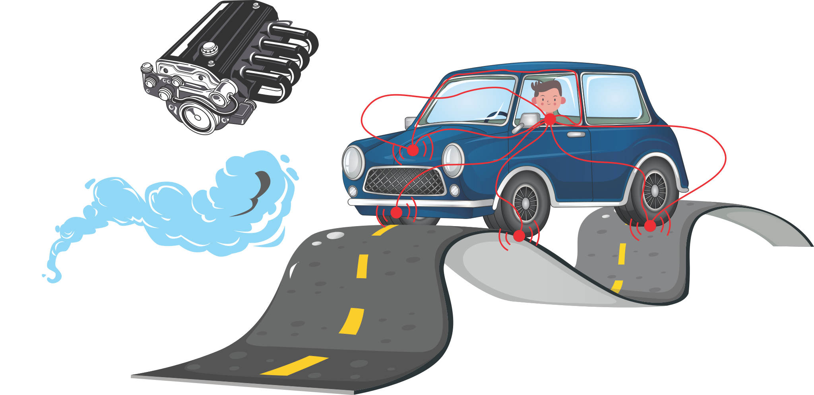

When should I use TPA?
****************************

Typical TPA implementation in NVH problems concerns reducing undesired
noise or vibrations in order to improve comfort, safety, or stealth.
Using TPA, the following challenges can be tackled:

1. Source excitations are unmeasurable in practice
^^^^^^^^^^^^^^^^^^^^^^^^^^^^^^^^^^^^^^^^^^^^^^^^^^

It is not difficult to imagine an active component with operational
excitation (far) too complex to model or measure. Just think of…well,
any source really:

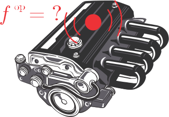

With TPA, operational loads can be measured. Well, not directly…

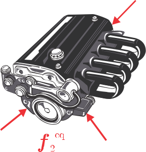

2. Distinguish partial transfer paths and find most dominant one
^^^^^^^^^^^^^^^^^^^^^^^^^^^^^^^^^^^^^^^^^^^^^^^^^^^^^^^^^^^^^^^^

Amongst all transfer paths, the most dominant one can be easily
pinpointed.

3. Predict response at the passive side
^^^^^^^^^^^^^^^^^^^^^^^^^^^^^^^^^^^^^^^

With operational interface loads you can easily predict responses at the
structure fixed to the source.

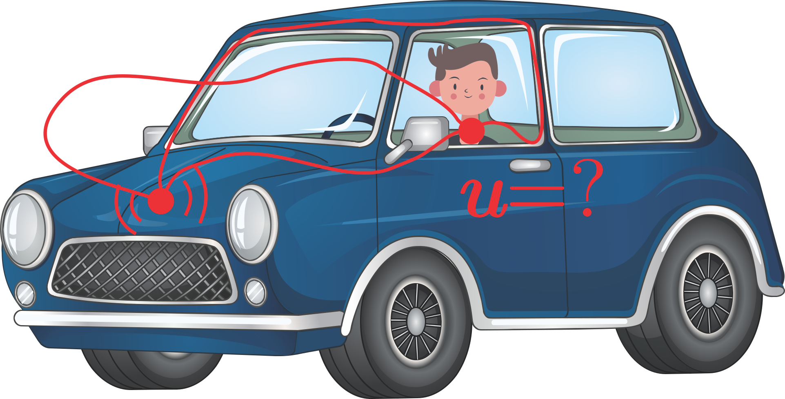

Development can be significantly speed up in this manner, and fewer
tests are required since it is not necessary to test all configurations.

4. Combine different physical domains to describe transfer path problem
^^^^^^^^^^^^^^^^^^^^^^^^^^^^^^^^^^^^^^^^^^^^^^^^^^^^^^^^^^^^^^^^^^^^^^^

Besides typical response measurements using accelerometers, the
implementation of strain or sound pressure measurements is also
straightforward.

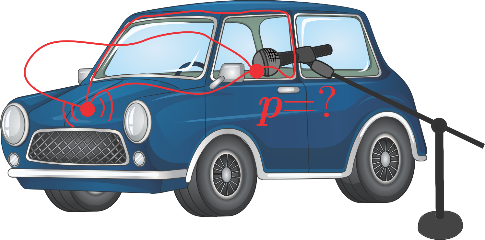

Which TPA methods can I use?
****************************

A wide range of different TPA methods speaks for its popularity and
applicability. In general, TPA methods are classified into three large
families: classical, component-based, and transmissibility-based. The
entire framework is depicted in the following Figure, followed by the
basic properties of the individual families.

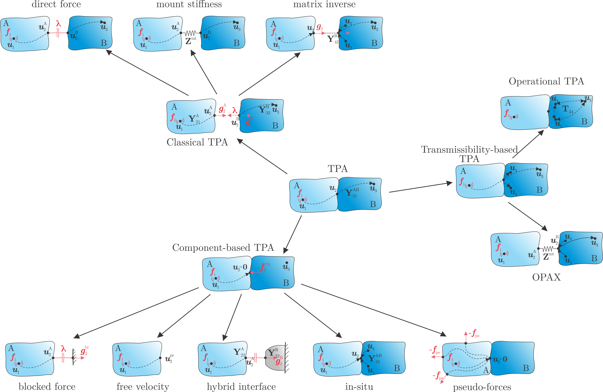

Classical TPA
^^^^^^^^^^^^^

Classical TPA methods conduct measurements on the assembled products AB
to obtain interface forces between the active and passive sides.
Usually, these methods are applied to troubleshoot NVH problems in
already existing products. Interface forces can be measured directly
between the substructures (direct force method) if stiff force
transducers are mounted directly at the interface while the assembly is
subjected to the operational excitation. Interface forces can also be
estimated for cases when both sides of the interface are connected
through a resilient mount (mount stiffness method). As mounting force
transducers at the interface are usually impractical, an inverse
procedure can be applied to estimate interface forces that replicate
responses around the interface. This matrix inverse method is a
practical method, however, it requires separate measurement of the FRFs,
followed by the measurement of the operational responses.

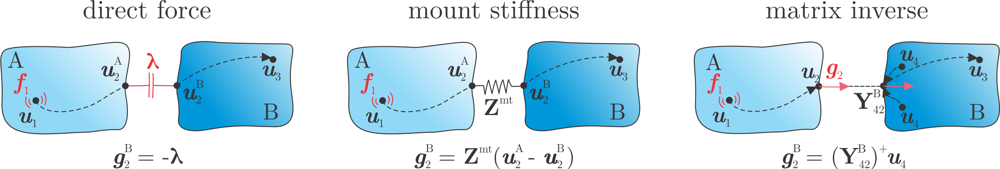

.. |pro| replace:: ✓
.. |con| replace:: ✗

Pros (Pro)
==========

- |pro| Interface forces replicate operational excitation.
- |pro| Identification of transfer path contribution.

Cons (Contra)
=============

- |con| Interface forces are valid for the measured assembly only.
- |con| High force transducer sensor stiffness and impractical mounting for the direct force method.
- |con| Dismounting of the assembly.

Component-based TPA
^^^^^^^^^^^^^^^^^^^

The main disadvantage of the classical TPA methods is the
non-transferability of the interface forces in case the passive
substructure is modified in any way. This explains why classical TPA is
mainly used on the existing products only. This drawback can be resolved
by using component-based TPA, which describes operational excitation in
terms of equivalent forces. Equivalent forces are non-existing load on
the assembly interface which, if applied, would counteract operational
excitation. Thus, they are property of the active part only and are
transferable to an assembly with a modified passive side. They replicate
the same responses at the passive side as caused by operational loads.

The simplest way to measure equivalent forces is to rigidly support the
active component only with the associated testbench. In this manner,
interface displacements are zero, and forces at the interface are solely
the equivalent forces. They can be measured by mounting stiff force
transducers at the interface (blocked force method). If the interface is
left free, however, no equivalent forces are acting on the active
component and all vibrations are seen as free displacements. Equivalent
forces, required to attenuate these free displacements, are then
calculated by the free velocity method. In cases when the testbench is
compliant, it can be accounted for with the hybrid interface method.
In-situ and pseudo-forces methods even eliminate the need to dismount
any part of the assembly in order to determine equivalent forces.

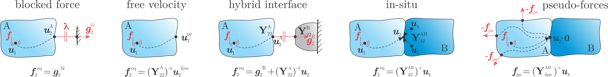

.. |pro| replace:: ✓
.. |con| replace:: ✗

Pros (Pro)
==========

- |pro| Equivalent forces replicate operational excitation.
- |pro| Identification of transfer path contribution.
- |pro| Transferability of the equivalent forces to an assembly with a modified passive side.
- |pro| Perfect for structural modifications in product development.

Cons (Contra)
=============

- |con| Direct measurements of the equivalent moments.
- |con| High force transducer sensor and testbench stiffness for the blocked force method.
- |con| Running active components at the free conditions is difficult for the free velocity method.

Transmissibility-based TPA
^^^^^^^^^^^^^^^^^^^^^^^^^^

If one is only interested in dominant transfer paths and source
excitation are of no interest, the transmissibility-based TPA family is
a viable and simple solution. Transfer paths are characterized solely by
transmissibilities between sensors around the connection points. With
operational TPA (OTPA) transfer path contributions are evaluated via
transmissibility matrix, which is built from responses at the passive
side, conducted under various operational loads. Operational mount
identification (OPAX) is a hybrid TPA method for the estimation of mount
stiffness parameters from the operational test.

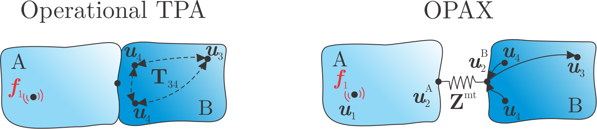

.. |pro| replace:: ✓
.. |con| replace:: ✗

Pros (Pro)
==========

- |pro| Description of the operational excitation is not needed.
- |pro| Only measurement of the operational response is required and no FRFs.
- |pro| Measurement is performed on the assembly only and no dismounting is needed.
- |pro| Simplistic combination of different types of sensors.

Cons (Contra)
=============

- |con| Operational interface loads are not known.
- |con| Results are strongly dependent on the choice of the sensor locations as some transmission paths may be missed.

Transfer path problem
^^^^^^^^^^^^^^^^^^^^^

Consider an assembly of substructures A and B, coupled at the interface,
as depicted below. Substructure A is an active component with the
operational excitation :math:`\boldsymbol{f}_1` acting at node 1.
Meanwhile, no excitation force is acting on passive substructure B. The
responses on B in :math:`\boldsymbol{u}_3` and :math:`\boldsymbol{u}_4`
are hence a consequence of the active force :math:`\boldsymbol{f}_1`
only:

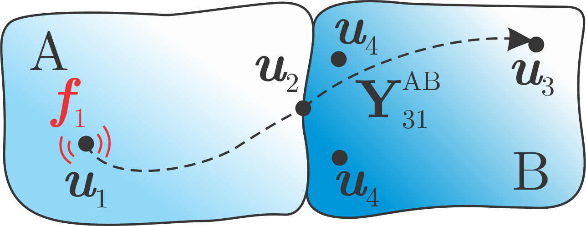

       :math:`\boldsymbol{u}_1\textbf{:}` internal DoFs at the active
   side in which operational excitation is present.    
   :math:`\boldsymbol{u}_2\textbf{:}` boundary DoFs at the interface
   between active and passive side.    
   :math:`\boldsymbol{u}_3\textbf{:}` internal DoFs at locations of
   interest on the passive side     :math:`\boldsymbol{u}_4\textbf{:}`
   internal DoFs, also named indicator responses, located in the
   proximity of the interface.

Responses at the passive side can be evaluated by multiplying force
spectra :math:`\boldsymbol{f}_1` with the respective transfer functions
:math:`\mathbf{Y}_{31}^{\text{AB}}`:

.. math:: \boldsymbol{u}_3 = \mathbf{Y}_{31}^{\text{AB}} \boldsymbol{f}_1

.. math:: \boldsymbol{f}_1 = \,\mathbf{?}

Operational excitations :math:`\boldsymbol{f}_1` are unknown in
practice. One can, however, express them in terms of interface forces
:math:`\boldsymbol{\lambda}` and substructures’ admittances using LM FBS
notation.

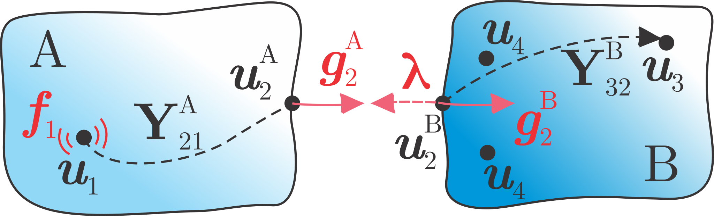

Equation of motion for both substructures are incorporated into
matrix-diagonal form as written below. External forces are acting only
at node 1 and connectivity forces are only present at both sides of the
interface.

.. math::

   \begin{bmatrix}
       \boldsymbol{u}_1 \\ \boldsymbol{u}_2^{\text{A}} \\ \boldsymbol{u}_2^{\text{B}} \\ \boldsymbol{u}_3 \\\boldsymbol{u}_4
   \end{bmatrix} \, = \,
   \begin{bmatrix}
       \mathbf{Y}_{11}^{\text{A}} & \mathbf{Y}_{12}^{\text{A}} & \mathbf{0} & \mathbf{0} & \mathbf{0} \\
       \mathbf{Y}_{21}^{\text{A}} & \mathbf{Y}_{22}^{\text{A}} & \mathbf{0} & \mathbf{0} & \mathbf{0} \\
       \mathbf{0} & \mathbf{0} & \mathbf{Y}_{22}^{\text{B}} & \mathbf{Y}_{23}^{\text{B}} & \mathbf{Y}_{24}^{\text{B}} \\
       \mathbf{0} & \mathbf{0} & \mathbf{Y}_{32}^{\text{B}} & \mathbf{Y}_{33}^{\text{B}} & \mathbf{Y}_{34}^{\text{B}} \\
       \mathbf{0} & \mathbf{0} & \mathbf{Y}_{42}^{\text{B}} & \mathbf{Y}_{43}^{\text{B}} & \mathbf{Y}_{44}^{\text{B}}
   \end{bmatrix}
   \, 
   \left(
   \begin{bmatrix}
       \boldsymbol{f}_1 \\ \mathbf{0} \\ \mathbf{0} \\ \mathbf{0} \\ \mathbf{0}
   \end{bmatrix}
   +
   \begin{bmatrix}
       \mathbf{0} \\ \boldsymbol{g}_2^{\text{A}} \\ \boldsymbol{g}_2^{\text{B}} \\ \mathbf{0} \\ \mathbf{0}
   \end{bmatrix}
   \right)
   \quad \Rightarrow \quad
   \boldsymbol{u} = \mathbf{Y}^{\text{A|B}}(\boldsymbol{f} + \boldsymbol{g})

Next, compatibility condition between both substructures is considered
which ensures that there is no spatial gap at the interface:

.. math::

   \boldsymbol{u}_2^{\text{A}} = \boldsymbol{u}_2^{\text{B}}
   \quad\Rightarrow\quad
   \mathbf{B}\, \boldsymbol{u} = \mathbf{0} \quad\Rightarrow\quad \mathbf{B} = 
   \begin{bmatrix}
       \mathbf{0} & \mathbf{-I} & \mathbf{I} & \mathbf{0} & \mathbf{0}
   \end{bmatrix}

Since displacements are prescribed at the interface, forces that enforce
compatibility conditions are required (interface forces
:math:`\boldsymbol{g}_2`). Interface forces are equal in magnitude on
both sides of the interface but opposite in sign:

.. math::  \boldsymbol{g}_2^{\text{A}} = -\boldsymbol{g}_2^{\text{B}} 

Interface forces can be expressed using a set of Lagrange multipliers
:math:`\boldsymbol{\lambda}`:

.. math::  \boldsymbol{g}_2^{\text{A}} = -\boldsymbol{g}_2^{\text{B}} = \boldsymbol{\lambda} \quad\Rightarrow\quad \boldsymbol{g} = -\mathbf{B}^{\text{T}}\boldsymbol{\lambda} 

With equation of motion for subsystems A and B, compatibility and
equilibrium conditions we can express interface forces
:math:`\boldsymbol{\lambda}` in terms of subsystems’ admittances.
Equating :math:`\boldsymbol{u}_2^{\text{A}}` and
:math:`\boldsymbol{u}_2^{\text{B}}` yields:

.. math::

    \mathbf{Y}_{21}^{\text{A}} \boldsymbol{f}_1 + \mathbf{Y}_{22}^{\text{A}} \boldsymbol{\lambda} = \mathbf{Y}_{22}^{\text{B}} (-\boldsymbol{\lambda}) \\
   -\boldsymbol{\lambda} = (\mathbf{Y}_{22}^{\text{A}} + \mathbf{Y}_{22}^{\text{B}})^{-1} \mathbf{Y}_{21}^{\text{A}} \boldsymbol{f}_1 = \boldsymbol{g}_2^{\text{B}}

From the last two equations of motion we obtain:

.. math::  \boldsymbol{u}_3 = \mathbf{Y}_{32}^{\text{A}}\boldsymbol{g}_2^{\text{B}} = \mathbf{Y}_{32}^{\text{B}} \underbrace{(\mathbf{Y}_{22}^{\text{A}} + \mathbf{Y}_{22}^{\text{B}})^{-1} \mathbf{Y}_{21}^{\text{A}} \boldsymbol{f}_1}_{-\boldsymbol{\lambda}} = \mathbf{Y}_{31}^{\text{AB}} \boldsymbol{f}_1

.. math::  \boldsymbol{u}_4 = \mathbf{Y}_{42}^{\text{A}}\boldsymbol{g}_2^{\text{B}} = \mathbf{Y}_{42}^{\text{B}} \underbrace{(\mathbf{Y}_{22}^{\text{A}} + \mathbf{Y}_{22}^{\text{B}})^{-1} \mathbf{Y}_{21}^{\text{A}} \boldsymbol{f}_1}_{-\boldsymbol{\lambda}} = \mathbf{Y}_{41}^{\text{AB}} \boldsymbol{f}_1

or responses at the passive side as a consequence of an operational load
expressed from the assembled admittance.

Component-based TPA: Equivalent source concept
^^^^^^^^^^^^^^^^^^^^^^^^^^^^^^^^^^^^^^^^^^^^^^

Now, we assume that all operational responses as a consequence of
:math:`\boldsymbol{f}_1` can be fully expressed by
:math:`\boldsymbol{f}_2^{\text{eq}}` (yet unknown) acting on the source.

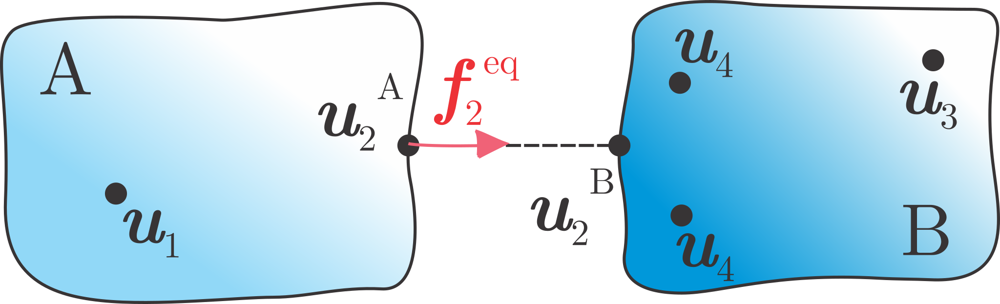

Again we can write an equation of motion for the uncoupled system along
with compatibility and equilibrium conditions:

.. math::

   \begin{bmatrix}
       \boldsymbol{u}_1 \\ \boldsymbol{u}_2^{\text{A}} \\ \boldsymbol{u}_2^{\text{B}} \\ \boldsymbol{u}_3 \\\boldsymbol{u}_4
   \end{bmatrix} \, = \,
   \begin{bmatrix}
       \mathbf{Y}_{11}^{\text{A}} & \mathbf{Y}_{12}^{\text{A}} & \mathbf{0} & \mathbf{0} & \mathbf{0} \\
       \mathbf{Y}_{21}^{\text{A}} & \mathbf{Y}_{22}^{\text{A}} & \mathbf{0} & \mathbf{0} & \mathbf{0} \\
       \mathbf{0} & \mathbf{0} & \mathbf{Y}_{22}^{\text{B}} & \mathbf{Y}_{23}^{\text{B}} & \mathbf{Y}_{24}^{\text{B}} \\
       \mathbf{0} & \mathbf{0} & \mathbf{Y}_{32}^{\text{B}} & \mathbf{Y}_{33}^{\text{B}} & \mathbf{Y}_{34}^{\text{B}} \\
       \mathbf{0} & \mathbf{0} & \mathbf{Y}_{42}^{\text{B}} & \mathbf{Y}_{43}^{\text{B}} & \mathbf{Y}_{44}^{\text{B}}
   \end{bmatrix}
   \, 
   \left(
   \begin{bmatrix}
       \mathbf{0} \\ \boldsymbol{f}_2^{\text{eq}} \\ \mathbf{0} \\ \mathbf{0} \\ \mathbf{0}
   \end{bmatrix}
   +
   \begin{bmatrix}
       \mathbf{0} \\ \boldsymbol{g}_2^{\text{A}} \\ \boldsymbol{g}_2^{\text{B}} \\ \mathbf{0} \\ \mathbf{0}
   \end{bmatrix}
   \right)

.. math:: \mathbf{B}\, \boldsymbol{u} = \mathbf{0}

.. math:: \boldsymbol{g} = -\mathbf{B}^{\text{T}}\boldsymbol{\lambda}

We repeat the procedure above. First, we express interface forces
:math:`\boldsymbol{\lambda}`:

.. math:: -\boldsymbol{\lambda} = \Big( \mathbf{Y}_{22}^{\text{A}} + \mathbf{Y}_{22}^{\text{B}} \Big)^{-1} \mathbf{Y}_{22}^{\text{A}} \boldsymbol{f}_2^{\text{eq}} = \boldsymbol{g}_2^{\text{B}}

Followed by the passive side responses:

.. math::  \boldsymbol{u}_3 = \mathbf{Y}_{32}^{\text{B}} \underbrace{(\mathbf{Y}_{22}^{\text{A}} + \mathbf{Y}_{22}^{\text{B}})^{-1} \mathbf{Y}_{22}^{\text{A}} \boldsymbol{f}_2^{\text{eq}}}_{-\boldsymbol{\lambda}} = \mathbf{Y}_{32}^{\text{AB}} \boldsymbol{f}_2^{\text{eq}}

.. math::  \boldsymbol{u}_4 = \mathbf{Y}_{42}^{\text{B}} \underbrace{(\mathbf{Y}_{22}^{\text{A}} + \mathbf{Y}_{22}^{\text{B}})^{-1} \mathbf{Y}_{22}^{\text{A}} \boldsymbol{f}_2^{\text{eq}}}_{-\boldsymbol{\lambda}} = \mathbf{Y}_{42}^{\text{AB}} \boldsymbol{f}_2^{\text{eq}}

In-situ TPA
***********************

Source excitations :math:`\boldsymbol{f}_1` are often not measurable in
practice. Equivalent forces, applied at the interface DoFs, generates
the same responses at the passive side as :math:`\boldsymbol{f}_1`.

The application of :math:`\boldsymbol{f}_1` and the reaction of
equivalent forces :math:`\boldsymbol{f}_2^{\mathrm{eq}}` removes any
response on the passive side.

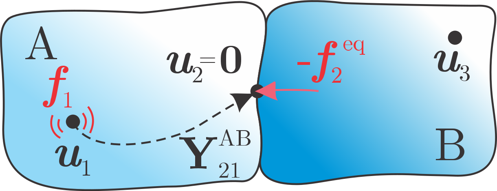

The response at the interface :math:`\boldsymbol{u}_2` or the indicator
DoFs :math:`\boldsymbol{u}_4` can be used to calculate the equivalent
forces, in a manner that the responses at B are zero:

.. math:: \boldsymbol{0} = \underbrace{\mathbf{Y}_{21}^{\mathrm{AB}} \boldsymbol{f}_1}_{\boldsymbol{u}_2} + \mathbf{Y}_{22}^{\mathrm{AB}} \big(-\boldsymbol{f}_2^{\mathrm{eq}} \big) 

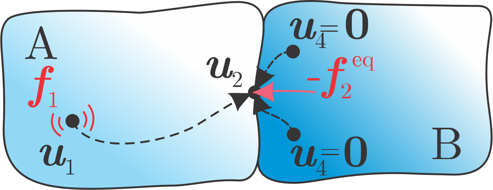

.. math:: \boldsymbol{0} = \underbrace{\mathbf{Y}_{41}^{\mathrm{AB}} \boldsymbol{f}_1}_{\boldsymbol{u}_4} + \mathbf{Y}_{42}^{\mathrm{AB}} \big(-\boldsymbol{f}_2^{\mathrm{eq}} \big)

We can then express equivalent forces from interface displacements:

.. math:: \boldsymbol{f}_2^{\mathrm{eq}} = \Big( \mathbf{Y}_{22}^{\mathrm{AB}} \Big)^{-1} \boldsymbol{u}_2

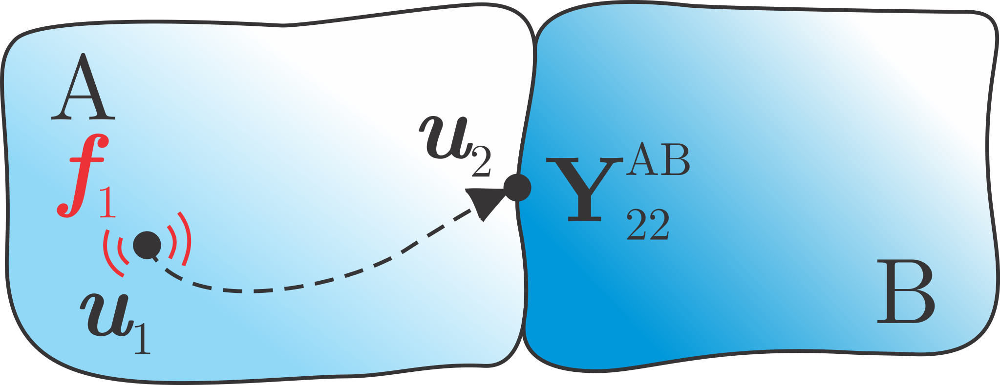

Or from displacements at the indicator DoFs:

.. math:: \boldsymbol{f}_2^{\mathrm{eq}} = \Big( \mathbf{Y}_{42}^{\mathrm{AB}} \Big)^{+} \boldsymbol{u}_4

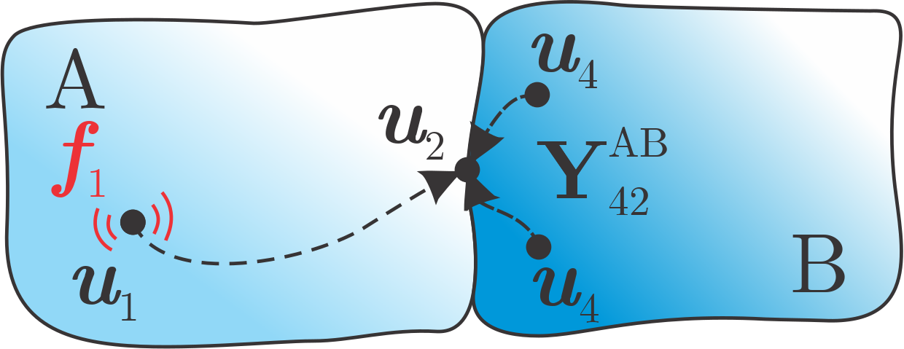

Now let us examine how equivalent forces are a property of the active
side only and are invariant of any passive substructure coupled to it.

.. math:: \mathbf{0} = \mathbf{Y}_{41}^{\mathrm{AB}} \boldsymbol{f}_1 + \mathbf{Y}_{42}^{\mathrm{AB}} \big(-\boldsymbol{f}_2^{\mathrm{eq}} \big)

.. math:: \mathbf{Y}_{41}^{\mathrm{AB}} \boldsymbol{f}_1 = \mathbf{Y}_{42}^{\mathrm{AB}} \boldsymbol{f}_2^{\mathrm{eq}}

.. math:: \underbrace{\mathbf{Y}_{42}^{\mathrm{B}} \Big( \mathbf{Y}_{22}^{\mathrm{A}} + \mathbf{Y}_{22}^{\mathrm{B}} \Big)^{-1} \mathbf{Y}_{21}^{\mathrm{A}}}_{\mathbf{Y}_{41}^{\mathrm{AB}}\text{, see Section C3.2}} \boldsymbol{f}_1 = \underbrace{\mathbf{Y}_{42}^{\mathrm{B}} \Big( \mathbf{Y}_{22}^{\mathrm{A}} + \mathbf{Y}_{22}^{\mathrm{B}} \Big)^{-1} \mathbf{Y}_{22}^{\mathrm{A}}}_{\mathbf{Y}_{42}^{\mathrm{AB}}\text{, see Section C3.2.1}} \boldsymbol{f}_2^{\mathrm{eq}}

By expressing :math:`\boldsymbol{f}_2^{\mathrm{eq}}` we obtain:

.. math:: \boldsymbol{f}_2^{\mathrm{eq}} = \Big( \mathbf{Y}_{22}^{\mathrm{A}} \Big)^{-1} \mathbf{Y}_{21}^{\mathrm{A}} \boldsymbol{f}_1

And thus prove :math:`\boldsymbol{f}_2^{\mathrm{eq}}` are only
dependable on the active side’s admittance and operational excitation.

The responses :math:`\boldsymbol{u}_3` remain independent of
:math:`\boldsymbol{f}_2^{\mathrm{eq}}`, as they are not considered in
the calculation of the latter. The predicted response
:math:`\boldsymbol{\tilde{u}}_3` as a consequence of
:math:`\boldsymbol{f}_2^{\mathrm{eq}}` only can be expressed as:

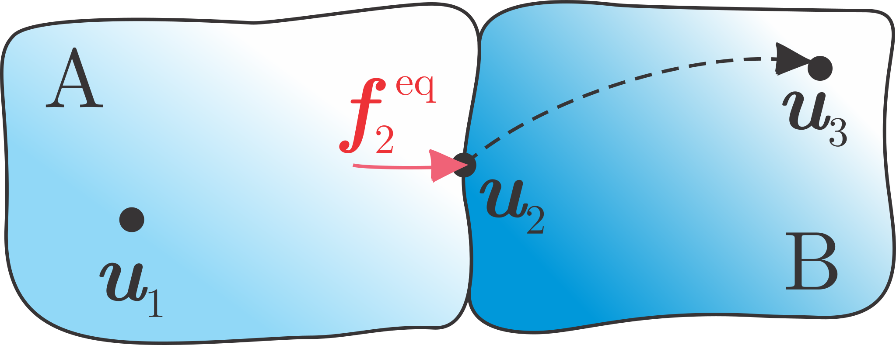

.. math:: \boldsymbol{\tilde{u}}_3 = \mathbf{Y}_{32}^{\mathrm{AB}} \boldsymbol{f}_2^{\mathrm{eq}}

By comparing the predicted :math:`\boldsymbol{\tilde{u}}_3` and the
measured :math:`\boldsymbol{u}_3` it is possible to evaluate whether the
transfer paths through the interface are sufficiently well described by
:math:`\boldsymbol{f}_2^{\mathrm{eq}}`.

This approach can be useful for an on-board validation when the
prediction is performed on the assembly AB, or cross validation when
applied to the assembly with a modified passive side
(:math:`\mathrm{A\tilde{B}}`).

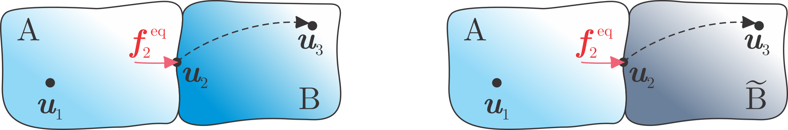

In-Situ TPA - Measurement Campaign
***********************

Operational measurement campaign
^^^^^^^^^^^^^^^^^^^^^^^^^^^^^^^^

-  Measurement of the output signal by source excitation →
   :math:`\boldsymbol{{u}}_{3}, \boldsymbol{{u}}_{4}`

-  Avoiding dismounting of any part

-  Outputs: Sensors and/or microphones

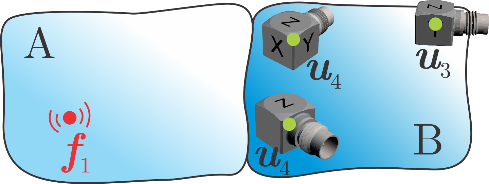

To ensure that the equivalent forces are independent of the receiver structure, the operating excitation must originate solely from the source structure. 

A potential violation of this assumption could occur with gearboxes.
Consider a gearbox whose housing is rigidly connected to a stiff
receiver. Due to manufacturing tolerances, the housing is slightly
deformed after assembly with the receiver. The resulting misalignment of
the gears would be an important mechanism changing the internal loads
:math:`f^\mathrm{A}_{1}`, which is dependent on the specific receiver
(how much is the housing deformed by the mounting?). Care has to be
taken so that this assumption is not violated.

FRF measurement campaign
^^^^^^^^^^^^^^^^^^^^^^^^

-  FRFs from hammer impacts at the interface

→ :math:`\mathbf{Y}_\mathrm{42,uf}, \mathbf{Y}_\mathrm{32,uf}`

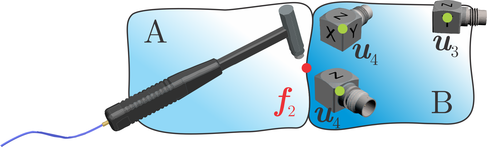

VPT reconstruction
^^^^^^^^^^^^^^^^^^

-  Transformation of the hammer inputs to virtual loads

| →
  :math:`\mathbf{Y}_\mathrm{42,um} = \mathbf{Y}_\mathrm{42,uf} \mathbf{T}_\mathrm{f}^\mathrm{T}`
| →
  :math:`\mathbf{Y}_\mathrm{32,um} = \mathbf{Y}_\mathrm{32,uf} \mathbf{T}_\mathrm{f}^\mathrm{T}`

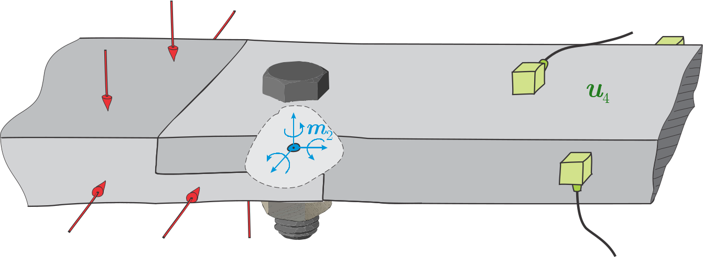

Limitations of in-situ TPA
^^^^^^^^^^^^^^^^^^^^^^^^^^

-  limited to linear time-invariant systems
-  many systems have nonlinear components
   → errors in the equivalent forces
   → transferability is limited

.. rubric:: References

.. [1] van der Seijs MV, de Klerk D, Rixen DJ. General framework for transfer path analysis: History, theory and classification of techniques. *Mechanical Systems and Signal Processing*. 2016 Feb 1;68:217–44. doi:10.1016/j.ymssp.2015.08.004.

.. [2] van der Seijs MV. *Experimental dynamic substructuring: Analysis and design strategies for vehicle development*. Delft University of Technology, 2016. doi:10.4233/uuid:28b31294-8d53-49eb-b108-284b63edf670.

.. [3] Moorhouse AT. On the characteristic power of structure-borne sound sources. *Journal of Sound and Vibration*. 2001;248(3):441–459. doi:10.1006/jsvi.2001.3797.

.. [4] Elliott A, Moorhouse AT. Characterisation of structure-borne sound sources from measurement in-situ. *Journal of the Acoustical Society of America*. 2008 May;123(5):3176.

.. [5] Wernsen MWF, van der Seijs MV, de Klerk D. An indicator sensor criterion for in-situ characterisation of source vibrations. In: *Sensors and Instrumentation, Volume 5* (pp. 55–69). Springer, Cham, 2017. doi:10.1007/978-3-319-54987-3_7.

.. [6] El Mahmoudi A, Trainotti F, Park K, Rixen DJ. In-situ TPA for NVH analysis of powertrains: an evaluation on an experimental test setup. In: *AAC 2019: Aachen Acoustics Colloquium / Aachener Akustik Kolloquium*, 2019.

.. [7] Haeussler M, Mueller T, Pasma EA, Freund J, Westphal O, Voehringer T, ZF AG. Component TPA: benefit of including rotational degrees of freedom and over-determination. In: *ISMA 2020 – International Conference on Noise and Vibration Engineering* (pp. 1135–1148), 2020.

.. [8] Haeussler M, Kobus DC, Rixen DJ. Parametric design optimization of e-compressor NVH using blocked forces and substructuring. *Mechanical Systems and Signal Processing*. 2021;150:107217. doi:10.1016/j.ymssp.2020.107217.

.. [9] Haeussler M. *Modular sound & vibration engineering by substructuring*. Technische Universität München, 2021. https://mediatum.ub.tum.de/doc/1550333/1550333.pdf

